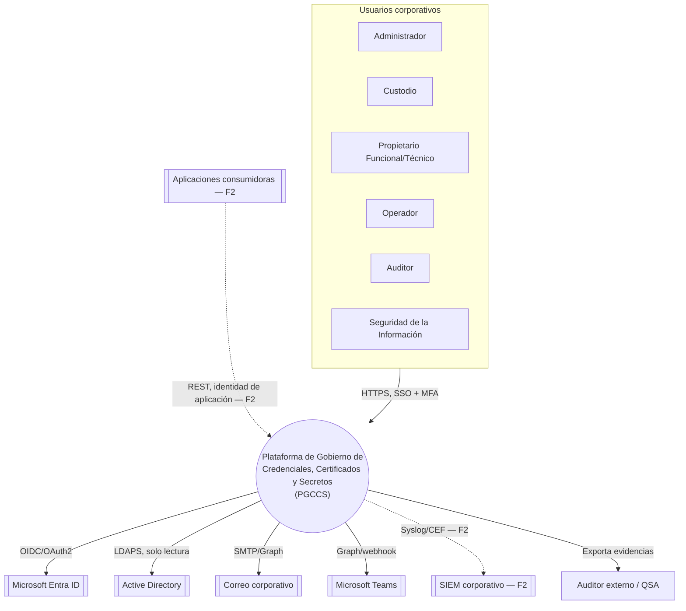
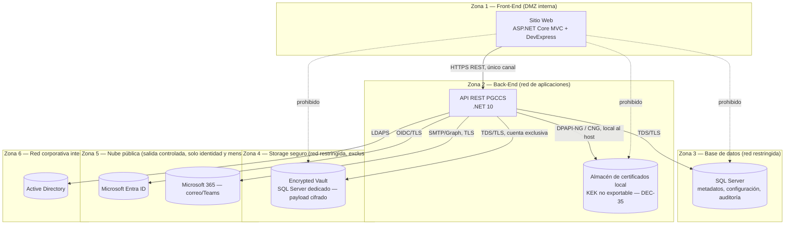
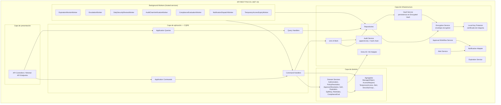
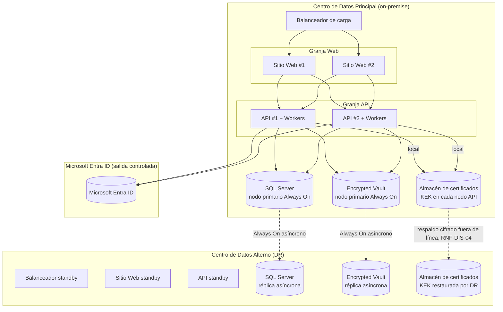
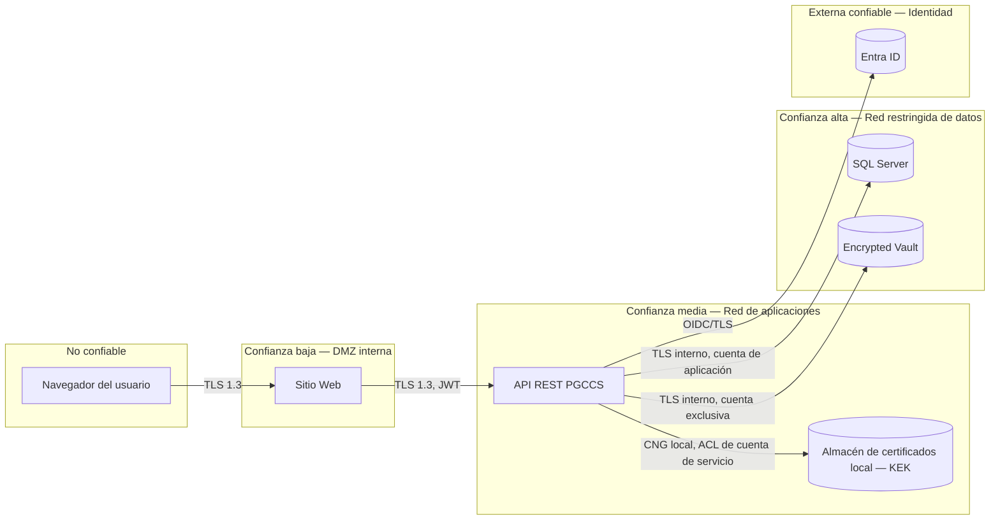
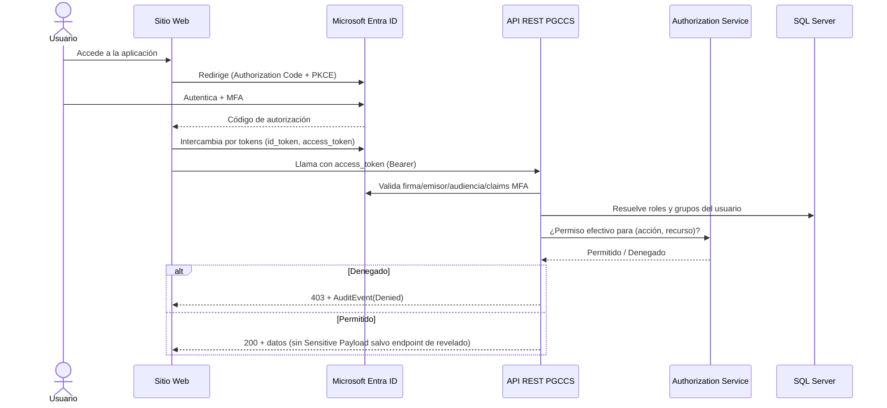
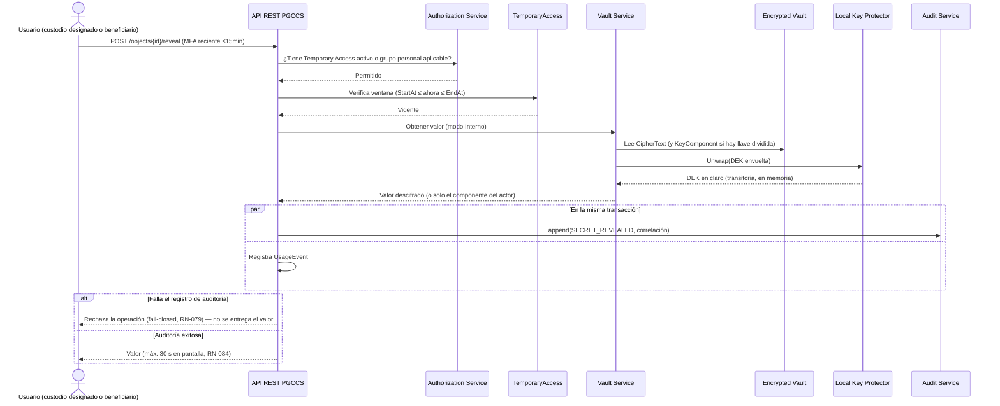
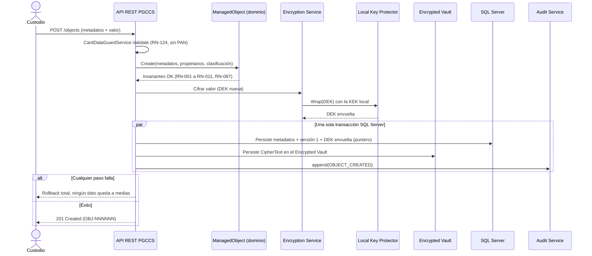
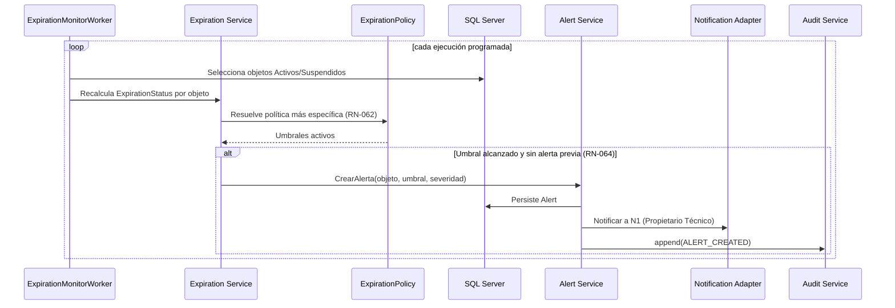

# Arquitectura C4 — Plataforma de Gobierno de Credenciales, Certificados y Secretos (PGCCS)

| Atributo | Valor |
|---|---|
| Documento | c4-containers.md |
| Versión | 1.0 |
| Fecha | 2026-09-24 |
| Rol autor | Software Architect (.NET, DDD, C4, CQRS) |
| Fuente | [docs/specs/functional/](../specs/functional/) |
| Documentos relacionados | [domain-model.md](domain-model.md), [ADR-001-layered-cqrs-architecture.md](ADR-001-layered-cqrs-architecture.md) |

**Decisión de notación:** los diagramas usan `flowchart`/`sequenceDiagram` de Mermaid en lugar de la sintaxis experimental `C4Context`/`C4Container`, para garantizar que rendericen igual en cualquier visor de Markdown compatible con Mermaid estándar. Los niveles C4 (Contexto, Contenedores, Componentes) se mantienen como estructura del documento y como subgrafos etiquetados dentro de cada diagrama.

---

## 1. Nivel 1 — System Context

### 1.1 Actores y sistemas externos

| Actor / Sistema | Tipo | Relación con la plataforma | Referencia |
|---|---|---|---|
| Administrador, Custodio, Propietario Funcional/Técnico, Operador, Auditor, Seguridad | Persona | Usan el Front-End con su identidad de Entra ID (o cuenta de emergencia, US-062) | 01 §4 |
| Custodios designados de componente (grupo) y de Seguridad | Persona (rol operativo, no de sistema) | Ingresan/revelan su parte de una llave dividida | US-057, US-058 |
| Microsoft Entra ID | Sistema externo | SSO, MFA, acceso condicional, identidad de aplicaciones (F2) | RN-030, RNF-SEG-01 |
| Active Directory | Sistema externo | LDAPS de solo lectura, validación de cuentas de servicio | DEC-06 |
| Correo corporativo / Microsoft Teams | Sistema externo | Canal de notificaciones | DEC-07 |
| SIEM corporativo | Sistema externo (F2) | Recepción de eventos de seguridad | DEC-08 |
| Aplicaciones consumidoras | Sistema externo (F2) | Recuperan secretos por API con identidad de aplicación | DEC-03 |
| Auditor externo / QSA | Persona externa | Recibe paquetes de evidencia exportados (US-044) | RNF-CUM-04 |

### 1.2 Diagrama de contexto

---

## 2. Nivel 2 — Containers

### 2.1 Distribución física obligatoria

**Cumplimiento de las validaciones obligatorias 6 y 7:** el Front-End (Zona 1), el Back-End (Zona 2), la Base de datos (Zona 3) y el Storage seguro (Zona 4) son cuatro nodos físicos/lógicos separados, cada uno en su propio segmento de red. El Front-End solo tiene una arista de salida: hacia el Back-End por HTTPS REST. No existe ninguna ruta entre el Front-End y SQL Server, el Encrypted Vault o el almacén de certificados que custodia la KEK (líneas punteadas "prohibido" documentadas explícitamente para la revisión de arquitectura y para las reglas del firewall/NSG). La plataforma no depende de ningún servicio de nube para su custodia criptográfica (DEC-35): la KEK reside en el almacén de certificados de la máquina de cada nodo de la API.

### 2.2 Contenedores

| Contenedor | Responsabilidad | Tecnología | Datos administrados | Dependencias | Protocolo | Límite de confianza | Controles de seguridad | Escalabilidad/Disponibilidad | Clasificación |
|---|---|---|---|---|---|---|---|---|---|
| **Sitio Web** (Front-End) | Presentación, formularios de registro/consulta/aprobación, grillas DevExpress, dashboards | ASP.NET Core MVC (.NET 10), DevExpress | Ninguno persistente propio; solo estado de sesión de presentación | API REST PGCCS, Entra ID (login redirect) | HTTPS/TLS 1.3 | DMZ interna | CSP estricta, anti-CSRF, cookies `Secure/HttpOnly/SameSite=Strict`, sin acceso a BD, Vault ni almacén de llaves (R-07) | Sin estado (stateless) tras Entra ID; N instancias detrás de balanceador (RNF-DIS-03) | Ninguna (no persiste sensibles) |
| **API REST PGCCS** (Back-End) | Casos de uso, reglas de negocio, autorización, orquestación de cifrado, workflows de aprobación, auditoría | .NET 10, ASP.NET Core Web API, Entity Framework Core | Ninguno propio; orquesta SQL Server + Encrypted Vault; usa la KEK del almacén de certificados local | SQL Server, Encrypted Vault, almacén de certificados local (KEK), Entra ID, Active Directory, Notificaciones | HTTPS/TLS 1.3 (interno TLS 1.2 AEAD si aplica) | Red de aplicaciones (interna) | OAuth2/OIDC, RBAC por endpoint, rate limiting, WAF por delante, RFC 7807 en errores (RNF-SEG-08) | Sin estado, N instancias + workers en background separados (RNF-REN-08) | Restringida (orquesta todo) |
| **SQL Server** (Base de datos) | Metadatos de objetos, configuración, usuarios/roles/grupos, solicitudes/aprobaciones, alertas, historial, auditoría append-only | SQL Server 2022+ on-premise, Always On AG | Metadatos, `VaultBlobId` (puntero, nunca el valor), auditoría, configuración | Ninguna saliente | TDS sobre TLS | Red restringida (Zona 3) | TDE, sin endpoint público, cuenta de aplicación de mínimo privilegio, Ledger tables *append-only* para auditoría (RNF-AUD-02) | Always On AG síncrono local + asíncrono a sitio DR (RNF-DIS-03/04) | Confidencial (metadatos); nunca texto plano de secretos (R-05) |
| **Encrypted Vault** (Storage seguro) | Persistencia exclusiva del contenido cifrado de los objetos administrados: `SensitivePayloadRecord`, `KeyComponent`, blobs PFX, versiones históricas cifradas | SQL Server 2022+ dedicado (instancia/base separada de la transaccional), o filegroup aislado con TDE + cifrado a nivel de columna | Ciphertext (AES-256-GCM) por objeto/versión/componente; nunca claves en claro | Ninguna saliente propia; la KEK que envuelve sus DEK es un certificado local en el almacén de la máquina de la API (DEC-35) | TDS sobre TLS, cuenta de servicio exclusiva y distinta de la de SQL Server transaccional | Red restringida y exclusiva (Zona 4), sin conectividad directa desde el Front-End ni desde ningún cliente que no sea la API | TDE + cifrado de sobre, *soft-delete* a nivel de aplicación (no delete físico salvo Purga, RN-109), auditoría de acceso vía la propia API | Always On AG propio, réplica a sitio DR sincronizada con la de SQL Server transaccional | Restringida/Crítica — el activo más sensible del sistema |
| **Almacén de certificados local (KEK)** | Custodia de la Key Encryption Key (KEK) de la plataforma y de las credenciales técnicas propias de la plataforma (cadenas de conexión protegidas con DPAPI) | Windows Certificate Store (almacén de máquina), certificado RSA-3072+ no exportable, protegido por DPAPI-NG/CNG y TPM cuando el hardware lo soporta | KEK (clave privada del certificado), credenciales técnicas cifradas de la plataforma | — | Local al host (API de CNG/DPAPI), sin red | Dentro del host de la API (Zona 2); solo la cuenta de servicio de la API tiene permiso de lectura de la clave privada | Clave no exportable, ACL restringida a la cuenta de servicio, rotación anual con re-envoltura de DEK, respaldo cifrado fuera de línea custodiado por Seguridad (RNF-SEG-04) | El mismo certificado se instala en cada nodo de la API y en el sitio DR mediante el procedimiento de respaldo (RNF-DIS-04) | Crítica (protege la KEK de todo el sistema) |
| **Microsoft Entra ID** | Autenticación SSO/MFA, acceso condicional, identidad de usuarios y de aplicaciones (F2) | Servicio gestionado Microsoft | Identidades, tokens | — | OIDC/OAuth 2.0 sobre TLS | Nube pública | MFA obligatorio, acceso condicional, tokens de corta duración (RNF-SEG-01/06) | Gestionado por Microsoft | N/A (no custodia datos de la plataforma) |
| **Active Directory** | Validación de existencia y estado de cuentas de servicio (US-026) | AD on-premise existente del banco | Cuentas de servicio (solo lectura) | — | LDAPS (636) | Red corporativa interna | Cuenta de solo lectura y mínimo privilegio, TLS obligatorio | Alta disponibilidad propia del AD del banco | N/A (solo lectura) |
| **Servicio de Notificaciones** (módulo dentro de la API) | Envío de correos y mensajes de Teams; colas y reintentos | Módulo .NET dentro de la API + Microsoft Graph / SMTP | Cola de notificaciones pendientes (SQL Server) | Correo corporativo, Teams | SMTP/Graph sobre TLS | Red de aplicaciones | Sin Sensitive Payloads en el cuerpo (RN-067, RN-085), reintentos con backoff (RN-099) | Cola persistente, procesamiento por worker | Interna (metadatos de notificación) |
| **Integraciones externas (F2)** | SIEM y recuperación de secretos por aplicaciones | Módulos .NET dentro de la API | — | SIEM, aplicaciones consumidoras | Syslog/CEF (TLS), REST | Frontera F1/F2 | Deshabilitado en F1 por *feature flag* (DEC-03, DEC-08) | — | — |

**[SUPUESTO ASSUMPTION-ARCH-01]** — repetido aquí por ser una decisión de contenedores: la especificación funcional describe el modo de custodia "Interno" como cifrado local con una KEK en un certificado de la máquina (DEC-01, DEC-35). Este documento **refina** esa decisión, sin contradecirla, separando físicamente el contenido cifrado (Encrypted Vault) de los metadatos transaccionales (SQL Server), tal como lo exige explícitamente el encargo de arquitectura ("Storage seguro" como nodo #4, distinto de la "Base de datos" #3). Ver el detalle en [domain-model.md §17](domain-model.md#17-supuestos-riesgos-y-decisiones-pendientes).

---

## 3. Nivel 3 — Components (Back-End)

### 3.1 Vista de componentes

### 3.2 Descripción de componentes

| Componente | Capa | Responsabilidad | Reglas / historias |
|---|---|---|---|
| **API Controllers / Endpoints** | Presentación | Exponen los recursos REST versionados (`/api/v1/...`), documentados con OpenAPI 3.x; traducen HTTP ↔ Commands/Queries; no contienen lógica de negocio | US-046, RNF-MAN-03 |
| **Application Commands** | Aplicación | DTO de intención de cambio (`RegisterCertificateCommand`, `SubmitAccessRequestCommand`, `RevealSecretCommand`…), validados con FluentValidation antes de llegar al handler | Todas las US de escritura |
| **Application Queries** | Aplicación | DTO de consulta (`SearchManagedObjectsQuery`, `GetOperationalDashboardQuery`…), resueltos contra modelos de lectura optimizados (vistas SQL o proyecciones EF `AsNoTracking`) | US-009, US-010, US-041 a US-045 |
| **Command Handlers** | Aplicación | Orquestan: cargan el agregado vía Repository, invocan Domain Services, aplican el cambio, registran el evento de auditoría dentro de la misma transacción (Unit of Work), publican notificaciones | RN-079 (fail-closed) |
| **Query Handlers** | Aplicación | Ejecutan proyecciones de solo lectura respetando el ámbito del usuario (RN-010); nunca devuelven Sensitive Payload (RN-086) | RN-010, RN-043 |
| **Domain Services** | Dominio | Ver [domain-model.md §11](domain-model.md#11-servicios-de-dominio) | — |
| **Authorization Service** | Dominio/Infra (política evaluada en dominio, contexto de usuario provisto por infraestructura) | Calcula permiso efectivo por rol + ámbito + grupo + SoD en cada Command/Query Handler, denegación por defecto | RN-010, RN-036, RN-040 a RN-043 |
| **Vault Service** | Infraestructura | Persiste y recupera el Sensitive Payload cifrado (pieza única o componentes de llave dividida) en el Encrypted Vault. Los objetos en modo Solo metadatos no tienen payload (RN-023) | RN-023, RN-083 |
| **Encryption Service** | Infraestructura | Implementa cifrado de sobre: genera la DEK AES-256-GCM por objeto/versión/componente y la envuelve/desenvuelve con la KEK local a través del Local Key Protector; nunca persiste la KEK ni la DEK en claro | RN-083, RNF-SEG-03/04 |
| **Expiration Service** | Infraestructura (orquesta) + Dominio (`ExpirationCalculationService`) | Recalcula `ExpirationStatus`, aplica la Expiration Policy más específica | RN-061, RN-062, RN-094 |
| **Alert Service** | Infraestructura (orquesta) | Crea/actualiza `Alert`, aplica idempotencia por umbral (RN-064), invoca Notification Adapter | RN-064 a RN-071 |
| **Approval Workflow Service** | Infraestructura (orquesta) + Dominio (`ApproverResolutionService`) | Resuelve el flujo de aprobación aplicable y el pool de aprobadores elegibles; bloquea autoaprobación | RN-047 a RN-055, RN-106, RN-122 |
| **Audit Service** | Infraestructura | Único escritor autorizado de `AuditEvent`; calcula el hash encadenado; expone solo `Append` y `Query`, nunca `Update`/`Delete` | RN-075 a RN-079 |
| **Repositories** | Infraestructura | Un repositorio por agregado (ver §5 de domain-model.md); ocultan EF Core; no exponen `IQueryable` fuera de la capa de infraestructura para las escrituras | RNF-MAN-01 |
| **Unit of Work** | Infraestructura | Envuelve un `DbContext` de EF Core; garantiza que el cambio de dominio y el `AuditEvent` se confirmen en la misma transacción SQL Server (fail-closed, RN-079) | RN-079 |
| **Notification Adapter** | Infraestructura | Envía correo (SMTP/Graph) y Teams; aplica reintentos con backoff; nunca incluye Sensitive Payload | RN-067, RN-085, RN-099 |
| **Entra ID / AD Adapter** | Infraestructura | Valida tokens OIDC, resuelve claims de MFA y acceso condicional; LDAPS de solo lectura para cuentas de servicio | RN-030 a RN-032, DEC-06 |
| **Local Key Protector** | Infraestructura | Único componente con acceso a la clave privada del certificado KEK en el almacén de la máquina (`X509Store` + RSA-OAEP vía CNG); expone solo `Wrap(dek)`/`Unwrap(wrappedDek)`; soporta varias versiones de certificado para la rotación sin indisponibilidad | DEC-35, RNF-SEG-04 |
| **ExpirationMonitorWorker** | Background | Ejecuta periódicamente el recálculo de `ExpirationStatus` y dispara alertas | RNF-REN-05 |
| **EscalationWorker** | Background | Evalúa plazos de reconocimiento y escala | RN-069 a RN-071 |
| **DailySecurityReviewWorker** | Background | Genera el reporte diario y evalúa reglas de detección | RN-119, US-059 |
| **AuditChainVerificationWorker** | Background | Verifica el encadenamiento hash cada 24 h y bajo demanda | RN-076 |
| **ComplianceEvaluationWorker** | Background | Ejecuta diariamente las fórmulas de `ComplianceControl` | RN-102 |
| **NotificationDispatchWorker** | Background | Procesa la cola de notificaciones pendientes | RN-099 |
| **TemporaryAccessExpiryWorker** | Background | Revoca accesos vencidos con desfase ≤ 60 s | RN-057 |

Todos los *workers* corren dentro del mismo proceso de la API como `IHostedService` para la primera versión (ver [ADR-001](ADR-001-layered-cqrs-architecture.md)), con bloqueo distribuido (`sp_getapplock` de SQL Server) para evitar ejecuciones duplicadas al escalar horizontalmente (RNF-REN-08).

---

## 4. Diagrama de despliegue físico

## 5. Zonas de confianza

Cada flecha cruza exactamente un límite de confianza y exige su propio control (autenticación de usuario en TZ0→TZ1, token de aplicación en TZ1→TZ2, credencial de servicio de mínimo privilegio en TZ2→TZ3, validación de token OIDC en TZ2→TZ4). El acceso a la KEK no cruza ningún límite de red: ocurre dentro del host de la API y está restringido por la ACL del certificado a la cuenta de servicio de la plataforma.

## 6. Flujo de autenticación y autorización

## 7. Flujo de consulta de un secreto (revelado)

## 8. Flujo de almacenamiento de un objeto sensible

## 9. Flujo de generación de alertas de vencimiento

## 10. Tabla de comunicaciones, puertos lógicos y protocolos

| Origen | Destino | Puerto lógico | Protocolo | Autenticación | Cifrado |
|---|---|---|---|---|---|
| Navegador | Sitio Web | 443 | HTTPS | Sesión Entra ID (cookie de sesión de presentación) | TLS 1.3 |
| Sitio Web | API REST PGCCS | 443 | HTTPS/REST | Bearer token OIDC (Entra ID) | TLS 1.3 |
| API REST PGCCS | Microsoft Entra ID | 443 | HTTPS/OIDC | Client credentials / validación de token | TLS 1.3 |
| API REST PGCCS | Active Directory | 636 | LDAPS | Cuenta de servicio de solo lectura | TLS (LDAPS) |
| API REST PGCCS | SQL Server | 1433 | TDS | Cuenta de aplicación con permisos mínimos | TLS 1.2 AEAD (interno) |
| API REST PGCCS | Encrypted Vault | 1433 (instancia dedicada) | TDS | Cuenta de servicio exclusiva, distinta de la anterior | TLS 1.2 AEAD (interno) |
| API REST PGCCS | Almacén de certificados local (KEK) | — (local, sin red) | CNG / DPAPI-NG | ACL del certificado restringida a la cuenta de servicio de la API | Clave privada no exportable |
| API REST PGCCS | Correo corporativo | 443/587 | Microsoft Graph / SMTP autenticado | OAuth2 (Graph) o credenciales SMTP | TLS 1.3/1.2 |
| API REST PGCCS | Microsoft Teams | 443 | Graph / webhook | OAuth2 (Graph) | TLS 1.3 |
| API REST PGCCS | SIEM corporativo (F2) | 6514 (syslog-tls) | Syslog/CEF sobre TLS | Certificado mutuo (a definir en F2) | TLS |
| Aplicaciones consumidoras (F2) | API REST PGCCS | 443 | HTTPS/REST | Certificado de cliente (Service Principal) | TLS 1.3 |

## 11. Riesgos arquitectónicos y mitigaciones

| ID | Riesgo | Impacto | Mitigación |
|---|---|---|---|
| RISK-C4-01 | Un solo `DbContext`/transacción que abarca SQL Server + Encrypted Vault (dos instancias físicamente separadas) no puede ser una transacción distribuida ACID nativa sin `MSDTC`, que añade complejidad operativa. | Alto | Usar un patrón de **commit en dos fases aplicativo simplificado**: escribir primero en el Encrypted Vault (operación idempotente, con `VaultBlobId` determinístico) y confirmar la fila de metadatos en SQL Server solo después; si falla el segundo paso, un *reconciliador* de arranque limpia blobs huérfanos. Documentar como decisión técnica a validar en el diseño detallado (no altera las historias de usuario). |
| RISK-C4-02 | La KEK es un certificado local: si se pierde el almacén de certificados de los nodos de la API (fallo de disco, reinstalación del servidor) sin un respaldo válido, todo el contenido cifrado queda irrecuperable. | Alto | Respaldo cifrado y fuera de línea del certificado, custodiado por Seguridad, incluido en el runbook de DR y probado en el simulacro anual (RNF-DIS-04, RNF-DIS-07); instalación del mismo certificado en todos los nodos y en el sitio alterno; rotación anual con período de convivencia de versiones (RNF-SEG-04). Sustituye al antiguo riesgo de dependencia de Azure Key Vault, retirado por DEC-35. |
| RISK-C4-03 | Los *workers* de background compiten por recursos con la API si corren en el mismo proceso al escalar a muchas instancias. | Medio | Bloqueo distribuido (`sp_getapplock`) ya mitiga duplicidad; si el volumen crece (ver horizonte de 200 000 objetos), extraer los *workers* a un proceso `Worker Service` .NET separado, sin cambiar el modelo de dominio ni las historias — ver [ADR-001 §Evolución futura](ADR-001-layered-cqrs-architecture.md). |
| RISK-C4-04 | DevExpress en el Front-End puede inducir a construir lógica de negocio o consultas directas a datos en el cliente. | Medio | Regla de arquitectura: todo *data source* de un componente DevExpress se alimenta exclusivamente de un endpoint de la API (paginado/filtrado en servidor); prohibido cualquier `SqlDataSource` o acceso directo. |
| RISK-C4-05 | El Encrypted Vault como base SQL Server "dedicada" separada de la transaccional duplica el esfuerzo operativo (parches, backups, HA) respecto de tenerlo todo en una sola base. | Bajo/Medio | Aceptado conscientemente: es exactamente lo que exige el encargo de arquitectura (nodo físico #4 distinto del #3) y refuerza la segmentación de red (RNF-SEG-11). Se documenta en [domain-model.md ASSUMPTION-ARCH-01](domain-model.md#17-supuestos-riesgos-y-decisiones-pendientes). |

## 12. Matriz de trazabilidad (arquitectura)

| Requisito / Historia | Necesidad funcional | Elemento del dominio | Contenedor / Componente responsable | Control de seguridad | Evidencia arquitectónica |
|---|---|---|---|---|---|
| R-07, US-046 | El Front-End no accede a datos directamente | ManagedObject y todos los agregados | Sitio Web → API REST PGCCS (único canal) | Segmentación de red, sin credenciales de BD en el Front-End | §2.1 Distribución física, §5 Zonas de confianza |
| RF-PRT-01, US-015 | Cifrado de la información sensible en reposo | SensitivePayloadRecord | Encrypted Vault + Encryption Service + Local Key Protector | Envelope encryption AES-256-GCM, KEK en certificado local no exportable (DEC-35) | §8 Flujo de almacenamiento |
| RN-042, US-016 | Revelado solo con acceso temporal aprobado | TemporaryAccess, SensitivePayloadRecord | Authorization Service, Vault Service, Audit Service | Fail-closed (RN-079), auditoría por revelado | §7 Flujo de consulta de un secreto |
| RN-075, US-037 | Bitácora inmutable | AuditEvent | Audit Service, SQL Server (Ledger tables) | Append-only, hash encadenado | §3.2 Audit Service |
| RF-VEN-01 a 04, US-020 a US-024 | Vencimientos, alertas, escalamiento | ExpirationPolicy, Alert | ExpirationMonitorWorker, EscalationWorker, Alert Service | Idempotencia por umbral (RN-064) | §9 Flujo de generación de alertas |
| RN-113 a RN-118, US-057, US-058 | Llave dividida y custodios designados | KeyComponent, SensitivePayloadRecord | Encryption Service, Vault Service, Encrypted Vault | Conocimiento dividido, sin valor completo expuesto | domain-model.md §11 SplitKeyService |
| DEC-35, RNF-SEG-04 | Custodia criptográfica local, sin servicios de nube | Sensitive Payload (DEK) | Local Key Protector, almacén de certificados de la máquina | Certificado no exportable, ACL a la cuenta de servicio, respaldo cifrado fuera de línea | §2.1 Distribución física, §4 Despliegue, RISK-C4-02 |
| RNF-MAN-03, US-046 | API documentada con OpenAPI | — | API Controllers / Endpoints | Contrato versionado `/api/v1` | §3.2 |
| RNF-SEG-08 | Autenticación por certificado para aplicaciones (F2) | — | Entra ID Adapter | Sin *client secrets* en producción | §10 Tabla de comunicaciones |
