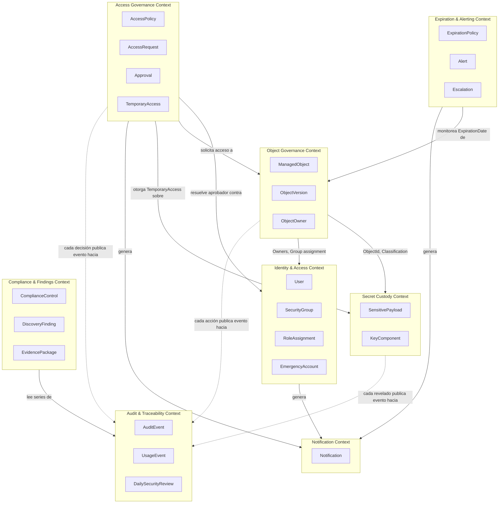
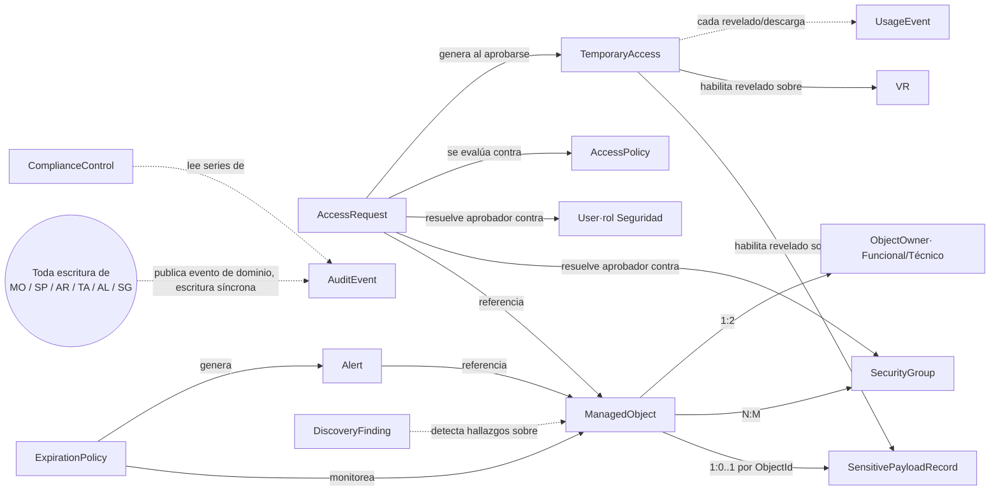
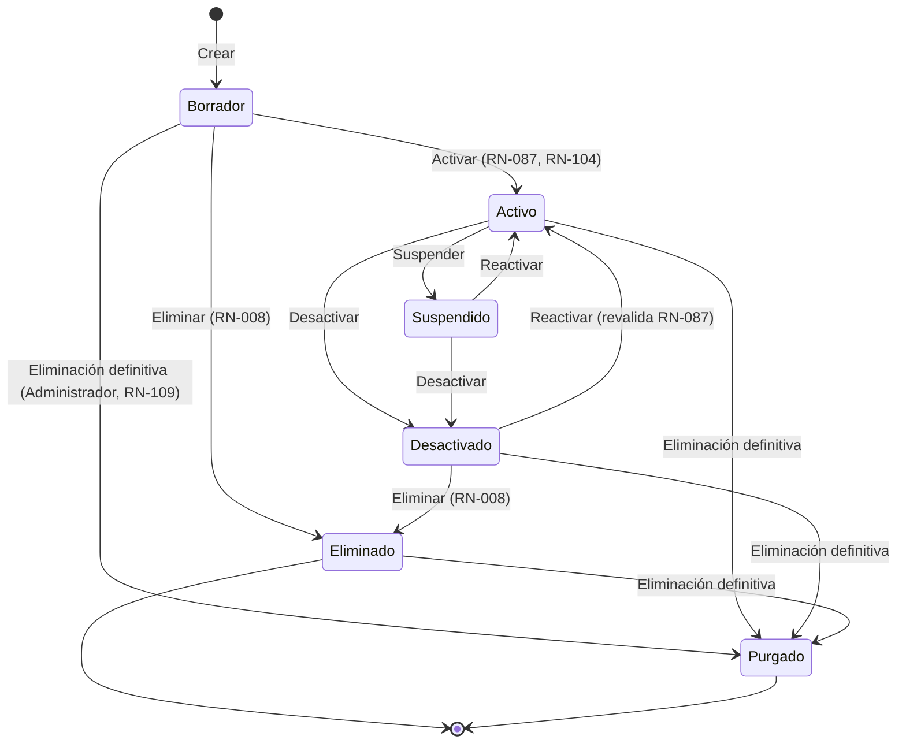
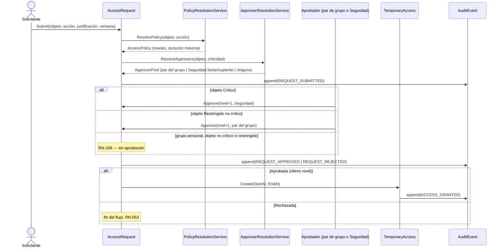
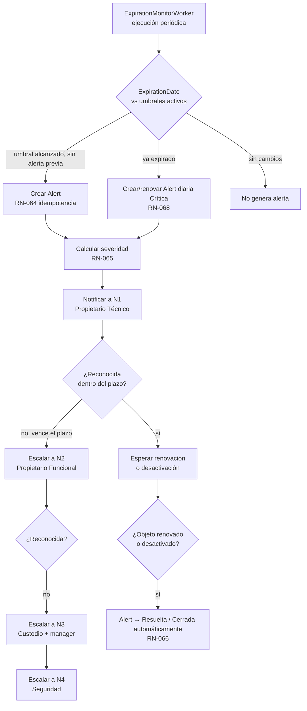

# Domain Model — Plataforma de Gobierno de Credenciales, Certificados y Secretos (PGCCS)

| Atributo | Valor |
|---|---|
| Documento | domain-model.md |
| Versión | 1.0 |
| Fecha | 2026-09-24 |
| Rol autor | Software Architect (.NET, DDD, C4, CQRS) |
| Fuente | [docs/specs/functional/](../specs/functional/) — 01-vision-document.md, 02-user-stories.md, 03-domain-glossary.md, 04-non-functional-requirements.md, 05-traceability-matrix.md |
| Documentos relacionados | [c4-containers.md](c4-containers.md), [ADR-001-layered-cqrs-architecture.md](ADR-001-layered-cqrs-architecture.md) |
| Regla de trazabilidad | Todo elemento cita el `US-`, `RF-`, `RN-` o `RNF-` de origen. No se introduce ningún requisito nuevo; donde la especificación funcional no basta, la fila queda marcada **[SUPUESTO]** o **[RIESGO]** en §12. |

> Este documento no modifica ningún archivo de `docs/specs/functional/`. Los identificadores `US-`, `RF-`, `RN-`, `RNF-`, `DEC-` citados son los ya existentes en esa carpeta.

---

## 1. Descripción general del dominio

La PGCCS gobierna el ciclo de vida completo de los **objetos administrados** (certificados, credenciales, secretos, claves criptográficas y cuentas de servicio) de un banco: alta, clasificación, propiedad, custodia cifrada, control de acceso, aprobación, vencimiento, uso y auditoría.

El dominio se divide en un **núcleo de gobierno de objetos** (qué existe, quién responde por ello, cómo se clasifica) y una **capa de control transversal** (quién puede verlo, quién debe aprobar, cuándo vence, qué queda registrado) que se aplica de la misma forma a los cinco tipos de objeto. Esta separación es la que justifica el diseño en capas con CQRS de [ADR-001](ADR-001-layered-cqrs-architecture.md): el lado de comandos protege las invariantes de negocio (RN-052, RN-096, RN-104, RN-117…) y el lado de consultas atiende dashboards, búsquedas y reportes sin pasar por esas invariantes.

## 2. Actores y perfiles

Igual que en [01-vision-document.md §4](../specs/functional/01-vision-document.md), los 9 perfiles de negocio se implementan con 6 roles de sistema, combinados con ámbitos y con la pertenencia a Security Group. Un usuario puede tener varios roles (DEC-17); solo **Auditor** y **Seguridad** son exclusivos (RN-036).

| Rol de sistema | Ámbito típico | Referencia |
|---|---|---|
| Administrador | Global | 03 §4.1 |
| Custodio | Área / Aplicación | 03 §4.1 |
| Propietario | Objeto (derivado de RN-037) | 03 §4.1 |
| Operador | Área / Aplicación / Grupo | 03 §4.1 |
| Auditor | Global, solo lectura | 03 §4.1 |
| Seguridad | Global | 03 §4.1 |

## 3. Subdominios

| Subdominio | Tipo (Evans) | Responsabilidad | Historias principales |
|---|---|---|---|
| **Gobierno de Objetos** | Núcleo (core) | Inventario, clasificación, propiedad, versionamiento, ciclo de vida, eliminación | US-001 a US-019, US-055 |
| **Custodia de Secretos** | Núcleo (core) | Cifrado de sobre con KEK local, modo de custodia, llave dividida | US-015 a US-017, US-056 a US-058 |
| **Identidad y Grupos de Acceso** | Genérico (con reglas propias de SoD → soporte) | Autenticación Entra ID/AD/emergencia, roles, permisos, grupos de acceso | US-025 a US-030, US-053, US-062 |
| **Solicitudes y Aprobaciones** | Núcleo (core) | Access Policy, Access Request, Approval, Temporary Access | US-031 a US-035 |
| **Vencimientos y Alertas** | Soporte | Expiration Policy, Alert, Escalation | US-020 a US-024 |
| **Auditoría y Trazabilidad** | Soporte (crítico para cumplimiento) | Audit Event append-only, Usage Event, revisión diaria | US-036 a US-040, US-059 |
| **Cumplimiento y Hallazgos** | Soporte | Compliance Control, Discovery Finding, Evidence Package | US-044, US-050, US-052 |
| **Notificaciones** | Genérico | Envío por correo/Teams, avisos de grupo y de Seguridad | US-047, US-054 |
| **Reportería y Dashboards** | Soporte (solo lectura, lado Query) | Indicadores operativos/ejecutivos, exportación | US-041 a US-045 |

## 4. Bounded Contexts

**Contrato entre contextos:** dentro de un mismo proceso .NET y una misma base SQL Server (ver [ADR-001 §Decisión](ADR-001-layered-cqrs-architecture.md)), los bounded contexts se comunican por **llamadas de aplicación in-process** (Domain Services / Command Handlers), no por mensajería asíncrona ni por bases de datos separadas. La flecha punteada hacia *Audit & Traceability* representa la publicación de un evento de dominio que un manejador dentro del mismo proceso persiste de forma síncrona y transaccional (RN-079, fail-closed) — no un bus de eventos externo.

## 5. Agregados y Aggregate Roots

| # | Aggregate Root | Contexto | Entidades internas | Invariantes que protege |
|---|---|---|---|---|
| A1 | **ManagedObject** (con sus 5 especializaciones: Credential, Certificate, Secret, CryptographicKey, ServiceAccount) | Object Governance | ObjectVersion (histórico), OwnerAssignment (funcional/técnico), GroupAssignment[], ApplicationAssignment[], InstallationLocation[] (certificados) | RN-001 a RN-011, RN-087 a RN-089, RN-104, RN-107, RN-124 |
| A2 | **SensitivePayloadRecord** | Secret Custody | KeyComponent[] (0, 1 o 2: usuario y Seguridad), CustodianDesignation[] | RN-083, RN-111 a RN-118 |
| A3 | **User** (proyección local de identidad) | Identity & Access | RoleAssignment[], GroupMembership[] (solo lectura del lado del usuario) | RN-030 a RN-032, RN-123 |
| A4 | **SecurityGroup** | Identity & Access | Member[], Responsible[], NotificationSetting | RN-033 a RN-035, RN-103 a RN-106, RN-108 |
| A5 | **EmergencyAccount** | Identity & Access | — | RN-123 |
| A6 | **RoleDefinition** | Identity & Access (configuración) | PermissionGrant[] | RN-039, RN-040 |
| A7 | **AccessPolicy** | Access Governance (configuración) | ApprovalLevelDefinition[] | RN-044 a RN-046, RN-052 |
| A8 | **AccessRequest** | Access Governance | ApprovalDecision[] (uno por nivel) | RN-047 a RN-055, RN-106, RN-122 |
| A9 | **TemporaryAccess** | Access Governance | — | RN-056 a RN-060 |
| A10 | **ExpirationPolicy** | Expiration & Alerting (configuración) | ThresholdDefinition[], EscalationRule[] | RN-061 a RN-063, RN-069 a RN-071 |
| A11 | **Alert** | Expiration & Alerting | EscalationEvent[] (histórico) | RN-064 a RN-071 |
| A12 | **AuditEvent** | Audit & Traceability | — (registro append-only, no se modifica tras crearse) | RN-075 a RN-079, RN-119 |
| A13 | **UsageEvent** | Audit & Traceability | — | RN-072 a RN-074 |
| A14 | **DailySecurityReview** | Audit & Traceability | DetectionRuleHit[] | RN-119, RNF-AUD-07 |
| A15 | **ComplianceControl** | Compliance & Findings (configuración + resultado) | ControlResult[] (serie histórica) | RN-102 |
| A16 | **DiscoveryFinding** | Compliance & Findings | — | RN-097, RN-098 |
| A17 | **EvidencePackage** | Compliance & Findings | EvidenceFileManifest[] | RN-100, RN-101 |
| A18 | **Notification** | Notification | — | RN-067, RN-085, RN-099, RN-105, RN-110 |

**Reglas de diseño de agregados aplicadas:**

1. **Un agregado = un límite de consistencia transaccional.** `ManagedObject` no incluye `AccessRequest` ni `Alert` como entidades internas: se referencian por `ObjectId` (referencia por identidad, no por objeto). Esto evita que aprobar una solicitud bloquee la edición de metadatos del objeto, y viceversa.
2. **`SensitivePayloadRecord` es un agregado separado de `ManagedObject`**, aunque 1:1 con él, porque su ciclo de vida (cifrado, componentes, custodios) tiene reglas propias (RN-111 a RN-118) y vive físicamente en el **Encrypted Vault**, no en la misma tabla transaccional que los metadatos (ver [c4-containers.md §2 — Encrypted Vault](c4-containers.md#22-contenedores) y **[ASSUMPTION-ARCH-01]** en §12).
3. **`AccessRequest` es la raíz que agrupa las `ApprovalDecision`** (RN-051 exige inmutabilidad por decisión); `TemporaryAccess` es un agregado propio porque su reloj de vida (RN-056, RN-057) es independiente de la solicitud que lo originó — una vez creado, revocarlo no reabre la solicitud.
4. **`AuditEvent` no es un agregado DDD clásico** (no expone comportamiento de negocio ni invariantes mutables): es un **registro de un log append-only** con encadenamiento hash (RN-076). Se modela como *Event Store* de solo inserción, escrito por un `IAuditWriter` de infraestructura invocado de forma síncrona por todos los Command Handlers (ver [ADR-001](ADR-001-layered-cqrs-architecture.md)).

## 6. Diagrama de clases del dominio

```mermaid
classDiagram
    class ManagedObject {
        <<abstract, aggregate root>>
        +ObjectId Id
        +ObjectCode Code
        +string Name
        +ObjectType Type
        +string Subtype
        +Criticality Criticality
        +Sensitivity Sensitivity
        +Environment Environment
        +AreaId AreaId
        +CustodyMode CustodyMode
        +bool SplitKey
        +LifecycleState LifecycleState
        +ExpirationStatus ExpirationStatus
        +DateTime ExpirationDate
        +int CurrentVersion
        +Activate()
        +Suspend(reason)
        +Deactivate(reason)
        +Reactivate()
        +RequestLogicalDeletion(reason)
        +ApplyLogicalDeletion(approverId)
        +Purge(reason, executorId, authorizerId)
        +Reclassify(criticality, sensitivity)
        +AssignOwner(role, userId)
        +AssignToGroup(groupId)
        +MarkSplitKey(bool)
    }
    class Credential {
        +string TargetSystem
        +string AccountName
        +int MaxRotationDays
    }
    class Certificate {
        +string Subject
        +string Issuer
        +string ThumbprintSha256
        +bool HasPrivateKey
        +DateTime NotAfter
    }
    class Secret {
        +string Issuer
        +string ClientId
        +string[] Scopes
    }
    class CryptographicKey {
        +string Algorithm
        +int KeyLength
        +int CryptoperiodDays
        +string KeyCheckValue
    }
    class ServiceAccount {
        +DirectorySource DirectorySource
        +string AccountIdentifier
        +bool InteractiveLogonAllowed
    }
    ManagedObject <|-- Credential
    ManagedObject <|-- Certificate
    ManagedObject <|-- Secret
    ManagedObject <|-- CryptographicKey
    ManagedObject <|-- ServiceAccount

    class ObjectVersion {
        +int VersionNumber
        +string ChangedBy
        +DateTime ChangedAtUtc
        +string Reason
        +string ChangedFieldsJson
    }
    ManagedObject "1" *-- "many" ObjectVersion

    class ObjectOwnerAssignment {
        +OwnerRole Role
        +UserId UserId
        +DateTime AssignedAt
    }
    ManagedObject "1" *-- "1..2" ObjectOwnerAssignment

    class SensitivePayloadRecord {
        <<aggregate root>>
        +ObjectId ObjectId
        +CustodyMode Mode
        +bool SplitKey
        +CipherText SinglePieceValue
        +Reveal(actorId, accessId) PlaintextHandle
        +UpdateValue(newValue, reason)
    }
    class KeyComponent {
        +ComponentSide Side
        +CombinationMethod Method
        +CipherText EncryptedComponent
        +string KeyCheckValue
        +CustodianId[] AcceptedCustodians
        +Reveal(custodianId, accessId) PlaintextHandle
    }
    SensitivePayloadRecord "1" *-- "0..2" KeyComponent
    ManagedObject "1" -- "0..1" SensitivePayloadRecord : ObjectId (referencia)

    class SecurityGroup {
        <<aggregate root>>
        +GroupId Id
        +string Code
        +bool IsPersonal
        +AddMember(userId)
        +RemoveMember(userId)
        +DesignateResponsible(userId)
    }
    class GroupMember {
        +UserId UserId
        +DateTime AddedAt
        +string AddedBy
    }
    SecurityGroup "1" *-- "many" GroupMember
    ManagedObject "many" -- "many" SecurityGroup : GroupAssignment (referencia)

    class User {
        <<aggregate root>>
        +UserId Id
        +string EntraObjectId
        +UserStatus Status
        +AssignRole(role)
        +RevokeRole(role)
    }
    class RoleAssignment {
        +RoleName Role
        +Scope Scope
    }
    User "1" *-- "many" RoleAssignment

    class AccessPolicy {
        <<aggregate root>>
        +PolicyId Id
        +PolicyCondition Condition
        +int Version
        +TimeSpan MaxDuration
        +bool AllowJit
    }
    class ApprovalLevelDefinition {
        +int Level
        +ApproverKind ApproverKind
    }
    AccessPolicy "1" *-- "many" ApprovalLevelDefinition

    class AccessRequest {
        <<aggregate root>>
        +RequestId Id
        +UserId RequesterId
        +ObjectId[] Objects
        +ActionType Action
        +string Justification
        +TimeWindow RequestedWindow
        +RequestState State
        +Submit()
        +Approve(level, approverId)
        +Reject(level, approverId, comment)
        +Cancel()
    }
    class ApprovalDecision {
        +int Level
        +UserId ApproverId
        +Decision Decision
        +string Comment
        +DateTime DecidedAtUtc
    }
    AccessRequest "1" *-- "many" ApprovalDecision
    AccessRequest --> AccessPolicy : evaluada contra
    AccessRequest --> ManagedObject : ObjectId (referencia)

    class TemporaryAccess {
        <<aggregate root>>
        +AccessId Id
        +ObjectId ObjectId
        +UserId BeneficiaryId
        +DateTime StartAt
        +DateTime EndAt
        +TemporaryAccessState State
        +Activate()
        +Revoke(reason, actorId)
    }
    TemporaryAccess --> AccessRequest : originada por

    class ExpirationPolicy {
        <<aggregate root>>
        +PolicyId Id
        +int[] ThresholdDays
        +EscalationRule[] Rules
    }
    class Alert {
        <<aggregate root>>
        +AlertId Id
        +ObjectId ObjectId
        +int ThresholdDays
        +AlertSeverity Severity
        +AlertState State
        +Acknowledge(userId, comment)
        +Resolve()
        +Escalate(level)
    }
    Alert --> ManagedObject : ObjectId (referencia)
    Alert --> ExpirationPolicy : generada según

    class AuditEvent {
        <<append-only log>>
        +long SequenceNumber
        +DateTime TimestampUtc
        +string ActorId
        +string Action
        +string ResourceType
        +string ResourceId
        +string Result
        +string PreviousHash
        +string Hash
    }
    class UsageEvent {
        +ObjectId ObjectId
        +string ActorType
        +string ActorId
        +string Action
        +DateTime TimestampUtc
    }
    class DiscoveryFinding {
        <<aggregate root>>
        +FindingId Id
        +FindingCategory Category
        +FindingState State
        +Accept(reason, reviewDate, approverId)
        +Discard(reason)
    }
    class ComplianceControl {
        <<aggregate root>>
        +ControlId Id
        +string Formula
        +decimal Threshold
    }
    class EvidencePackage {
        <<aggregate root>>
        +PackageId Id
        +string ManifestSha256
    }
```

*Nota de notación:* `<<aggregate root>>` marca la raíz transaccional; el resto de clases sin ese estereotipo son entidades o value objects internos al agregado indicado por composición (`*--`). Las asociaciones marcadas «(referencia)» son referencias por identidad entre agregados, nunca por objeto embebido, conforme a la regla de diseño §5.1.

## 7. Relación entre agregados

## 8. Entidades

Ver §5 y §6 para el detalle campo a campo. Resumen de entidades no-raíz relevantes:

| Entidad | Agregado dueño | Rol |
|---|---|---|
| ObjectVersion | ManagedObject | Instantánea inmutable tras cada cambio (RN-092) |
| ObjectOwnerAssignment | ManagedObject | Propietario Funcional / Técnico vigente (RN-087) |
| GroupMember | SecurityGroup | Membresía con fecha de alta y autor (RN-034) |
| KeyComponent | SensitivePayloadRecord | Componente de usuario o de Seguridad (RN-113) |
| CustodianDesignation | SensitivePayloadRecord (vía KeyComponent) | Custodio nominal que aceptó su rol (RN-117) |
| ApprovalDecision | AccessRequest | Decisión inmutable de un nivel (RN-051) |
| EscalationEvent | Alert | Historial de escalamientos (RN-069, RN-070) |
| DetectionRuleHit | DailySecurityReview | Coincidencia de una regla de detección (RN-119) |
| EvidenceFileManifest | EvidencePackage | Huella SHA-256 de cada archivo del paquete (RN-100) |
| ControlResult | ComplianceControl | Resultado diario, serie histórica (RN-102) |

## 9. Value Objects

| Value Object | Composición / invariante | Origen |
|---|---|---|
| `ObjectCode` | `OBJ-NNNNNN`, inmutable, único | RN-001 |
| `Justification` | string, ≥ 20 caracteres | RN-047 |
| `TimeWindow` | `(StartAt, EndAt)`, `EndAt > StartAt` | RN-056 |
| `CipherText` | bytes + `KeyId` de la DEK que lo cifró; nunca serializable a texto plano | RN-083, RNF-SEG-03 |
| `KeyCheckValue` | hash corto no reversible de una clave criptográfica o de un componente XOR | RN-026, RN-116 |
| `Hash` / `PreviousHash` | SHA-256, forma la cadena de auditoría | RN-076 |
| `CorrelationId` | GUID que enlaza UI → API → AuditEvent → UsageEvent | 04 §Auditoría |
| `PolicyCondition` | combinación `(Type?, Subtype?, Criticality?, Sensitivity?, Environment?, Action?)` | RN-044, RN-062 |
| `ApproverPool` | conjunto resuelto de `UserId` elegibles para un nivel, calculado, no persistido | RN-106, RN-122 |
| `RiskScore` | 0–100, fórmula ponderada (§Índice de riesgo, US-042) | US-042 |

## 10. Enumeraciones y catálogos

| Enumeración | Valores | Origen |
|---|---|---|
| `ObjectType` | Certificate, CryptographicKey, Secret, Credential, ServiceAccount | 01 §1.2 |
| `Criticality` | Crítico, Alto, Medio, Bajo | RN-003 |
| `Sensitivity` | Pública, Interna, Confidencial, Restringida | RN-004 |
| `Environment` | Producción, Contingencia/DR, Preproducción/UAT, QA, Desarrollo | RN-006 |
| `LifecycleState` | Borrador, Activo, Suspendido, Desactivado, Eliminado, Purgado | RN-007, RN-109 |
| `ExpirationStatus` | Vigente, PróximoAVencer, Expirado, SinVencimiento | RN-094 |
| `CustodyMode` | Internal, MetadataOnly | RN-023 |
| `OwnerRole` | Funcional, Técnico | 03 §2.22 |
| `RoleName` | Administrador, Custodio, Propietario, Operador, Auditor, Seguridad | 03 §4.1 |
| `PermissionAction` | Consultar, Crear, Modificar, Descargar, Eliminar, Aprobar, Exportar, Administrar | RN-040 |
| `RequestState` | Borrador, Pendiente, EnAprobación, Aprobada, Rechazada, Cancelada, Expirada | 03 §2.12 |
| `TemporaryAccessState` | Programado, Disponible, Activo, Expirado, Revocado | 03 §2.14 |
| `AlertSeverity` | Baja, Media, Alta, Crítica | RN-065 |
| `AlertState` | Generada, Enviada, Reconocida, Escalada, Resuelta, CerradaAutomáticamente | 03 §2.16 |
| `ApprovalDecisionKind` | Aprobado, Rechazado | RN-051 |
| `ComponentSide` | Usuario, Seguridad | RN-113 |
| `CombinationMethod` | Concatenación, XOR, ContraseñaDivididaPfx | RN-116 |
| `FindingCategory` | NoRegistrado, Huérfano, Expirado, ConfiguraciónInsegura | RN-097 |
| `FindingState` | Abierto, EnGestión, Resuelto, RiesgoAceptado, Descartado | RN-098 |
| `PurgeReasonCatalog` | CreadoPorError, Duplicado, DatosIncorrectos, Otro | RN-109 |
| `DirectorySource` | EntraID, AD, Local, Database | 03 §2.6 |
| `ActorType` | User, Application, System | 03 §2.18 |

## 11. Servicios de dominio

| Servicio de dominio | Responsabilidad | Reglas que implementa |
|---|---|---|
| `AuthorizationService` | Calcula el permiso efectivo de un usuario sobre un objeto/acción (unión de roles, ámbito, grupos, SoD) | RN-010, RN-036, RN-040 a RN-043, RN-095 |
| `PolicyResolutionService` | Dado un objeto y una acción, resuelve la Access Policy más específica/restrictiva aplicable | RN-044, RN-062 |
| `ApproverResolutionService` | Calcula el `ApproverPool` de un nivel: par del grupo (RN-106), Seguridad titular/suplente (RN-122), o ninguno en grupo personal (RN-108) | RN-054, RN-106, RN-122 |
| `SegregationOfDutiesService` | Valida combinaciones de rol al asignar roles o miembros de grupo; detecta violaciones sobrevenidas | RN-036, RN-095, RN-103 |
| `GroupClassificationService` | Determina si un grupo es "personal" (1 miembro) y si un objeto puede asignarse a él | RN-104, RN-108 |
| `ExpirationCalculationService` | Calcula `ExpirationStatus` y fecha de expiración derivada (rotación, criptoperíodo) | RN-014, RN-025, RN-094 |
| `EscalationService` | Determina el nivel de escalamiento y el plazo de reconocimiento según severidad | RN-069 a RN-071 |
| `EnvelopeEncryptionService` | Orquesta cifrado de sobre: usa el certificado local (KEK) para envolver/desenvolver cada DEK mediante RSA-OAEP; nunca persiste la KEK en texto plano ni fuera del almacén de certificados de la máquina | RN-083, RNF-SEG-03/04 |
| `SplitKeyService` | Aplica el conocimiento dividido: valida custodios, combina componentes solo en memoria y solo para el sistema destino, nunca en un objeto de dominio persistente | RN-111 a RN-118 |
| `RiskIndexCalculationService` | Calcula el índice de riesgo del dashboard ejecutivo | US-042 |
| `ComplianceEvaluationService` | Ejecuta diariamente las fórmulas de `ComplianceControl` contra el estado del inventario y la auditoría | RN-102 |
| `AuditChainVerificationService` | Verifica el encadenamiento hash de `AuditEvent` | RN-076 |
| `CardDataGuardService` | Detecta y bloquea secuencias tipo PAN en metadatos y cargas masivas | RN-124 |

## 12. Eventos de dominio

| Evento | Disparado por | Consumidores (dentro del mismo proceso) |
|---|---|---|
| `ManagedObjectCreated` | ManagedObject.Create | AuditWriter, ComplianceIndexer |
| `ManagedObjectActivated` | ManagedObject.Activate | AuditWriter, ExpirationScheduler |
| `ManagedObjectLifecycleChanged` | Suspend/Deactivate/Reactivate | AuditWriter, TemporaryAccess (revocación en cascada, RN-009) |
| `ManagedObjectLogicallyDeleted` | ApplyLogicalDeletion | AuditWriter, GroupNotifier (RN-105) |
| `ManagedObjectPurged` | Purge | AuditWriter (evento `OBJECT_PURGED`, RN-109) |
| `OwnerReassigned` | AssignOwner | AuditWriter, Notifier (propietario anterior y nuevo) |
| `SplitKeyEnabled` / `SplitKeyDisabled` | MarkSplitKey | AuditWriter, SecurityNotifier (RN-110) |
| `SecretValueRevealed` | SensitivePayloadRecord.Reveal | AuditWriter, UsageEventWriter |
| `SecretComponentRevealed` | KeyComponent.Reveal | AuditWriter, UsageEventWriter |
| `AccessRequestSubmitted` | AccessRequest.Submit | Notifier (aprobadores elegibles) |
| `AccessRequestApproved` / `Rejected` | Approve/Reject | AuditWriter, Notifier, TemporaryAccessFactory |
| `TemporaryAccessActivated` | TemporaryAccess.Activate | AuditWriter |
| `TemporaryAccessRevoked` | Revoke (manual, RN-057, RN-009, RN-035) | AuditWriter, Notifier |
| `ExpirationThresholdReached` | ExpirationMonitorWorker | AlertFactory (RN-064) |
| `AlertEscalated` | Alert.Escalate | Notifier, AuditWriter |
| `GroupMembershipChanged` | SecurityGroup.Add/RemoveMember | SoDValidator, GroupClassificationService, TemporaryAccess (revocación, RN-035) |
| `AuditChainVerificationFailed` | AuditChainVerificationService | AlertFactory (severidad Crítica, RN-076) |
| `DiscoveryFindingRaised` | ReconciliationWorker | Notifier (Custodio/Seguridad) |
| `ComplianceControlBreached` | ComplianceEvaluationService | AlertFactory |
| `EmergencyModeActivated/Deactivated` | EmergencyAccount | AuditWriter, AlertFactory (crítica) |

Todos los eventos se procesan **de forma síncrona y transaccional dentro del mismo `DbContext`** que originó el cambio (ver [ADR-001](ADR-001-layered-cqrs-architecture.md)): no hay bus de mensajería, no hay consistencia eventual entre agregados y el evento de auditoría. Esto es lo que garantiza RN-079 (fail-closed: si no se puede escribir el `AuditEvent`, la transacción completa se revierte).

## 13. Reglas e invariantes de negocio clave

Lista no exhaustiva de las invariantes que el modelo de dominio debe hacer imposible de violar (el catálogo completo de 124 reglas está en [03-domain-glossary.md](../specs/functional/03-domain-glossary.md)):

| Invariante | Dónde se protege | Regla |
|---|---|---|
| Un objeto Activo siempre tiene Propietario Funcional y Técnico | `ManagedObject.Activate()` | RN-087 |
| El tipo de un objeto no cambia tras crearse | `ManagedObject` sin setter de `Type` | RN-002 |
| Un objeto Crítico o Restringido solo se activa si su grupo tiene ≥ 2 miembros activos y no es personal | `ManagedObject.Activate()` invoca `GroupClassificationService` | RN-104 |
| Nadie aprueba su propia solicitud | `AccessRequest.Approve()` valida `approverId != requesterId && approverId != beneficiaryId` | RN-054 |
| Los objetos Críticos los aprueba solo Seguridad (titular o suplente) | `ApproverResolutionService` + `AccessRequest.Approve()` | RN-122 |
| El material de una `KeyComponent` nunca se expone completo | `SensitivePayloadRecord` no expone un getter de valor combinado; solo `SplitKeyService` combina en memoria transitoria y exclusivamente al momento de entrega | RN-113 |
| Un objeto con llave dividida no se activa sin un custodio aceptado por lado | `SensitivePayloadRecord` invariante de estado | RN-117 |
| Ningún `AuditEvent` se modifica o elimina | Ausencia de método `Update`/`Delete`; repositorio solo expone `Append` | RN-075 |
| Toda operación sensible sin auditoría exitosa se revierte | Unit of Work: `AuditWriter.Append()` participa de la misma transacción que el cambio de dominio | RN-079 |
| Un `Temporary Access` nunca sobrevive a `EndAt` | `TemporaryAccessExpiryWorker` + verificación en cada acceso (RN-057) | RN-056, RN-057 |
| Auditor y Seguridad son incompatibles entre sí y con cualquier otro rol | `SegregationOfDutiesService.Validate()` | RN-036 |
| No se registran datos de tarjeta | `CardDataGuardService` intercepta comandos de creación/edición y de carga masiva | RN-124 |

## 14. Relaciones entre entidades (resumen)

Ver diagramas §6 y §7. Cardinalidades clave no evidentes en el diagrama de clases:

- `ManagedObject` 1—N `Alert` (histórico; solo hay alertas *abiertas* activas por umbral, RN-064).
- `ManagedObject` N—M `Application` (RN-091), N—M `SecurityGroup`, 1—1 `Area` (RN-090).
- `SecurityGroup` 1—N `GroupMember`; un `GroupMember` con 1 elemento marca el grupo como personal (RN-108).
- `AccessRequest` 1—0..1 `TemporaryAccess` (una solicitud aprobada genera como máximo un acceso; RN-059 impide extender, exige nueva solicitud).
- `SensitivePayloadRecord` 1—0..2 `KeyComponent` (0 si `SplitKey = false` y el valor vive como pieza única; 2 si `SplitKey = true`).

## 15. Diagramas de flujo

### 15.1 Ciclo de vida de un Managed Object

*(reproduce exactamente [03-domain-glossary.md §3.1](../specs/functional/03-domain-glossary.md); no se altera el original.)*

### 15.2 Flujo de solicitud, aprobación y otorgamiento de acceso

### 15.3 Flujo de vencimiento, alerta y escalamiento

## 16. Matriz de trazabilidad — Historias de usuario ↔ Elementos del dominio

| US | Título (resumen) | Agregado(s) | Servicio(s) de dominio | Eventos |
|---|---|---|---|---|
| US-001 a US-005 | Registrar certificado / secreto / credencial / cuenta / clave | ManagedObject (subtipos), SensitivePayloadRecord | EnvelopeEncryptionService, CardDataGuardService | ManagedObjectCreated |
| US-006, US-019 | Editar objeto / historial de versiones | ManagedObject, ObjectVersion | — | ManagedObjectLifecycleChanged |
| US-007 | Administrar estado del objeto | ManagedObject | — | ManagedObjectLifecycleChanged |
| US-008 | Eliminar objeto lógicamente | ManagedObject, AccessRequest | ApproverResolutionService | ManagedObjectLogicallyDeleted |
| US-009, US-010 | Consultar / buscar | ManagedObject (lado Query) | AuthorizationService | — |
| US-011 | Clasificar criticidad/sensibilidad | ManagedObject | — | — |
| US-012 | Carga inicial CSV | ManagedObject (batch) | CardDataGuardService | ManagedObjectCreated (N) |
| US-013, US-014 | Propiedad / huérfanos | ManagedObject, User | — | OwnerReassigned |
| US-015 a US-017 | Cifrado, revelado, descarga de llave privada | SensitivePayloadRecord, TemporaryAccess | EnvelopeEncryptionService | SecretValueRevealed |
| US-020 a US-024 | Políticas de expiración, monitoreo, alertas, escalamiento | ExpirationPolicy, Alert | ExpirationCalculationService, EscalationService | ExpirationThresholdReached, AlertEscalated |
| US-025 a US-030 | Entra ID/AD, grupos, roles, SoD | User, SecurityGroup, RoleDefinition | SegregationOfDutiesService | GroupMembershipChanged |
| US-031 a US-033 | Solicitar / configurar flujos / aprobar | AccessRequest, AccessPolicy | PolicyResolutionService, ApproverResolutionService | AccessRequestSubmitted/Approved/Rejected |
| US-034, US-035 | Acceso temporal JIT / revocación | TemporaryAccess | — | TemporaryAccessActivated/Revoked |
| US-036 a US-040 | Auditoría, integridad, uso | AuditEvent, UsageEvent | AuditChainVerificationService | AuditChainVerificationFailed |
| US-041 a US-045 | Dashboards y reportes | (lado Query, read models) | RiskIndexCalculationService | — |
| US-046 | API REST | (todos, vía Application layer) | AuthorizationService | — |
| US-047, US-054 | Notificaciones / aviso a Seguridad | Notification | — | — |
| US-048 | SIEM (F2) | AuditEvent | — | — |
| US-049, US-050 | Descubrimiento / hallazgos | DiscoveryFinding | — | DiscoveryFindingRaised |
| US-051 | No exposición de secretos | (transversal) | — | — |
| US-052 | Controles de cumplimiento | ComplianceControl | ComplianceEvaluationService | ComplianceControlBreached |
| US-053 | Notificaciones de grupo | SecurityGroup, Notification | — | — |
| US-055 | Eliminación definitiva | ManagedObject | — | ManagedObjectPurged |
| US-056 a US-058 | Llave dividida y custodios | SensitivePayloadRecord, KeyComponent | SplitKeyService | SplitKeyEnabled, SecretComponentRevealed |
| US-059 | Revisión diaria de seguridad | DailySecurityReview, AuditEvent | AuditChainVerificationService | — |
| US-062 | Cuentas de emergencia | EmergencyAccount | — | EmergencyModeActivated |

*(Todos los identificadores `US-` existen en [02-user-stories.md](../specs/functional/02-user-stories.md); no se crea ningún `US-TEMP`.)*

## 17. Supuestos, riesgos y decisiones pendientes

| ID | Tipo | Descripción | Impacto |
|---|---|---|---|
| **[SUPUESTO] ASSUMPTION-ARCH-01** | Supuesto arquitectónico | La especificación funcional (DEC-01, DEC-35) describe la custodia "Interna" como cifrado local mediante una KEK en un certificado de la máquina. El encargo de arquitectura exige explícitamente un nodo físico separado, el **Encrypted Vault**, distinto de SQL Server, para el contenido sensible. Se asume que `SensitivePayloadRecord` y `KeyComponent` (ciphertext) se persisten en ese Encrypted Vault (modelado como una base de datos SQL Server dedicada, en un segmento de red propio, con su propia cuenta de servicio de mínimo privilegio), mientras que la base "SQL Server" transaccional solo guarda metadatos y un puntero (`VaultBlobId`). Esto **no contradice** la especificación funcional (sigue siendo custodia "Interna" desde el punto de vista del usuario) y refuerza R-05/RNF-SEG-11. Ver [c4-containers.md §2.2](c4-containers.md#22-contenedores). | Alto — define el límite físico entre contenedores 3 y 4 del encargo de arquitectura. |
| **[SUPUESTO] ASSUMPTION-ARCH-02** | Supuesto arquitectónico | DevExpress se usa solo en el Front-End (componentes de grilla, formularios); no expone lógica de negocio ni acceso a datos propio — todo pasa por la API, conforme a R-07. | Bajo |
| **[SUPUESTO] ASSUMPTION-ARCH-03** | Supuesto arquitectónico | El Front-End ASP.NET Core MVC actúa como *cliente confidencial* OAuth 2.0 (Authorization Code + PKCE) frente a Entra ID y como cliente HTTP autenticado frente a la API interna; no mantiene su propia sesión de dominio, solo sesión de presentación. | Medio |
| **[RIESGO] RISK-ARCH-01** | Riesgo | Las cuentas de emergencia (US-062) introducen una ruta de excepción a la regla general "todo pasa por Entra ID". Debe implementarse como un *Bounded Context* aislado con su propio conjunto mínimo de invariantes, para no debilitar el resto del modelo de autorización. | Alto — ver [ADR-001 §Riesgos](ADR-001-layered-cqrs-architecture.md). |
| **[RIESGO] RISK-ARCH-02** | Riesgo | `SensitivePayloadRecord` y `KeyComponent` viven en un agregado distinto del `ManagedObject` pero deben mantenerse en el mismo commit lógico al activar un objeto con llave dividida (RN-117: "no se activa sin custodio aceptado por lado"). Al ser dos agregados, esa invariante cruza el límite transaccional recomendado por DDD. Se mitiga con una transacción de base de datos única (posible porque hay una sola base SQL Server, ver ADR-001) más una verificación de precondición antes de confirmar, no con Sagas. | Medio |
| **[PENDIENTE]** | Decisión pendiente | El catálogo de `Area` y `Application` (RN-090, RN-091) no tiene un dueño de datos maestro definido en la especificación funcional (¿RRHH, CMDB, alta manual?). Se asume alta manual por el Administrador hasta que se decida una fuente maestra. | Bajo — no bloquea el diseño. |
