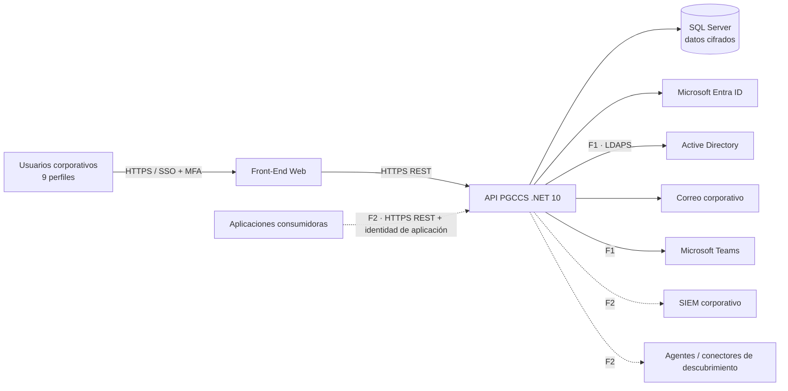

# 01 — Documento de Visión

**Plataforma de Gobierno de Credenciales, Certificados y Secretos (PGCCS)**

| Atributo | Valor |
|---|---|
| Documento | 01-vision-document.md |
| Versión | 1.0 |
| Estado | Borrador para revisión |
| Fecha | 2026-09-24 |
| Rol autor | Lead Requirements Engineer |
| Documentos relacionados | [02-user-stories.md](02-user-stories.md), [03-domain-glossary.md](03-domain-glossary.md), [04-non-functional-requirements.md](04-non-functional-requirements.md), [05-traceability-matrix.md](05-traceability-matrix.md) |

---

## 1. Introducción

### 1.1 Propósito de la plataforma

La PGCCS es la plataforma institucional para **inventariar, custodiar, proteger, controlar el acceso, monitorear y auditar** el ciclo de vida de los objetos sensibles que utilizan las aplicaciones y la infraestructura tecnológica del banco: certificados digitales, claves criptográficas, secretos, credenciales técnicas y cuentas de servicio.

Su propósito es sustituir el control disperso actual (hojas de cálculo, repositorios de código, correos, conocimiento individual) por un **punto único de gobierno**. Este punto garantiza:

- Inventario centralizado y confiable.
- Control de acceso seguro basado en identidad corporativa (Microsoft Entra ID).
- Trazabilidad completa e inmutable de toda acción.
- Gestión proactiva de vencimientos con alertamiento y escalamiento.
- Evidencias de auditoría y cumplimiento regulatorio.
- Gestión de riesgos sobre los objetos sensibles.
- Protección criptográfica de la información sensible.
- Segregación de funciones y principio de cuatro ojos.

### 1.2 Tipos de objetos administrados

| Categoría (Tipo) | Subtipos | Término del glosario |
|---|---|---|
| Certificado | Certificado digital genérico, SSL/TLS, VPN, API (mTLS cliente/servidor), SWIFT, Firma | Certificate |
| Clave criptográfica | Clave criptográfica, llave de cifrado (simétrica / asimétrica) | Cryptographic Key |
| Secreto | Secreto de aplicación, API Key, OAuth Token (client secret, refresh token, access token de larga duración) | Secret |
| Credencial | Contraseña técnica, credencial de base de datos, credencial de infraestructura, credencial de dispositivo de red | Credential |
| Cuenta de servicio | Service Principal, Managed Identity, cuenta de servicio AD/local, cuenta de servicio de base de datos | Service Account |

Todos los tipos anteriores son especializaciones del concepto **Managed Object (Objeto Administrado)** definido en el glosario.

### 1.3 Alcance (visión general)

La plataforma cubre el ciclo de vida de **gobierno** de los objetos: registro, clasificación, asignación de propiedad, custodia cifrada, control de acceso, aprobaciones, acceso temporal, monitoreo de vencimientos, alertamiento, auditoría, trazabilidad de uso, dashboards y reportería.

No es una Autoridad Certificadora, ni una solución PAM, ni un orquestador de rotación automática (ver §8 *Fuera de Alcance*).

### 1.4 Objetivos estratégicos

| ID | Objetivo estratégico |
|---|---|
| OE-01 | Reducir el riesgo operativo por interrupciones de servicio causadas por certificados o credenciales vencidos. |
| OE-02 | Reducir el riesgo de fuga o uso indebido de secretos y credenciales. |
| OE-03 | Contar con un inventario único, completo y con propietario asignado de todos los objetos sensibles. |
| OE-04 | Cumplir y evidenciar controles exigidos por ISO 27001, PCI DSS, DORA, SWIFT CSP y la regulación bancaria local. |
| OE-05 | Automatizar controles preventivos (aprobaciones, segregación de funciones, revocación) y detectivos (alertas, hallazgos). |
| OE-06 | Disminuir el esfuerzo y el tiempo de preparación de auditorías internas y externas. |

---

## 2. Problemas que resuelve

| ID | Problema | Situación actual | Impacto | Cómo lo resuelve la plataforma |
|---|---|---|---|---|
| P-01 | **Credenciales dispersas** | Contraseñas técnicas, API keys y secretos en archivos, código fuente, correos, wikis y hojas de cálculo. | Fuga de información, imposibilidad de revocar, dependencia de personas. | Repositorio centralizado cifrado, con visibilidad por grupos y acceso controlado. |
| P-02 | **Certificados sin control** | No existe inventario confiable de certificados SSL/TLS, VPN, API y SWIFT ni de su ubicación o propietario. | Caídas de servicio, rechazos de transacciones SWIFT, incumplimientos. | Inventario con extracción automática de metadatos y propietario obligatorio. |
| P-03 | **Falta de trazabilidad** | No se sabe quién consultó, cambió o utilizó un secreto. | Imposibilidad de investigar incidentes y de atribuir responsabilidades. | Bitácora de auditoría inmutable y eventos de uso por usuario y aplicación. |
| P-04 | **Riesgo de vencimientos** | Los vencimientos se detectan cuando el servicio falla. | Incidentes de disponibilidad y reputacionales. | Monitoreo continuo, alertas en 8 umbrales y escalamiento automático. |
| P-05 | **Accesos no controlados** | Cualquier persona con acceso al archivo o sistema puede ver credenciales sin aprobación. | Uso indebido, fraude interno, incumplimiento de mínimo privilegio. | RBAC, solicitudes con justificación, aprobaciones multinivel, cuatro ojos y acceso Just-In-Time con revocación automática. |
| P-06 | **Falta de evidencias para auditoría** | Las evidencias se construyen manualmente y son incompletas. | Hallazgos de auditoría y sanciones regulatorias. | Reportes regulatorios, paquetes de evidencia con integridad verificable y exportación. |

---

## 3. Objetivos de Negocio

| ID | Objetivo de negocio | Indicador (KPI) | Meta |
|---|---|---|---|
| ON-01 | **Centralizar la administración** | % de objetos sensibles conocidos registrados en la plataforma | ≥ 95 % a los 6 meses de la puesta en producción |
| ON-02 | **Reducir el riesgo operativo** | Incidentes causados por vencimientos de certificados o credenciales | 0 incidentes por vencimiento no alertado |
| ON-03 | **Mejorar el cumplimiento** | % de objetos con propietario funcional y técnico válido | 100 % |
| ON-04 | **Automatizar controles** | % de accesos a información sensible con aprobación registrada | 100 % |
| ON-05 | **Mejorar la auditoría** | Tiempo de preparación de evidencias para una auditoría | Reducción ≥ 70 % frente a la línea base |
| ON-06 | **Reducir exposición** | Secretos revelados sin acceso temporal vigente | 0 |

---

## 4. Perfiles de Usuario

### 4.1 Descripción de perfiles

| Perfil | Descripción | Responsabilidades principales | Rol(es) de sistema |
|---|---|---|---|
| **Administrador** | Administrador funcional/técnico de la plataforma. | Configurar parámetros, catálogos, grupos de acceso (y designar sus responsables), asignación de roles, políticas (con aprobación de Seguridad) e integraciones. Es el único que puede **eliminar definitivamente** objetos creados por error (con autorización de Seguridad si son críticos). Puede tener otros roles y ser miembro de grupos (DEC-17); el rol Administrador, por sí solo, no da acceso a valores secretos. **Nunca altera la auditoría.** | Administrador |
| **Custodio** | Responsable de la custodia operativa de los objetos de un área o dominio. | Registrar objetos, cargar y actualizar valores cifrados, mantener metadatos, atender alertas, aprobar solicitudes de primer nivel en su ámbito. | Custodio |
| **Propietario Funcional** | Responsable de negocio del servicio que utiliza el objeto. | Rendir cuentas del objeto, aprobar accesos a sus objetos, recibir alertas y escalamientos, validar la necesidad del objeto. | Propietario (implícito sobre sus objetos) |
| **Propietario Técnico** | Responsable técnico de la implementación del objeto (renovación, configuración). | Mantener datos técnicos, renovar o actualizar el objeto, atender alertas de vencimiento, aprobar accesos técnicos. | Propietario (implícito sobre sus objetos) |
| **Operador** | Personal de operación de TI (mesa de operaciones, NOC, soporte). | Consultar objetos asignados, solicitar acceso temporal, registrar renovaciones, reconocer alertas y aprobar como par las solicitudes sobre objetos restringidos de su grupo. | Operador |
| **Auditor** | Auditoría interna, externa o de cumplimiento. | Consultar inventario (sin valores), auditoría, evidencias y reportes; verificar integridad de la bitácora. **Solo lectura.** | Auditor |
| **Seguridad de la Información** | Área de ciberseguridad / CISO. | Definir políticas de acceso y expiración, aprobar operaciones de gobierno (políticas, roles privilegiados, aceptación de riesgo), supervisar los accesos críticos, aprobar los accesos a objetos críticos, autorizar la eliminación de objetos críticos, custodiar el componente de Seguridad de los objetos con llave dividida, recibir el aviso de creaciones, ediciones y eliminaciones, gestionar hallazgos, supervisar riesgos y cumplimiento, aprobar eliminaciones. | Seguridad |
| **Administrador de Infraestructura** | Responsable de servidores, redes, bases de datos y dispositivos. | Registrar y mantener credenciales de infraestructura, BD y red; consultar y solicitar acceso a objetos de su área. | Custodio u Operador con ámbito de área de Infraestructura; Propietario Técnico de sus objetos |
| **Administrador de Aplicaciones** | Responsable de aplicaciones de negocio. | Registrar y mantener secretos, API keys, OAuth tokens y cuentas de servicio de sus aplicaciones; registrar identidades de aplicación consumidoras. | Custodio u Operador con ámbito de Aplicación; Propietario Técnico de sus objetos |

> **Nota de diseño:** los nueve perfiles de negocio se implementan con los **seis roles de sistema** que exige el requerimiento (Administrador, Custodio, Propietario, Operador, Auditor, Seguridad) combinados con **ámbitos** (global, área, aplicación, grupo u objeto). El detalle de permisos y la matriz de segregación de funciones están en [03-domain-glossary.md §4](03-domain-glossary.md#4-matriz-de-roles-y-permisos).
>
> Los **grupos de acceso** son propios de la plataforma, sin relación con Entra ID ni con AD (DEC-12). Organizan a las personas que acceden a cada conjunto de objetos, reciben las notificaciones de actividad y aprueban como pares los accesos a objetos restringidos. **No otorgan roles**: los roles se asignan directamente a cada persona (DEC-13). Un usuario puede tener **varios roles** (DEC-17). Un grupo con un solo miembro es un **grupo personal**: su miembro usa los objetos no críticos ni restringidos sin autorizaciones (DEC-19, DEC-22).

### 4.2 Principios de acceso

1. **Denegación por defecto:** sin permiso explícito no hay acceso.
2. **Mínimo privilegio:** los permisos se otorgan por ámbito y, para valores sensibles, solo de forma temporal.
3. **Segregación de funciones:** un usuario puede tener varios roles, pero Auditor y Seguridad son exclusivos (DEC-17).
4. **Cuatro ojos:** las operaciones críticas requieren dos personas: quien solicita y quien aprueba (Seguridad o su suplente en los objetos críticos; otro miembro del grupo en los objetos restringidos).
5. **Sin autoaprobación:** ningún usuario aprueba sus propias solicitudes o cambios.

---

## 5. Casos de Uso de Alto Nivel

| ID | Caso de uso | Actores principales | Descripción | Historias |
|---|---|---|---|---|
| CU-01 | **Registro de objetos** | Custodio, Propietario Técnico, Adm. Infraestructura, Adm. Aplicaciones | Registrar, clasificar, editar, desactivar, eliminar lógicamente, versionar y consultar objetos; asignar propietarios; custodiar valores cifrados localmente; carga inicial masiva. | US-001 a US-019 |
| CU-02 | **Gestión de accesos** | Administrador, Seguridad, todos los usuarios | Autenticación SSO/MFA con Entra ID, grupos de acceso propios de la plataforma, roles, permisos, asignación de objetos a usuarios/grupos/áreas/aplicaciones, segregación de funciones, acceso temporal y JIT. | US-025 a US-030, US-034, US-035, US-053 |
| CU-03 | **Aprobación de solicitudes** | Solicitante, Propietario, Custodio, Seguridad | Solicitar acceso con justificación y duración; flujos configurables multinivel; aprobación de Seguridad en objetos críticos y de un par del grupo en objetos restringidos; no autoaprobación. | US-031 a US-033, US-008 |
| CU-04 | **Monitoreo de vencimientos** | Sistema, Propietarios, Custodio, Seguridad | Políticas de expiración, monitoreo continuo, alertas en 180/120/90/60/30/15/7/1 días, escalamiento, identificación de expirados. | US-020 a US-024, US-047 |
| CU-05 | **Auditoría** | Auditor, Seguridad, Sistema | Registro inmutable de consultas, descargas, cambios, eliminaciones, aprobaciones y accesos; eventos de uso; verificación de integridad; envío a SIEM (F2); prevención de exposición de secretos. | US-036 a US-040, US-048, US-051 |
| CU-06 | **Reportería** | Auditor, Seguridad, Gerencia, Custodio | Dashboards operativos y ejecutivos; reportes operativos, ejecutivos y regulatorios; evidencias; exportación a PDF, Excel y CSV. | US-041 a US-045, US-052 |
| CU-07 | **Integración por API** | Aplicaciones, sistemas externos | Consumo de la API REST documentada con OpenAPI; recuperación de secretos por aplicaciones autorizadas (F2, DEC-03); registro de uso. | US-046, US-039 |
| CU-08 | **Descubrimiento y hallazgos** *(Fase 2)* | Seguridad, Custodio | Descubrir objetos en servidores y dispositivos e identificar objetos no registrados, huérfanos, expirados o con configuración insegura. | US-049, US-050 |

### 5.1 Diagrama de contexto

Leyenda: **F1** = Fase 1 · **F2** = fase posterior (línea discontinua). Las fases reflejan las decisiones cerradas de §9.2. La plataforma se despliega on-premise (DEC-02) y no depende de ningún servicio de nube para proteger sus datos: toda la custodia criptográfica es local (DEC-35). Entra ID y Microsoft 365 se alcanzan por conectividad saliente controlada; no hay dependencia de Azure Key Vault en la Fase 1.

---

## 6. Alcance — Fase 1

La primera fase tiene como objetivo **centralizar el inventario y el control** de los objetos sensibles utilizados por las aplicaciones e infraestructura tecnológica del banco.

### 6.1 Inventario centralizado

- Registro de certificados digitales (SSL/TLS, VPN, API, SWIFT y otros).
- Registro de secretos (secretos de aplicación, API keys, OAuth tokens).
- Registro de credenciales técnicas (contraseñas técnicas, BD, infraestructura, dispositivos de red).
- Registro de cuentas de servicio.
- Registro de claves criptográficas y llaves de cifrado.
- Consulta y búsqueda de objetos registrados.
- Carga inicial del inventario mediante archivo CSV (DEC-04).

### 6.2 Gobierno de objetos

- Clasificación de criticidad (Crítico, Alto, Medio, Bajo).
- Clasificación de sensibilidad (Pública, Interna, Confidencial, Restringida).
- Asignación de Propietario Funcional y Propietario Técnico.
- Administración de estados de los objetos (Borrador, Activo, Suspendido, Desactivado, Eliminado).
- Eliminación definitiva de objetos creados por error, exclusiva del Administrador (DEC-18).
- Marca visible de objetos críticos; solo Seguridad autoriza su eliminación (DEC-18).
- Aviso a Seguridad de creaciones, ediciones y eliminaciones (DEC-20).
- Check «Llave dividida» en los objetos que lo requieran: el valor se divide entre el grupo y Seguridad (DEC-21).
- Versionamiento e historial de cambios.

### 6.3 Gestión de accesos

- Integración con Microsoft Entra ID (SSO, MFA, acceso condicional).
- Cuentas locales de emergencia ante la caída de Entra ID (DEC-33).
- Integración con Active Directory por LDAPS, solo para validar cuentas de servicio (DEC-06).
- Gestión de roles y permisos (RBAC, mínimo privilegio, segregación de funciones).
- Grupos de acceso propios de la plataforma (sin relación con Entra ID ni AD): organizan a las personas por conjunto de objetos, dan visibilidad, envían notificaciones de actividad y permiten la aprobación por pares en objetos restringidos.
- Solicitud y aprobación de accesos (multinivel, cuatro ojos).
- Acceso temporal y Just-In-Time con revocación automática.
- Custodios designados y guardia de Seguridad para los objetos con llave dividida (DEC-23, DEC-24).

### 6.4 Gestión de vencimientos

- Registro de fechas de expiración.
- Políticas de expiración configurables.
- Monitoreo de vencimientos.
- Alertas automáticas (180, 120, 90, 60, 30, 15, 7 y 1 día).
- Escalamiento de alertas.

### 6.5 Auditoría

- Registro de accesos, consultas, descargas, modificaciones, eliminaciones y aprobaciones.
- Bitácora inmutable con verificación de integridad.
- Trazabilidad de acciones y de uso sobre los objetos.
- Revisión diaria automatizada de los eventos de seguridad (DEC-30).

### 6.6 Monitoreo y reportes

- Dashboard operativo y dashboard ejecutivo.
- Reportes de inventario, de vencimientos y de auditoría.
- Reportes regulatorios y paquetes de evidencia.
- Exportación a PDF, Excel y CSV.

---

## 7. Mapa de fases de los requisitos

Algunos requisitos funcionales del encargo entran en conflicto con el alcance de la Fase 1 o con los supuestos pendientes. **Ningún requisito se omite**: todos están especificados en [02-user-stories.md](02-user-stories.md) con su fase asignada.

| ID | Conflicto identificado | Resolución adoptada | Fase |
|---|---|---|---|
| C-01 | Se requiere integración con Active Directory. | Cerrado por DEC-06: autenticación siempre con Entra ID; AD por LDAPS (solo lectura) únicamente para validar cuentas de servicio (US-026). Los grupos son propios de la plataforma (DEC-12). | F1 |
| C-02 | Se requieren notificaciones por Teams. | Cerrado por DEC-07: correo y Teams en F1 (US-047). | F1 |
| C-03 | Se requiere descubrimiento automático, pero está explícitamente fuera de alcance. | Especificado en US-049 como fase 2. En F1, US-050 identifica objetos huérfanos, expirados e inseguros **dentro del inventario registrado**. Los objetos «no registrados» requieren descubrimiento (F2). | F2 / F1 parcial |
| C-04 | Se requiere integración con el SIEM, pero no figura en el alcance F1 ni fuera de él. | Cerrado por DEC-08: especificada en US-048 para F2. En F1, Seguridad revisa la auditoría desde la propia plataforma. | F2 |
| C-05 | Se requería integración con Azure Key Vault y había que definir dónde se guardan los valores. | Cerrado por DEC-01 (revisada) y DEC-35: la plataforma no depende de ningún servicio de nube. Todo objeto con Sensitive Payload se cifra localmente (modo **Interno**); el modo **Solo metadatos** sigue disponible para certificados públicos y cuentas de servicio sin secreto propio. La llave maestra (KEK) es un certificado no exportable en el almacén de la máquina. | F1 |
| C-06 | La rotación automática está fuera de alcance, pero el ciclo de vida exige renovación. | La renovación es manual y la plataforma la registra como nueva versión (US-006, US-019). | F1 |
| C-07 | El permiso «Eliminación» choca con la trazabilidad completa y la auditoría inmutable. | Dos vías (DEC-18): eliminación **lógica** (estado Eliminado, con aprobación según criticidad) y eliminación **definitiva** por el Administrador para objetos creados por error. La auditoría nunca se elimina: queda el evento `OBJECT_PURGED` con los metadatos. | F1 |
| C-08 | Se requieren 9 perfiles de usuario y 6 roles de sistema. | Los perfiles se mapean a roles y ámbitos (§4.1). | F1 |
| C-09 | Se requiere registrar el uso por aplicación, pero en F1 las aplicaciones no recuperan secretos (DEC-03). | En F1 se registra el uso humano (revelados y descargas) y el uso que las aplicaciones notifican por API. La recuperación de valores por aplicaciones queda para F2. | F1 / F2 |
| C-10 | Se requería la integración con Azure Key Vault, pero la integración con HSM está fuera de alcance. | Sin objeto tras DEC-35: no hay AKV ni HSM en la Fase 1. La KEK es un certificado local (RSA-3072 o superior) en el almacén de certificados de Windows, protegido por DPAPI/TPM cuando el hardware lo soporta. | F1 |

---

## 8. Fuera de Alcance (Fase 1)

- Autoridad Certificadora (CA).
- Emisión automática de certificados.
- Rotación automática de certificados.
- Rotación automática de contraseñas.
- Gestión de sesiones privilegiadas (PAM).
- Grabación de sesiones administrativas.
- Integración con HSM.
- Integración con CyberArk o HashiCorp Vault.
- Descubrimiento automático en servidores y dispositivos (especificado para F2, ver C-03).
- Aplicación móvil.
- Integración con ServiceNow o CMDB.

---

## 9. Supuestos

| ID | Supuesto |
|---|---|
| S-01 | Los usuarios utilizarán Microsoft Entra ID para autenticarse. |
| S-02 | Existirá un inventario inicial de certificados, credenciales y secretos para cargar en la plataforma. |
| S-03 | Cada objeto tendrá un propietario funcional y técnico definido. |
| S-04 | Las alertas se enviarán por correo electrónico y Microsoft Teams (DEC-07). |
| S-05 | La plataforma será utilizada inicialmente por Tecnología y Seguridad de la Información. |
| S-06 | Existe un catálogo corporativo de áreas y aplicaciones que puede cargarse en la plataforma. |
| S-07 | Las aplicaciones consumidoras pueden autenticarse con identidades de Entra ID (Service Principal o Managed Identity). |

### 9.1 Supuestos a confirmar — cerrados

| ID | Pregunta | Estado | Decisión |
|---|---|---|---|
| SC-01 | ¿Los secretos se almacenarán dentro de la plataforma o solo como referencia a un servicio externo? | Cerrado: todo se custodia localmente, sin servicios de nube | DEC-01, DEC-35 |
| SC-02 | ¿La carga inicial del inventario se hará mediante Excel? | Cerrado | DEC-04 |
| SC-03 | ¿Se necesita integración directa con Active Directory en la Fase 1? | Cerrado | DEC-06 |
| SC-04 | ¿Las notificaciones se enviarán solo por correo o también por Teams? | Cerrado | DEC-07 |
| SC-05 | ¿El envío de eventos al SIEM forma parte de la Fase 1? | Cerrado | DEC-08 |
| SC-06 | ¿Qué período de retención de auditoría se exige? | Cerrado: 10 años, confirmado por Cumplimiento. | DEC-28 |
| SC-07 | ¿El banco está sujeto a DORA? | Cerrado | DEC-10 |

### 9.2 Registro de decisiones

Fecha de cierre: 2026-09-24.

| ID | Decisión | Detalle | Impacto en la especificación |
|---|---|---|---|
| DEC-01 | **Custodia local, configurable por tipo** *(revisada por DEC-35: sin Azure Key Vault)* | Cada tipo o subtipo tiene un modo de custodia por defecto: *Interno* (cifrado local) o *Solo metadatos* (sin Sensitive Payload). El modo *Referencia* a Azure Key Vault queda retirado en la Fase 1. Seguridad configura el modo por tipo con cuatro ojos. | RN-023, US-002 |
| DEC-02 | **Despliegue on-premise** | Servidores y SQL Server 2022+ en los centros de datos del banco, con salida controlada hacia Entra ID y Microsoft 365. | R-09, RNF-DIS-03/04, RNF-AUD-02 |
| DEC-03 | **Fase 1 solo de gobierno** | Las aplicaciones no recuperan secretos de la plataforma en F1. Pueden notificar su uso por API. La recuperación en tiempo de ejecución pasa a F2. | US-028, US-039, US-046, RNF-REN-03, RNF-DIS-01 |
| DEC-04 | **Carga inicial por CSV** | Archivo CSV (UTF-8) solo con metadatos. Los valores secretos se cargan objeto por objeto. | US-012 |
| DEC-05 | **KEK local, retirada** *(sustituida por DEC-35)* | Esta decisión asumía la KEK en Azure Key Vault. Se sustituye por DEC-35: la KEK es un certificado local, sin dependencia de servicios de nube. | RN-083 |
| DEC-06 | **Active Directory por LDAPS en F1** | Solo lectura: estado de las cuentas de servicio de AD. No se usa para grupos (DEC-12). La autenticación sigue siendo exclusivamente con Entra ID. | US-026 (Must · F1) |
| DEC-07 | **Correo y Teams en F1** | Teams mediante Microsoft Graph o webhook de flujo. | US-047 |
| DEC-08 | **SIEM en F2** | En F1 la auditoría se consulta en la plataforma y Seguridad la revisa periódicamente. | US-048 (Should · F2), RNF-AUD-05/06 |
| DEC-09 | **Retención de auditoría: 5 años** | Configurable. Cumple el mínimo de PCI DSS (12 meses). Pendiente validar con el regulador local cuando se identifique. *Sustituida por DEC-28 (10 años).* | RN-078, RNF-AUD-01 |
| DEC-10 | **DORA como marco de referencia** | No es obligatorio; se usa como buena práctica. | 04 §6.3 |
| DEC-11 | **Valores por defecto de las políticas** | Se mantienen (4 h críticos/restringidos, 8 h confidenciales, 90 días sin uso, 72 h para resolver solicitudes) como valores iniciales configurables, a revisar con Seguridad. | RN-045, RN-049, RN-073 |
| DEC-12 | **Grupos de acceso propios de la plataforma** | Se crean en la plataforma y no tienen relación con Entra ID ni con AD. Organizan a las personas que pueden acceder a cada conjunto de objetos. | RN-033, US-027 |
| DEC-13 | **Roles asignados directamente** | Cada rol se asigna a la persona. Los grupos no otorgan roles. | RN-036, RN-041, US-029, US-030 |
| DEC-14 | **Gestión de grupos: Administrador + Responsable** | El Administrador crea el grupo y designa a su Responsable, que agrega y retira miembros. Todo cambio se audita y se notifica. | RN-034, RN-103, US-027 |
| DEC-15 | **Notificaciones de actividad configurables por grupo** | Las acciones de un miembro se notifican al resto del grupo. Los tipos de acción notificados son configurables (por defecto, todas salvo las consultas). | RN-105, US-053 |
| DEC-16 | **Aprobación por par en temas críticos** | En objetos Críticos o Restringidos basta la aprobación de otro miembro del mismo grupo. Seguridad no es aprobador obligatorio. Sin par elegible no se puede solicitar. *Modificada por DEC-31: los objetos críticos los aprueba Seguridad.* | RN-045, RN-052, RN-096, RN-104, RN-106, US-008, US-017, US-032, US-033 |
| DEC-17 | **Varios roles por usuario** | Un usuario puede tener varios roles; sus permisos son la unión. El Administrador puede combinarse con roles operativos y ser miembro de grupos. Solo Auditor y Seguridad son exclusivos. | RN-036, RN-103, US-013, US-027, US-029, US-030 |
| DEC-18 | **Eliminación lógica y definitiva; objetos críticos solo con Seguridad** | Dos vías: la lógica (estado Eliminado), con aprobación según criticidad, y la definitiva, solo por el Administrador, para objetos creados por error. Los objetos críticos se marcan de forma visible, y su eliminación (lógica o definitiva) y la rebaja de su criticidad solo las autoriza Seguridad. | RN-008, RN-107, RN-109, US-008, US-011, US-055 |
| DEC-19 | **Grupo personal** | Un grupo con un solo miembro activo no requiere autorizaciones para sus objetos no críticos. Los objetos críticos no pueden estar en un grupo personal. | RN-045, RN-104, RN-108, US-016, US-017, US-027 |
| DEC-20 | **Aviso a Seguridad** | Creaciones, ediciones y eliminaciones de objetos: aviso inmediato si son críticos y resumen diario en los demás casos. | RN-110, US-054 |
| DEC-21 | **Check «Llave dividida»** | En los objetos a los que aplique se marca el check «Llave dividida»; no es una clasificación nueva. Con el check, el valor se registra en dos componentes: uno lo ingresa y lo conoce un miembro del grupo y el otro, Seguridad. Nadie ve el valor completo. Las reglas de los objetos de criticidad Crítico no cambian. | RN-111 a RN-116, US-056, US-057 |
| DEC-22 | **Objetos Restringidos fuera de los grupos personales** *(cierra OBS-08)* | Los objetos Restringidos, igual que los Críticos, necesitan un grupo de dos o más miembros. Como la llave privada y el material de clave son siempre Restringidos, nunca se usan sin aprobación. | RN-104, RN-108, US-016, US-017, US-027, US-028 |
| DEC-23 | **Custodios con nombre en la llave dividida** *(cierra OBS-09)* | Por cada objeto con llave dividida, de 1 a 2 custodios del grupo y de 1 a 2 de Seguridad, que aceptan formalmente su rol. | RN-117, US-058 |
| DEC-24 | **Guardia de Seguridad 24x7** *(cierra OBS-09)* | Calendario de guardia entre los custodios de Seguridad. Si nadie revela su componente en 30 min, se escala. | RN-118, US-058 |
| DEC-25 | **Revisión semanal de actividad sensible** *(cierra OBS-05)* | Reporte semanal que Seguridad marca como revisado, y alerta inmediata ante intentos denegados repetidos. *Sustituida por DEC-30 (revisión diaria automatizada).* | RN-119, US-059 |
| DEC-26 | **Conciliación con Azure Key Vault — retirada** | Sin objeto: al no existir integración con Azure Key Vault en ninguna fase de este alcance, no hay bóvedas que conciliar. La categoría de hallazgo «No registrado» queda íntegramente para el descubrimiento de F2 (US-049). | RN-097 |
| DEC-27 | **Modo de contingencia ante la pérdida de Key Vault — retirado** | Sin objeto: al no depender de Azure Key Vault, no existe ese escenario de pérdida que mitigar. El riesgo equivalente (pérdida del certificado local) se cubre con los respaldos y el sitio DR ya definidos (RNF-DIS-04, RNF-DIS-07). | RNF-DIS-04 |
| DEC-28 | **Retención de auditoría: 10 años** *(cierra OBS-01)* | Confirmada por Cumplimiento. Configurable. Implica más almacenamiento con retención bloqueada. | RN-078, RNF-AUD-01 |
| DEC-29 | **Plataforma dentro del alcance de PCI DSS** *(cierra OBS-03)* | Es un sistema que puede afectar la seguridad del CDE, pero no forma parte de él. Se agregan escaneos trimestrales, monitoreo de archivos críticos, confirmación anual del alcance y el bloqueo de datos de tarjeta en los metadatos. | RN-124, RNF-CUM-03, RNF-CUM-04, RNF-SEG-13, RNF-SEG-14 |
| DEC-30 | **Revisión diaria automatizada de eventos de seguridad** *(brecha PCI DSS 10.4.1; sustituye a DEC-25)* | Reporte diario automático con reglas de detección y alertas inmediatas, revisado por Seguridad el siguiente día hábil. El SIEM sigue en F2. | RN-119, RNF-AUD-07, US-059 |
| DEC-31 | **Objetos críticos aprobados por Seguridad** *(cierra OBS-06)* | Los accesos a objetos Críticos los aprueba siempre Seguridad (titular o suplente designado, ambos con rol Seguridad), nunca un par. Los Restringidos no críticos siguen con aprobación del par. | RN-045, RN-052, RN-096, RN-106, RN-122, US-031, US-032, US-033 |
| DEC-32 | **Motivo en la eliminación definitiva** *(cierra OBS-07)* | Auditoría Interna acepta el evento `OBJECT_PURGED` como evidencia, siempre que registre el motivo (catálogo más descripción), quién ejecutó y quién autorizó. | RN-109, US-055 |
| DEC-33 | **Cuentas locales de emergencia** *(cierra OBS-10)* | La autenticación normal es con Entra ID. Las cuentas locales son nominales, con MFA propio y deshabilitadas por defecto; solo se habilitan si Entra ID no responde, con activación conjunta de un Administrador y un usuario de Seguridad, por un máximo de 8 h. | R-03, RN-030, RN-123, RNF-SEG-15, US-062 |
| DEC-34 | **Evaluación anual de PCI DSS con el QSA** *(cierra OBS-11)* | Cada año, la evaluación con el QSA incluye la plataforma y confirma su clasificación como sistema que afecta la seguridad del CDE. Cumplimiento conserva la evidencia y da seguimiento a los hallazgos. | RNF-CUM-04 |
| DEC-35 | **Sin Azure Key Vault; KEK en certificado local** | La plataforma no integra ningún servicio de nube para proteger su información. La Key Encryption Key (KEK) es un certificado RSA no exportable (3072 bits o superior) instalado en el almacén de certificados de la máquina (Windows Certificate Store), protegido por DPAPI/TPM cuando el hardware lo soporta. Solo el servicio de la API, con la cuenta de servicio de la plataforma, tiene permiso de lectura de la clave privada. Su rotación genera un nuevo certificado y re-envuelve las DEK existentes, sin indisponibilidad. Su respaldo (exportación cifrada, fuera de línea, custodiada por Seguridad) forma parte del procedimiento de recuperación ante desastres (RNF-DIS-04). Reemplaza a DEC-05. Con esto se retiran el modo de custodia *Referencia* (antes DEC-01), la conciliación con Azure Key Vault (antes DEC-26) y el modo de contingencia ante la pérdida de Azure Key Vault (antes DEC-27); US-018, US-060 y US-061 quedan marcadas como retiradas en 02-user-stories.md. | R-02, R-05, RN-023, RN-083, RNF-SEG-03, RNF-SEG-04, RNF-DIS-04 |

---

## 10. Restricciones

| ID | Restricción |
|---|---|
| R-01 | La solución se desarrollará en **.NET 10**. |
| R-02 | La base de datos será **SQL Server** (on-premise, 2022+). |
| R-03 | La autenticación se hará mediante **Microsoft Entra ID**, salvo las cuentas locales de emergencia, que solo se habilitan si Entra ID no responde (DEC-33). |
| R-04 | Toda comunicación usará **HTTPS** (TLS 1.3; ver RNF-SEG-02). |
| R-05 | La información sensible se almacenará **cifrada**. |
| R-06 | Todo acceso a información sensible quedará **auditado**. |
| R-07 | El Front-End **no accederá directamente** a la base de datos; todo acceso será a través de la API. |
| R-08 | La visibilidad de los objetos puede restringirse por **grupos de acceso** definidos en la plataforma (DEC-12). |
| R-09 | La plataforma se desplegará **on-premise** en los centros de datos del banco (DEC-02). |
| R-10 | La plataforma no depende de ningún servicio de nube para proteger su información sensible: la custodia criptográfica es enteramente local (DEC-35). |

---

## 11. Criterios de Éxito

### 11.1 Operativos

| ID | Criterio | Verificación |
|---|---|---|
| CE-OP-01 | Los usuarios autorizados pueden registrar y administrar objetos desde una única plataforma. | Pruebas de aceptación de US-001 a US-011. |
| CE-OP-02 | Los objetos se pueden localizar mediante búsquedas y filtros. | Pruebas de aceptación de US-010 y RNF-REN-02. |
| CE-OP-03 | Los vencimientos se monitorean automáticamente. | Pruebas de aceptación de US-021 y US-022. |

### 11.2 Seguridad

| ID | Criterio | Verificación |
|---|---|---|
| CE-SEG-01 | Todos los accesos se hacen mediante autenticación corporativa. | US-025 y pruebas de penetración. |
| CE-SEG-02 | Toda acción relevante queda registrada en la auditoría. | US-036 y US-037. |
| CE-SEG-03 | Los secretos y credenciales no son visibles en texto plano para usuarios no autorizados. | US-015, US-016 y US-051, más revisión de logs y reportes. |

### 11.3 Gestión

| ID | Criterio | Verificación |
|---|---|---|
| CE-GE-01 | Todos los objetos registrados tienen propietario asignado. | Reporte de cumplimiento (US-052) = 100 %. |
| CE-GE-02 | Las alertas de vencimiento se generan correctamente. | US-022 con datos de prueba en los 8 umbrales. |
| CE-GE-03 | Los responsables reciben las notificaciones correspondientes. | US-023 y US-047. |

### 11.4 Calidad técnica

| ID | Criterio | Verificación |
|---|---|---|
| CE-CT-01 | La aplicación se despliega correctamente en el ambiente de pruebas. | Pipeline CI/CD con despliegue exitoso. |
| CE-CT-02 | La API está documentada mediante OpenAPI. | US-046; especificación OpenAPI 3.x publicada. |
| CE-CT-03 | Las pruebas automatizadas críticas se ejecutan satisfactoriamente. | Suite de pruebas críticas en verde (RNF-MAN-02). |

---

## 12. Partes interesadas

| Parte interesada | Interés |
|---|---|
| CISO / Seguridad de la Información | Reducción de riesgo, control, cumplimiento. |
| Dirección de Tecnología | Continuidad operativa y eficiencia. |
| Auditoría Interna | Evidencias y trazabilidad. |
| Cumplimiento / Riesgo Operacional | Cumplimiento regulatorio y gestión de riesgos TIC. |
| Equipos de Infraestructura y Aplicaciones | Operación simplificada y alertas oportunas. |
| Reguladores y auditores externos | Evidencia de controles. |
