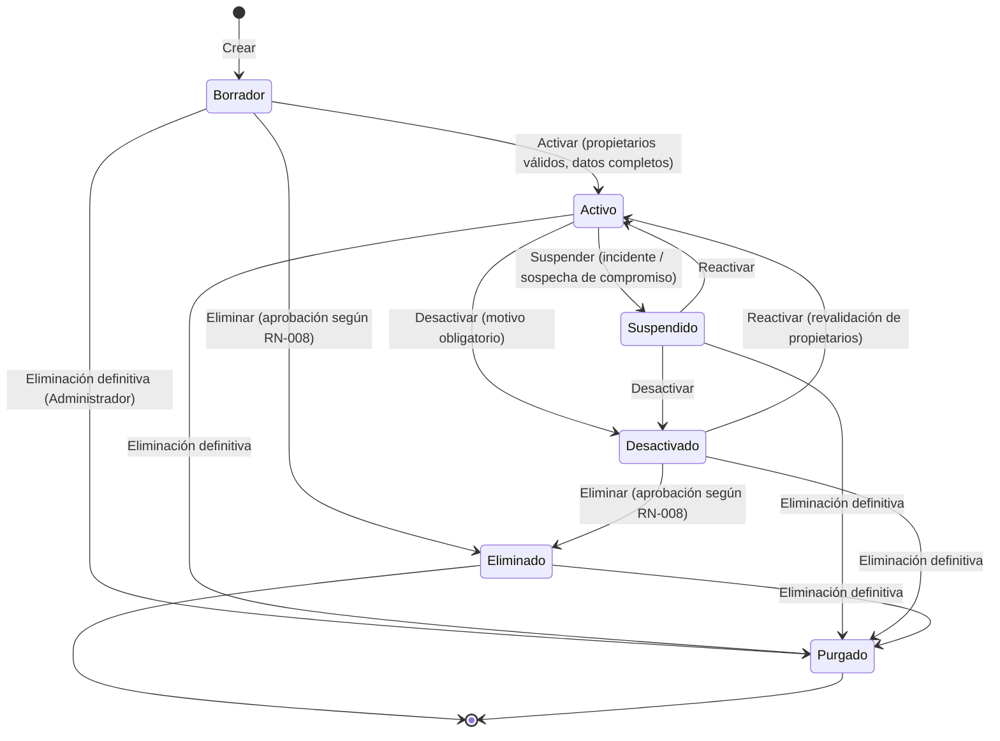
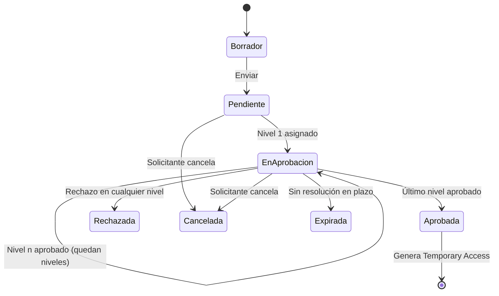
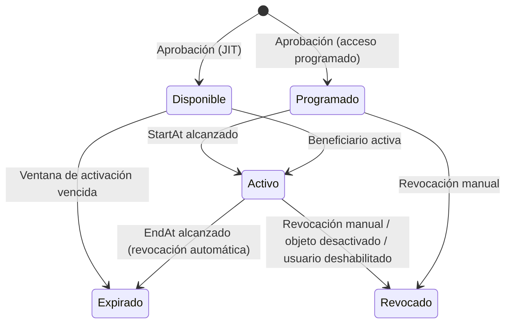

# 03 — Glosario de Dominio

**Plataforma de Gobierno de Credenciales, Certificados y Secretos (PGCCS)**

| Atributo | Valor |
|---|---|
| Documento | 03-domain-glossary.md |
| Versión | 1.0 |
| Fecha | 2026-09-24 |
| Convención | Término canónico en inglés (usado en código y API) · nombre funcional en español |
| Reglas de negocio | Identificadas como **RN-NNN**, únicas en todo el conjunto documental |

---

## 1. Convenciones

- El **término canónico** (inglés) se usa en el modelo de dominio, la API y la base de datos. El **nombre funcional** (español) se usa en la interfaz y la documentación de usuario.
- Cada término tiene **Definición**, **Descripción funcional**, **Atributos clave** (cuando aplica) y **Reglas de negocio**.
- Los términos 2.1 a 2.20 son los requeridos como mínimo. Los términos 2.21 en adelante son complementarios y necesarios para la consistencia con las historias de usuario.

---

## 2. Términos del dominio

### 2.1 Managed Object — Objeto Administrado

**Definición:** Entidad abstracta que representa cualquier elemento sensible gobernado por la plataforma. Es la raíz de agregado del dominio. Sus especializaciones son Certificate, Cryptographic Key, Secret, Credential y Service Account.

**Descripción funcional:** Concentra los atributos comunes de gobierno: identificación, tipo, subtipo, clasificación, propietarios, área, aplicaciones, ambiente, estado del ciclo de vida, estado de expiración, modo de custodia, políticas aplicables, versiones y relaciones con otros objetos. Todas las operaciones de inventario, acceso, vencimiento y auditoría se hacen sobre un Managed Object.

**Atributos clave:** `Id` (GUID), `Code` (OBJ-NNNNNN), `Name`, `Description`, `Type`, `Subtype`, `Criticality`, `Sensitivity`, `Environment`, `AreaId`, `ApplicationIds[]`, `FunctionalOwnerId`, `TechnicalOwnerId`, `LifecycleState`, `ExpirationStatus`, `ExpirationDate`, `CustodyMode` (Internal / MetadataOnly), `SplitKey` (sí / no), `Tags[]`, `CurrentVersion`, `LastUsedAt`, `CreatedBy/At`, `ModifiedBy/At`.

**Reglas de negocio:**

| ID | Regla |
|---|---|
| RN-001 | Todo objeto tiene un identificador interno único e inmutable (GUID) y un código legible único (`OBJ-NNNNNN`) asignado por el sistema. |
| RN-002 | El tipo y el subtipo son obligatorios y deben pertenecer al catálogo. El **tipo** no puede cambiarse después de la creación. |
| RN-003 | La criticidad es obligatoria y toma uno de estos valores: **Crítico, Alto, Medio, Bajo**. |
| RN-004 | La sensibilidad es obligatoria y toma uno de estos valores: **Pública, Interna, Confidencial, Restringida**. Un objeto que custodia un Sensitive Payload no puede clasificarse por debajo de **Confidencial**. Las claves privadas, el material de claves criptográficas y los objetos SWIFT se clasifican como **Restringida**. |
| RN-005 | El nombre es único dentro de la combinación *tipo + ambiente + área*. |
| RN-006 | El ambiente es obligatorio: Producción, Contingencia (DR), Pre-producción/UAT, QA o Desarrollo. |
| RN-007 | Estados del ciclo de vida: **Borrador, Activo, Suspendido, Desactivado, Eliminado**. Solo se permiten las transiciones definidas en §3.1. |
| RN-008 | Hay dos formas de eliminar un objeto. (a) **Lógica**: el objeto pasa a estado Eliminado y conserva historial, versiones y auditoría. La aprueba Seguridad si el objeto es Crítico (RN-107), un par del grupo si no lo es (RN-106), nadie si está en un grupo personal (RN-108) y Seguridad si no está asignado a ningún grupo. (b) **Definitiva**: solo la ejecuta el Administrador, para objetos creados por error (RN-109). En ningún caso se eliminan los eventos de auditoría. |
| RN-009 | Al pasar a Suspendido, Desactivado o Eliminado se revocan automáticamente todos los Temporary Access vigentes sobre el objeto y se bloquea su revelado y su recuperación por API. |
| RN-010 | La visibilidad de metadatos está limitada al ámbito del usuario: objetos asignados a sus grupos, áreas o aplicaciones, o de los que es propietario. Los roles Seguridad y Auditor tienen visibilidad global de metadatos en solo lectura. Los objetos fuera del ámbito no aparecen en búsquedas, conteos por ámbito ni exportaciones del usuario. |
| RN-011 | Un objeto puede relacionarse con otros (por ejemplo, una Service Account con sus Credentials, o un Certificate con su Cryptographic Key). La relación no hereda permisos. |
| RN-107 | **Marca de objeto crítico:** los objetos con criticidad Crítico se muestran con una marca visible en listados, detalle, notificaciones y reportes. Rebajar la criticidad de un objeto Crítico requiere la aprobación de Seguridad. La eliminación (lógica o definitiva) de un objeto Crítico **solo la autoriza un usuario con rol Seguridad**, distinto del solicitante. |
| RN-124 | **Sin datos de tarjeta:** la plataforma no admite números de tarjeta (PAN) ni otros datos de tarjeta en los metadatos ni en las cargas masivas. Los campos de texto se validan (secuencias de 13 a 19 dígitos que superan la verificación de Luhn); si hay coincidencia, se rechazan y el intento se audita sin registrar el dato. Esto mantiene la plataforma fuera del CDE (RNF-CUM-03, DEC-29). |
| RN-109 | **Eliminación definitiva:** solo el rol Administrador la ejecuta, para objetos creados por error, en cualquier estado. Exige un motivo, elegido de un catálogo (Creado por error, Duplicado, Datos incorrectos, Otro) y acompañado de una descripción, y una confirmación explícita. Si el objeto es Crítico, requiere autorización previa de Seguridad (RN-107). Revoca los accesos, cancela las solicitudes, cierra las alertas y destruye las versiones y los Sensitive Payloads (destrucción de la DEK). Los Audit Events y Usage Events se conservan. El evento `OBJECT_PURGED` registra el motivo, quién ejecutó, quién autorizó (si aplica) y una instantánea de metadatos sin payload; el código del objeto no se reutiliza (DEC-32). | |

---

### 2.2 Credential — Credencial

**Definición:** Especialización de Managed Object formada por un identificador de cuenta (usuario/login) y un valor de autenticación secreto (contraseña) que usa un sistema o componente técnico para autenticarse contra otro.

**Descripción funcional:** Cubre los subtipos **Contraseña técnica**, **Credencial de base de datos**, **Credencial de infraestructura** (servidores, hipervisores, almacenamiento, consolas) y **Credencial de dispositivo de red** (routers, switches, firewalls, balanceadores). Registra el sistema destino, el usuario, la fecha de último cambio y la fecha de vencimiento, calculada a partir de la política de rotación.

**Atributos clave:** `TargetSystem` (host/instancia/dispositivo), `AccountName`, `AuthenticationType`, `LastChangedAt`, `MaxRotationDays`, `Sensitive Payload` (contraseña).

**Reglas de negocio:**

| ID | Regla |
|---|---|
| RN-012 | El valor de la contraseña es un Sensitive Payload y siempre se almacena cifrado. El `AccountName` es metadato Confidencial y se muestra a quien tenga permiso de Consultar. |
| RN-013 | El sistema destino y el nombre de cuenta son obligatorios. |
| RN-014 | Si la credencial no tiene fecha de expiración propia, esta se calcula como `LastChangedAt + MaxRotationDays` según la Expiration Policy aplicable. |

---

### 2.3 Certificate — Certificado

**Definición:** Especialización de Managed Object que representa un certificado digital X.509, opcionalmente con su clave privada asociada.

**Descripción funcional:** Cubre los subtipos **Certificado digital (genérico)**, **SSL/TLS**, **VPN**, **API** (mTLS cliente o servidor), **SWIFT** y **Firma**. Al cargar el archivo, el sistema extrae los metadatos. La parte pública del certificado se puede consultar y la clave privada se custodia como Sensitive Payload.

**Atributos clave:** `Subject`, `Issuer`, `SerialNumber`, `SAN[]`, `NotBefore`, `NotAfter`, `ThumbprintSha256`, `SignatureAlgorithm`, `KeyAlgorithm`, `KeySize`, `HasPrivateKey`, `InstallationLocations[]`, `ChainInfo`.

**Reglas de negocio:**

| ID | Regla |
|---|---|
| RN-015 | Formatos admitidos: PEM, DER, CER/CRT, PFX/P12. Para PFX/P12 protegidos, la contraseña del contenedor se usa solo para validar y re-cifrar, y nunca se persiste en texto plano. |
| RN-016 | Si se carga un archivo, el sistema extrae automáticamente Subject, Issuer, número de serie, SAN, NotBefore, NotAfter, huella SHA-256, algoritmos y tamaño de clave. La fecha de expiración es igual a `NotAfter` y **no se puede editar manualmente**. |
| RN-017 | Si el certificado incluye clave privada, esta es un Sensitive Payload con sensibilidad Restringida. Su visualización o descarga requiere autorización explícita mediante Temporary Access con cuatro ojos. |
| RN-018 | No se admiten dos certificados activos con la misma huella SHA-256. El sistema bloquea el registro duplicado e informa del objeto existente. |
| RN-019 | Los certificados del subtipo SWIFT tienen criticidad **Crítico** por defecto. Rebajarla requiere aprobación de Seguridad. |
| RN-020 | Un certificado se marca con **configuración insegura** si cumple alguna de estas condiciones: RSA < 2048 bits, EC < 256 bits, algoritmo de firma SHA-1 o MD5, validez mayor que la máxima de la política, o certificado autofirmado en Producción sin excepción aprobada. |

---

### 2.4 Secret — Secreto

**Definición:** Especialización de Managed Object que representa un valor confidencial usado por aplicaciones para autenticarse o autorizarse ante otro servicio, sin un identificador de cuenta asociado como parte principal.

**Descripción funcional:** Cubre los subtipos **Secreto de aplicación**, **API Key** y **OAuth Token** (client secret, refresh token, access token de larga duración). Registra el servicio emisor, los scopes (en OAuth), la fecha de emisión y la de expiración. El valor se custodia cifrado localmente (modo Interno).

**Atributos clave:** `Issuer/Provider`, `ClientId` (OAuth), `Scopes[]`, `IssuedAt`, `ExpirationDate`, `CustodyMode`, `Sensitive Payload`.

**Reglas de negocio:**

| ID | Regla |
|---|---|
| RN-021 | En los OAuth Tokens son obligatorios el emisor, el tipo de token y la fecha de expiración (o la justificación de «Sin vencimiento» según RN-063). |
| RN-022 | En modo Interno el valor es obligatorio y no puede superar 64 KB. |
| RN-023 | Cada objeto con Sensitive Payload tiene **exactamente un** modo de custodia: *Interno* (valor cifrado localmente) o *Solo metadatos* (sin Sensitive Payload, para certificados públicos y cuentas de servicio sin secreto propio). No existe el modo Referencia en la Fase 1 (DEC-35). El modo por defecto de cada tipo o subtipo, y si el custodio puede cambiarlo, lo configura Seguridad con cuatro ojos (DEC-01). |

---

### 2.5 Cryptographic Key — Clave Criptográfica

**Definición:** Especialización de Managed Object que representa una clave o llave de cifrado (simétrica o asimétrica) usada para cifrar, descifrar, firmar, verificar o envolver otras claves.

**Descripción funcional:** Registra el algoritmo, la longitud, el uso permitido, el sistema que la usa, la fecha de generación y el criptoperíodo. Puede custodiar el material de clave (modo Interno) o mantenerlo en modo Solo metadatos cuando la clave reside en un sistema externo no integrado con la plataforma.

**Atributos clave:** `Algorithm` (AES, RSA, EC, 3DES…), `KeyLength`, `KeyUsage[]` (Encrypt, Decrypt, Sign, Verify, Wrap, Unwrap), `GeneratedAt`, `CryptoperiodDays`, `KeyCheckValue` (KCV), `Sensitive Payload` (material de clave).

**Reglas de negocio:**

| ID | Regla |
|---|---|
| RN-024 | Son obligatorios el algoritmo, la longitud, el uso y la fecha de generación. |
| RN-025 | El criptoperíodo es obligatorio y determina la fecha de expiración (`GeneratedAt + CryptoperiodDays`). |
| RN-026 | El material de clave nunca se incluye en exportaciones ni reportes. Su revelado o descarga **siempre** requiere cuatro ojos, independientemente de la política. Solo se muestra el KCV como identificador no sensible. |

---

### 2.6 Service Account — Cuenta de Servicio

**Definición:** Especialización de Managed Object que representa una identidad no humana usada por una aplicación, proceso o servicio para ejecutar operaciones.

**Descripción funcional:** Cubre Service Principals y Managed Identities de Entra ID, cuentas de servicio de Active Directory, cuentas locales de servidor y cuentas de servicio de base de datos. Registra el directorio de origen, la aplicación consumidora, los privilegios declarados y las credenciales o secretos asociados.

**Atributos clave:** `DirectorySource` (EntraID, AD, Local, Database), `AccountIdentifier` (UPN/objectId/SID/login), `AccountKind`, `ConsumingApplications[]`, `DeclaredPrivileges`, `InteractiveLogonAllowed`, `LinkedObjects[]`.

**Reglas de negocio:**

| ID | Regla |
|---|---|
| RN-027 | Son obligatorios el directorio de origen, el identificador de la cuenta y al menos una aplicación consumidora. |
| RN-028 | Los propietarios (funcional y técnico) de cualquier objeto deben ser **personas** (User activos). Una cuenta de servicio nunca puede ser propietaria. |
| RN-029 | Una cuenta de servicio con `InteractiveLogonAllowed = true` se marca con configuración insegura, salvo que tenga una excepción aprobada por Seguridad. |

---

### 2.7 User — Usuario

**Definición:** Persona identificada en Microsoft Entra ID que accede a la plataforma.

**Descripción funcional:** El usuario se aprovisiona en la plataforma en su primer inicio de sesión (aprovisionamiento just-in-time) a partir de los claims de Entra ID. Sus roles se asignan directamente en la plataforma. Su acceso a los objetos depende además de los grupos de acceso a los que pertenece (RN-010, RN-033).

**Atributos clave:** `EntraObjectId`, `UPN`, `DisplayName`, `Email`, `Department/Area`, `Manager`, `Status` (Active / Disabled), `LastLoginAt`.

**Reglas de negocio:**

| ID | Regla |
|---|---|
| RN-030 | El identificador del usuario es el `objectId` de Entra ID, que es inmutable. La autenticación normal es siempre con Entra ID; las únicas cuentas locales son las de emergencia (RN-123), vinculadas a un usuario existente. |
| RN-031 | Si un usuario se deshabilita o elimina en Entra ID, pierde todo acceso en la siguiente validación de token o sincronización (≤ 15 min). Sus Temporary Access se revocan, queda inactivo en sus grupos de acceso (RN-103) y los objetos de los que es propietario pasan a la condición **Propietario inválido** (objeto huérfano), lo que genera una alerta de reasignación. |
| RN-032 | Todo inicio de sesión exige MFA (RNF-SEG-01) y respeta las políticas de acceso condicional de Entra ID. |
| RN-123 | **Cuentas locales de emergencia:** solo existen para cuando Entra ID no responde. El Administrador las crea, con aprobación de Seguridad, para personas designadas por el responsable de Seguridad (6 como máximo por defecto). Son nominales, no se comparten y heredan los roles y grupos de la persona. Exigen MFA local (FIDO2 o TOTP) y contraseña de al menos 15 caracteres, y se bloquean tras 5 intentos fallidos. Están deshabilitadas por defecto: el modo de emergencia empieza solo cuando se autentican la cuenta de un Administrador y la de un usuario de Seguridad, y dura como máximo 8 h o hasta que vuelve Entra ID. Cada acción se audita marcada «emergencia», cada inicio de sesión genera una alerta crítica y, tras cada uso, se cambian las contraseñas utilizadas. |

---

### 2.8 Security Group — Grupo de Acceso

**Definición:** Agrupación de personas creada y administrada **dentro de la plataforma**, sin relación con los grupos de Microsoft Entra ID ni de Active Directory. Organiza quién puede acceder a un conjunto de objetos, quién recibe las notificaciones de actividad sobre ellos y quién puede aprobar como par en los objetos restringidos.

**Descripción funcional:** El Administrador crea el grupo y designa uno o más Responsables. El Responsable agrega o retira miembros, elegidos entre los usuarios de la plataforma (identidades de Entra ID). Los objetos se asignan a uno o más grupos. Ser miembro de un grupo permite:
1. Ver los metadatos de los objetos del grupo.
2. Solicitar acceso temporal a esos objetos.
3. Recibir notificaciones de las acciones de los demás miembros sobre esos objetos.
4. Aprobar como par las solicitudes de otros miembros sobre objetos Restringidos no críticos (los Críticos los aprueba Seguridad, RN-122).

El grupo **no otorga roles**: los roles se asignan directamente a cada persona (RN-036, RN-038).

**Atributos clave:** `Id`, `Code` (GRP-…), `Name`, `Description`, `AreaId` (opcional), `Responsibles[]`, `Members[]` (usuario, fecha de alta, alta realizada por), `NotificationSettings` (tipos de acción notificados), `Status` (Activo / Inactivo), `CreatedBy/At`.

**Reglas de negocio:**

| ID | Regla |
|---|---|
| RN-033 | Los grupos se crean únicamente en la plataforma y solo los crea el Administrador. No se sincronizan ni se importan desde Entra ID ni desde Active Directory, y la plataforma no crea grupos en esos directorios. |
| RN-034 | Cada grupo tiene al menos un Responsable, que debe ser miembro activo. El Responsable o el Administrador agregan y retiran miembros. Cada alta, baja o cambio de Responsable registra quién lo hizo, se audita y se notifica a los miembros. Los grupos no otorgan roles, solo acceso a sus objetos. |
| RN-035 | Al desactivar un grupo o retirar a un miembro, se pierde de inmediato la visibilidad sobre los objetos del grupo (salvo que exista otro origen de acceso, como la propiedad), se cancelan las solicitudes pendientes sobre esos objetos y se revocan los Temporary Access obtenidos por esa pertenencia. |
| RN-103 | No pueden ser miembros de un grupo los usuarios con rol **Auditor** o **Seguridad** (segregación de funciones) ni los usuarios deshabilitados en Entra ID. El Administrador sí puede ser miembro (DEC-17). Un usuario deshabilitado queda inactivo en todos sus grupos. |
| RN-104 | Todo objeto **Crítico** o de sensibilidad **Restringida** debe estar asignado al menos a un grupo con **dos o más miembros activos** para poder activarse, y no puede asignarse a un grupo personal (RN-108, DEC-22). Si un grupo con objetos Críticos o Restringidos queda con un solo miembro activo, se alerta al Responsable y al Administrador, y esos objetos quedan bloqueados para revelado y descarga hasta que el grupo vuelva a tener dos miembros activos. |
| RN-105 | **Notificaciones de actividad:** cuando un miembro ejecuta una acción sobre un objeto del grupo, se notifica a los demás miembros, pero no al autor. El Responsable configura qué tipos de acción se notifican. Por defecto: revelar, descargar, modificar, cambiar estado, eliminar, solicitar acceso y aprobar o rechazar. Las consultas no se notifican. Si un objeto está en varios grupos, cada persona recibe una sola notificación. Las notificaciones nunca incluyen Sensitive Payloads (RN-067). |
| RN-106 | **Aprobación por par:** en objetos Restringidos no críticos de un grupo con dos o más miembros activos, aprueba **un** miembro activo del mismo grupo, distinto del solicitante y del beneficiario. Si el objeto está en varios grupos, el aprobador debe compartir al menos uno de ellos con el solicitante. Los objetos Críticos los aprueba siempre Seguridad (RN-122). En un grupo personal no hay aprobación (RN-108). |
| RN-108 | **Grupo personal:** un grupo con un solo miembro activo es un grupo personal. Su miembro revela, descarga, modifica y elimina lógicamente los objetos **no críticos y no Restringidos** del grupo sin solicitud ni aprobación. Cada acción se audita, registra su uso y sigue exigiendo MFA reciente. Un objeto Crítico o Restringido no puede estar en un grupo personal (RN-104, DEC-22). |

---

### 2.9 Role — Rol

**Definición:** Conjunto nombrado de permisos que se asigna a usuarios o grupos dentro de un ámbito.

**Descripción funcional:** Los roles de sistema son **Administrador, Custodio, Propietario, Operador, Auditor y Seguridad** (ver §4). El rol Propietario se otorga implícitamente sobre los objetos en los que el usuario es Propietario Funcional o Técnico. Se pueden definir roles personalizados como subconjunto de permisos, siempre sujetos a la validación de segregación de funciones.

**Reglas de negocio:**

| ID | Regla |
|---|---|
| RN-036 | Un usuario puede tener **varios roles** y sus permisos efectivos son la unión de todos ellos (DEC-17). Solo **Auditor** y **Seguridad** son incompatibles con cualquier otro rol (matriz §4.3). Los roles se asignan directamente a cada persona; los grupos de acceso no otorgan roles. El sistema bloquea las asignaciones incompatibles y registra el intento. |
| RN-037 | El rol Propietario se deriva automáticamente de la propiedad del objeto y se ajusta al cambiar la propiedad. |
| RN-038 | La asignación de los roles Administrador, Seguridad, Custodio o Auditor requiere cuatro ojos (quien solicita y un aprobador de Seguridad). Un administrador no puede asignarse roles a sí mismo. |
| RN-039 | Los roles de sistema no se pueden eliminar. Sus permisos base solo se modifican mediante una versión de configuración aprobada por Seguridad. |

---

### 2.10 Permission — Permiso

**Definición:** Autorización para ejecutar una acción sobre un tipo de recurso dentro de un ámbito.

**Descripción funcional:** Los permisos del dominio son **Consultar, Crear, Modificar, Descargar, Eliminar, Aprobar y Exportar**, más el permiso de configuración **Administrar**. *Descargar* incluye revelar el valor en pantalla y descargar el archivo o el valor. El ámbito puede ser Global, Área, Aplicación, Grupo u Objeto.

**Reglas de negocio:**

| ID | Regla |
|---|---|
| RN-040 | **Denegación por defecto:** una acción sin permiso explícito se rechaza y se audita como intento denegado. |
| RN-041 | Permiso efectivo = permisos de los roles asignados directamente al usuario, restringidos por el ámbito del rol, más la visibilidad que dan sus grupos de acceso y su propiedad de objetos, **menos** las restricciones de segregación de funciones. |
| RN-042 | El permiso *Descargar* sobre objetos Confidenciales o Restringidos **nunca es permanente**. Solo se ejerce mediante un Temporary Access aprobado y vigente. Excepción: en un grupo personal, su único miembro accede a los objetos Confidenciales no críticos sin Temporary Access (RN-108). |
| RN-043 | *Consultar* da acceso a metadatos y nunca a Sensitive Payloads. |

---

### 2.11 Access Policy — Política de Acceso

**Definición:** Regla configurable que determina, para una combinación de tipo, subtipo, criticidad, sensibilidad, ambiente y acción, el flujo de aprobación, la duración máxima de acceso y los grupos aprobadores elegibles.

**Descripción funcional:** La definen Seguridad o el Administrador (con aprobación de Seguridad). Se evalúa en cada Access Request para determinar los niveles de aprobación, si aplica cuatro ojos, la duración máxima, si se permite JIT y quiénes pueden aprobar.

**Reglas de negocio:**

| ID | Regla |
|---|---|
| RN-044 | Si aplican varias políticas, prevalece la **más restrictiva** (más niveles, menor duración). |
| RN-045 | Políticas por defecto: (a) **Crítico** → 1 aprobación de Seguridad, titular o suplente (RN-122), duración máxima de 4 h y flujo no modificable; (b) **Restringida** no crítica → 1 aprobación de un par del mismo grupo (RN-106), duración máxima de 4 h y flujo no modificable; (c) **Confidencial** → 1 aprobación del Propietario y duración máxima de 8 h; (d) **Interna/Pública** → no aplica revelado de payload; (e) objetos no críticos ni Restringidos de un **grupo personal** → sin aprobación (RN-108). |
| RN-046 | La creación o modificación de políticas requiere cuatro ojos y genera una nueva versión de la política. Las solicitudes en curso conservan la versión de política vigente al crearse. |

---

### 2.12 Access Request — Solicitud de Acceso

**Definición:** Petición formal de un usuario para obtener un acceso sobre uno o más objetos (revelar, descargar, modificar o eliminar) durante un período determinado.

**Descripción funcional:** Registra el solicitante, los objetos, la acción, la justificación, la duración solicitada, la referencia de ticket (opcional) y el aprobador sugerido. El sistema determina el flujo según la Access Policy. Estados: **Borrador, Pendiente, En aprobación, Aprobada, Rechazada, Cancelada, Expirada (sin respuesta)**.

**Reglas de negocio:**

| ID | Regla |
|---|---|
| RN-047 | Son obligatorios la **justificación** (mínimo 20 caracteres), el **tiempo de acceso** (inicio y duración) y el **responsable aprobador**, que el flujo asigna o el solicitante elige de la lista de aprobadores elegibles. |
| RN-048 | La duración solicitada no puede superar la máxima de la política aplicable. |
| RN-049 | Una solicitud sin resolución en el plazo configurado (72 h por defecto) pasa a **Expirada** y se notifica al solicitante. |
| RN-050 | No se admiten solicitudes sobre objetos en estado Borrador, Suspendido, Desactivado o Eliminado. |

---

### 2.13 Approval — Aprobación

**Definición:** Decisión registrada (aprobar o rechazar) de un aprobador sobre un nivel de un flujo de aprobación asociado a una solicitud o a un cambio controlado.

**Descripción funcional:** Las aprobaciones se aplican a Access Requests y a operaciones controladas (eliminación de objetos, cambios de políticas, asignación de roles privilegiados, cambio de criticidad en objetos SWIFT). Un flujo puede tener uno o más niveles secuenciales, cada uno con uno o más aprobadores requeridos.

**Reglas de negocio:**

| ID | Regla |
|---|---|
| RN-051 | Cada decisión registra aprobador, rol efectivo, nivel, decisión, comentario (obligatorio en rechazos), fecha y hora UTC. La decisión es inmutable. |
| RN-052 | **Cuatro ojos:** toda operación controlada requiere al menos dos personas distintas: quien la solicita y quien la aprueba. En revelados y descargas de objetos Críticos aprueba Seguridad, titular o suplente (RN-122); en los de objetos Restringidos no críticos, un par del mismo grupo (RN-106). En la eliminación de objetos Críticos, la rebaja de su criticidad y las operaciones de gobierno (políticas, roles privilegiados, aceptación de riesgo, cuentas de emergencia) aprueba un usuario con rol Seguridad (RN-107). Excepción: los objetos no críticos ni Restringidos de un grupo personal no requieren aprobación (RN-108). |
| RN-053 | **Multinivel:** los niveles se evalúan en orden. Un rechazo en cualquier nivel termina la solicitud como Rechazada. |
| RN-054 | **Sin autoaprobación:** el solicitante, el beneficiario o el autor de un cambio no puede aprobar ningún nivel de su propia solicitud o cambio, aunque tenga el rol aprobador. |
| RN-055 | La delegación de aprobación está permitida durante un período definido y queda registrada. El delegado no puede ser el solicitante ni el beneficiario. En la aprobación por par, el delegado debe ser miembro activo del mismo grupo. En objetos Críticos solo se delega en otro usuario con rol Seguridad. |
| RN-122 | **Aprobación de objetos críticos por Seguridad:** los revelados y descargas de objetos de criticidad Crítico los aprueba obligatoriamente un usuario con rol Seguridad, designado por el responsable de Seguridad como aprobador titular o suplente; nunca un par del grupo. Si ningún titular resuelve en el plazo configurado (4 h hábiles por defecto; 30 min fuera de horario, a través de la guardia de RN-118), la solicitud pasa a los suplentes. El aprobador debe ser distinto del solicitante. Si el objeto tiene llave dividida, el aprobador puede ser también el custodio de Seguridad que revela su componente. |

---

### 2.14 Temporary Access — Acceso Temporal

**Definición:** Concesión de acceso con fecha y hora de inicio y fin, derivada de una Access Request aprobada, que habilita la acción solicitada sobre los objetos indicados.

**Descripción funcional:** Puede ser **programado** (activo desde la hora de inicio aprobada) o **Just-In-Time** (el beneficiario lo activa cuando lo necesita, dentro de la ventana aprobada, y corre la duración aprobada). Estados: **Programado, Disponible (JIT), Activo, Expirado, Revocado**.

**Reglas de negocio:**

| ID | Regla |
|---|---|
| RN-056 | El acceso solo es efectivo entre `StartAt` y `EndAt`. En JIT, `StartAt` es el momento de activación, que debe caer dentro de la ventana de activación aprobada (24 h por defecto). |
| RN-057 | Al llegar `EndAt`, el sistema revoca el acceso automáticamente (con un desfase máximo de 60 s). Los valores revelados en pantalla se ocultan y los enlaces de descarga pierden validez. |
| RN-058 | El propietario del objeto, Seguridad o el propio beneficiario pueden revocar el acceso manualmente antes de su fin. |
| RN-059 | No se admiten extensiones: ampliar el tiempo requiere una nueva Access Request. |
| RN-060 | Cada revelado o descarga dentro del acceso genera un Audit Event y un Usage Event independientes. |

---

### 2.15 Expiration Policy — Política de Expiración

**Definición:** Regla configurable que establece los umbrales de alerta, los destinatarios, las reglas de escalamiento y el período máximo de validez o rotación de un conjunto de objetos.

**Descripción funcional:** Se asigna por tipo, subtipo y criticidad. Define los días previos al vencimiento en los que se generan alertas, a quién se notifica en cada umbral, cuándo se escala y la vigencia máxima permitida (utilizada también para detectar configuración insegura).

**Reglas de negocio:**

| ID | Regla |
|---|---|
| RN-061 | Umbrales por defecto: **180, 120, 90, 60, 30, 15, 7 y 1 días**. Una política puede desactivar umbrales, pero no por debajo del mínimo {30, 7, 1} para objetos Críticos o Altos. |
| RN-062 | Se aplica la política más específica: *subtipo + criticidad* > *tipo + criticidad* > *tipo* > *global*. |
| RN-063 | Un objeto sin fecha de expiración requiere la marca «Sin vencimiento», con justificación aprobada por Seguridad, y se revisa anualmente. Sin esa marca, la fecha de expiración es obligatoria. |

---

### 2.16 Alert — Alerta

**Definición:** Notificación generada por el sistema cuando se cumple una condición de riesgo: umbral de vencimiento, objeto expirado, propietario inválido, hallazgo de seguridad o fallo de integridad.

**Descripción funcional:** Se crea con destinatarios, severidad y canal. Estados: **Generada, Enviada, Reconocida, Escalada, Resuelta, Cerrada automáticamente**. Los usuarios pueden reconocerla y el sistema la resuelve automáticamente cuando desaparece la condición.

**Reglas de negocio:**

| ID | Regla |
|---|---|
| RN-064 | Se genera **una sola alerta por objeto y umbral** (idempotencia): reprocesar el monitoreo no duplica alertas. |
| RN-065 | La severidad se deriva de los días restantes y la criticidad: ≤ 7 días u objeto Crítico ≤ 30 días → Alta; ≤ 30 días → Media; resto → Baja. Objetos expirados → Crítica. |
| RN-066 | Si el objeto se renueva (nueva fecha de expiración mayor que el umbral) o se desactiva, las alertas abiertas pasan a **Resuelta / Cerrada automáticamente**. |
| RN-067 | Las alertas y notificaciones **nunca** incluyen Sensitive Payloads, solo metadatos y un enlace al objeto. |
| RN-068 | Los objetos expirados generan una alerta diaria de severidad Crítica hasta su renovación, desactivación o eliminación. |

---

### 2.17 Escalation — Escalamiento

**Definición:** Proceso automático que amplía los destinatarios de una alerta a niveles jerárquicos superiores cuando no se atiende en el plazo definido o cuando alcanza una condición de severidad.

**Descripción funcional:** Las reglas de escalamiento se configuran en la Expiration Policy. Cada escalamiento queda registrado en la alerta y en la auditoría.

**Reglas de negocio:**

| ID | Regla |
|---|---|
| RN-069 | Niveles de escalamiento por defecto: **N1** Propietario Técnico → **N2** Propietario Funcional → **N3** Custodio del área y responsable jerárquico (manager en Entra ID) → **N4** Seguridad de la Información. |
| RN-070 | Una alerta escala al nivel siguiente si no se reconoce dentro del plazo configurado para su severidad (por defecto: Alta 24 h, Media 72 h, Baja 7 días). Reconocer una alerta no la resuelve. |
| RN-071 | Los objetos Críticos a ≤ 30 días del vencimiento y todo objeto expirado se notifican directamente hasta N3, independientemente del reconocimiento. |

---

### 2.18 Usage Event — Evento de Uso

**Definición:** Registro de que un usuario o una aplicación utilizó un objeto: recuperación por API, revelado, descarga o uso notificado.

**Descripción funcional:** Permite conocer quién usa cada objeto, desde qué aplicación y cuándo, e identificar objetos sin uso candidatos a desactivación.

**Atributos clave:** `ObjectId`, `ActorType` (User/Application), `ActorId`, `ApplicationId`, `Action`, `TimestampUtc`, `SourceIp`, `Channel` (UI/API), `Result`, `CorrelationId`.

**Reglas de negocio:**

| ID | Regla |
|---|---|
| RN-072 | Cada evento registra usuario o aplicación, fecha y hora UTC, acción realizada, canal, IP de origen y resultado. |
| RN-073 | Un objeto Activo sin Usage Events durante el período configurado (90 días por defecto) se marca como **Sin uso** y genera una alerta de baja severidad a sus propietarios. |
| RN-074 | Los Usage Events no contienen Sensitive Payloads. |

---

### 2.19 Audit Event — Evento de Auditoría

**Definición:** Registro inmutable de una acción relevante ejecutada o intentada en la plataforma por un usuario, una aplicación o el propio sistema.

**Descripción funcional:** Conforma la **bitácora de auditoría**. Cubre inicios de sesión, consultas, búsquedas, revelados, descargas, creaciones, modificaciones, cambios de estado, eliminaciones, solicitudes, aprobaciones, rechazos, revocaciones, cambios de configuración, exportaciones, alertas, escalamientos e intentos denegados.

**Atributos clave:** `EventId`, `SequenceNumber`, `TimestampUtc`, `ActorType`, `ActorId`, `EffectiveRoles`, `Action`, `ResourceType`, `ResourceId`, `Result` (Success/Denied/Failed), `SourceIp`, `UserAgent`, `CorrelationId`, `BeforeState`, `AfterState` (enmascarados), `PreviousHash`, `Hash`.

**Reglas de negocio:**

| ID | Regla |
|---|---|
| RN-075 | La bitácora es **de solo anexado (append-only)**. Ningún rol, incluido el Administrador y los administradores de base de datos a través de la aplicación, puede modificar ni eliminar eventos. No existe funcionalidad de edición ni borrado. |
| RN-076 | Cada evento incluye el hash SHA-256 del evento anterior (encadenamiento). El sistema verifica la integridad de la cadena periódicamente (al menos cada 24 h) y bajo demanda. Toda ruptura genera una alerta Crítica a Seguridad. |
| RN-077 | `BeforeState` y `AfterState` enmascaran todo Sensitive Payload con el marcador `[PROTEGIDO]`. Solo se registra que el valor cambió y la versión afectada. |
| RN-078 | La retención es de **10 años** (DEC-28), configurable. No se permite purgar eventos dentro del período de retención. |
| RN-079 | **Fail-closed:** si no se puede registrar el evento de auditoría de una operación sensible (revelado, descarga, modificación, eliminación, aprobación), la operación se rechaza. |
| RN-119 | **Revisión diaria automatizada de eventos de seguridad** (PCI DSS 10.4.1 y 10.4.1.1, DEC-30): cada día la plataforma genera automáticamente un reporte de los eventos de seguridad del día anterior (revelados, descargas, eliminaciones con su motivo, intentos denegados, cambios de roles, grupos, custodios y políticas, activaciones del modo de emergencia, inicios de sesión locales y fallos de integridad). Además evalúa reglas de detección con umbrales configurables (intentos denegados repetidos, revelados fuera de horario, revelados masivos, uso de cuentas de emergencia, ruptura de integridad), que generan alertas inmediatas a Seguridad. Un usuario de Seguridad marca el reporte como revisado, con comentario, a más tardar el siguiente día hábil; si no, se alerta al responsable de Seguridad. Las excepciones se gestionan y quedan registradas. |

---

### 2.20 Vault Reference — Referencia a Bóveda *(retirado en la Fase 1, DEC-35)*

**Estado:** Retirado. La plataforma no integra ningún servicio de nube en la Fase 1; no existe el modo de custodia Referencia ni, por tanto, el concepto Vault Reference. Todo objeto con Sensitive Payload se custodia en modo Interno (cifrado localmente) o, si no tiene valor propio, en modo Solo metadatos (§2.1, RN-023).

**Reglas de negocio (retiradas):**

| ID | Regla |
|---|---|
| RN-080 | Retirado (DEC-35). El modo de custodia Referencia no existe en la Fase 1. |
| RN-081 | Retirado (DEC-35). |
| RN-082 | Retirado (DEC-35). |

---

### 2.21 Sensitive Payload — Valor Sensible

**Definición:** Contenido confidencial de un Managed Object: contraseña, valor de secreto, API key, token, clave privada o material de clave criptográfica.

**Descripción funcional:** Es la información que se debe proteger por encima de todo. Se cifra con cifrado de sobre (*envelope encryption*): cada objeto tiene una Data Encryption Key (DEK) AES-256-GCM, protegida a su vez por una Key Encryption Key (KEK): un certificado local no exportable en el almacén de certificados de la máquina (DEC-35). En los objetos con llave dividida, el valor se guarda en dos componentes, cada uno con su propia DEK (RN-113).

**Reglas de negocio:**

| ID | Regla |
|---|---|
| RN-083 | Todo Sensitive Payload se cifra antes de persistirse. Si el servicio de cifrado no está disponible, la operación se rechaza: **no se admite almacenamiento sin cifrar** bajo ninguna circunstancia (fail-closed). |
| RN-084 | Por defecto se muestra enmascarado (`••••••••`). El revelado muestra el valor durante un máximo de 30 s. La copia al portapapeles se limpia a los 30 s y cada acción se audita. |
| RN-085 | Los Sensitive Payloads nunca aparecen en logs técnicos, mensajes de error, trazas, reportes, exportaciones, notificaciones, eventos de auditoría, eventos de uso ni eventos enviados al SIEM. |
| RN-086 | La API solo devuelve un Sensitive Payload en endpoints específicos de revelado o recuperación, que están sujetos a autorización y auditoría. El resto de endpoints no lo incluyen nunca. |
| RN-121 | Retirado (DEC-35, DEC-27). El modo de contingencia existía solo para la pérdida de Azure Key Vault; al no depender de ningún servicio de nube, ese escenario no aplica. El respaldo y la recuperación de la KEK local se rigen por RNF-DIS-04 y RNF-DIS-07. |

---

### 2.22 Object Owner — Propietario (Funcional / Técnico)

**Definición:** Persona responsable de un Managed Object. El **Propietario Funcional** responde por la necesidad de negocio y el **Propietario Técnico** por la implementación y el mantenimiento.

**Reglas de negocio:**

| ID | Regla |
|---|---|
| RN-087 | Todo objeto debe tener **Propietario Funcional y Propietario Técnico** asignados, que sean User activos, para pasar a estado Activo. El sistema impide guardar un objeto que no tenga al menos un responsable asignado, incluso en estado Borrador. |
| RN-088 | En objetos **Críticos**, el Propietario Funcional y el Técnico deben ser personas distintas. |
| RN-089 | No se puede quitar un propietario sin designar un reemplazo en la misma operación. El cambio de propietario se audita y se notifica al propietario anterior y al nuevo. |

---

### 2.23 Area — Área

**Definición:** Unidad organizacional del banco (por ejemplo, Infraestructura, Canales Digitales, Tesorería) usada para agrupar objetos y definir ámbitos de permisos.

| ID | Regla |
|---|---|
| RN-090 | Todo objeto pertenece a exactamente un área. El catálogo de áreas lo administra el Administrador. |

---

### 2.24 Application — Aplicación

**Definición:** Sistema de negocio o componente técnico del catálogo de aplicaciones que usa objetos o los consume por API.

| ID | Regla |
|---|---|
| RN-091 | Un objeto puede asociarse a cero o más aplicaciones. Para que una aplicación recupere objetos por API, debe tener registrada una identidad de Entra ID (Service Principal o Managed Identity) y una asignación explícita a cada objeto o grupo de objetos. La recuperación de valores por aplicaciones se habilita en F2 (DEC-03). |

---

### 2.25 Object Version — Versión de Objeto

**Definición:** Instantánea inmutable del estado de un Managed Object después de cada modificación.

| ID | Regla |
|---|---|
| RN-092 | Cada creación o modificación genera una versión numerada de forma consecutiva, con autor, fecha y hora UTC, motivo del cambio y detalle de los campos modificados. Las versiones no se pueden editar ni eliminar. |
| RN-093 | En la comparación entre versiones, los campos de Sensitive Payload se muestran solo como «Valor modificado». Los valores anteriores se conservan cifrados durante el período de retención configurado y su revelado sigue el mismo flujo que el valor actual. |

---

### 2.26 Lifecycle State y Expiration Status — Estado de ciclo de vida y estado de expiración

**Definición:** Dos dimensiones de estado independientes. El **estado de ciclo de vida** lo controlan los usuarios (Borrador, Activo, Suspendido, Desactivado, Eliminado). El **estado de expiración** lo calcula el sistema (Vigente, Próximo a vencer, Expirado, Sin vencimiento).

| ID | Regla |
|---|---|
| RN-094 | El estado de expiración se recalcula en cada ejecución del monitoreo y en cada cambio de la fecha de expiración: **Expirado** si `ExpirationDate < ahora`; **Próximo a vencer** si faltan ≤ 180 días o el primer umbral activo de la política; **Vigente** en los demás casos. Los usuarios no pueden editarlo. |

---

### 2.27 Segregation of Duties (SoD) y Four Eyes Principle — Segregación de funciones y principio de cuatro ojos

**Definición:** La **SoD** impide que una sola persona concentre funciones incompatibles. El **principio de cuatro ojos** exige que dos personas distintas intervengan en una operación crítica.

| ID | Regla |
|---|---|
| RN-095 | La SoD se evalúa en cuatro momentos: (1) al asignar roles (RN-036); (2) al agregar miembros a grupos de acceso (RN-103); (3) al determinar los aprobadores elegibles (RN-054, RN-106); (4) al ejecutar operaciones controladas (RN-052). |
| RN-096 | Operaciones que requieren cuatro ojos: (a) **en grupos de dos o más miembros, aprobadas por un par del grupo**: revelado o descarga de objetos Restringidos no críticos, revelado de material de claves criptográficas no crítico y eliminación lógica de objetos no críticos; (b) **aprobadas por Seguridad**: revelado o descarga de objetos Críticos (RN-122), eliminación (lógica o definitiva) y rebaja de criticidad de objetos Críticos, eliminación lógica de objetos sin grupo, cambios de Access Policy o Expiration Policy, asignación de roles privilegiados, creación de cuentas locales de emergencia y aceptación de riesgo de hallazgos. Los objetos no críticos ni Restringidos de un grupo personal no requieren aprobación (RN-108). |

---

### 2.28 Discovery Finding — Hallazgo

**Definición:** Resultado de un análisis que identifica un objeto no registrado, huérfano, expirado o con configuración insegura.

| ID | Regla |
|---|---|
| RN-097 | Categorías: **No registrado** (F2: descubrimiento completo), **Huérfano** (propietario inválido o sin aplicación asociada activa), **Expirado** y **Configuración insegura** (RN-020, RN-029). |
| RN-098 | Un hallazgo no modifica el inventario automáticamente. Requiere gestión (registrar, asignar, aceptar riesgo con justificación aprobada por Seguridad, o descartar) y conserva su historial. |
| RN-120 | Retirado (DEC-35, DEC-26). No existe integración con Azure Key Vault en ningún alcance de esta plataforma; no hay bóvedas que conciliar. |

---

### 2.29 Notification — Notificación

**Definición:** Mensaje enviado por un canal (correo corporativo o, si se confirma, Microsoft Teams) como consecuencia de una alerta, una solicitud, una aprobación, una revocación o la actividad de un miembro de un grupo de acceso (RN-105).

| ID | Regla |
|---|---|
| RN-099 | Los envíos fallidos se reintentan con espera exponencial (3 reintentos). Cada envío o fallo definitivo se registra y los fallos definitivos generan una alerta al Administrador. |
| RN-110 | **Aviso a Seguridad:** toda creación, edición (metadatos, valor, clasificación, propietarios, asignaciones) y eliminación (lógica o definitiva) de objetos se notifica a los usuarios con rol Seguridad: **al instante** si el objeto es Crítico (o deja de serlo o pasa a serlo) y en un **resumen diario** en los demás casos. Sin Sensitive Payloads (RN-067). |

---

### 2.30 Evidence Package — Paquete de Evidencia

**Definición:** Conjunto exportable de reportes y registros de auditoría, generado para una auditoría o requerimiento regulatorio, con integridad verificable.

| ID | Regla |
|---|---|
| RN-100 | Cada paquete incluye los parámetros de generación, la fecha, el usuario generador, la huella SHA-256 de cada archivo y un manifiesto firmado por la plataforma. Nunca incluye Sensitive Payloads. |
| RN-101 | Toda exportación (reportes, auditoría, evidencias) requiere el permiso Exportar, respeta el ámbito del usuario (RN-010), incluye una marca de agua con usuario y fecha, y se audita. |

---

### 2.31 Compliance Control — Control de Cumplimiento

**Definición:** Regla verificable automáticamente que mide el cumplimiento del inventario, por ejemplo: objetos con propietario válido, objetos no expirados, accesos con aprobación, ausencia de violaciones de SoD o integridad de la auditoría.

| ID | Regla |
|---|---|
| RN-102 | Cada control tiene un identificador, una descripción, una referencia normativa (ISO 27001, PCI DSS, DORA, SWIFT CSP, regulación local), una fórmula y un umbral. El resultado se calcula diariamente y se conserva como serie histórica. |

---

### 2.32 Split Key — Llave Dividida

**Definición:** Check que se marca en los objetos a los que aplique para indicar que su valor sensible se custodia dividido en dos Key Components: uno a cargo de los miembros del grupo y otro a cargo de Seguridad.

**Descripción funcional:** No es una clasificación: es una marca opcional (sí / no) en el objeto. Sin el check, el valor es una sola pieza. Con el check, se aplica el conocimiento dividido (§2.33). Es independiente de la criticidad y de la sensibilidad, y no cambia ninguna otra regla del objeto (grupos, aprobaciones, eliminación, avisos).

**Reglas de negocio:**

| ID | Regla |
|---|---|
| RN-111 | Los objetos con Sensitive Payload en custodia interna pueden marcarse con el check **«Llave dividida»**. Por defecto está desmarcado; el sistema sugiere marcarlo cuando la criticidad del objeto es Crítico. |
| RN-112 | Sin el check, el valor es una sola pieza y se rige por las reglas generales de acceso. |
| RN-114 | **Marcar o desmarcar el check:** marcarlo exige cargar los dos componentes; mientras no estén, sigue vigente la versión anterior. Desmarcarlo requiere aprobación de Seguridad y registrar un valor nuevo (rotación), porque nadie conoce el valor completo. Todo cambio se audita y se avisa a Seguridad al instante. |

---

### 2.33 Key Component — Componente de Llave

**Definición:** Cada una de las dos partes en que se divide el valor sensible de un objeto con llave dividida: el **componente del usuario**, custodiado por custodios designados del grupo, y el **componente de Seguridad**, custodiado por custodios designados de Seguridad (RN-117).

**Descripción funcional:** Cada lado ingresa, ve y renueva solo su componente. Para usar el objeto, cada custodio introduce su parte en el sistema destino, como en una ceremonia de llaves. La plataforma guarda ambos componentes, pero nunca muestra ni entrega el valor completo.

**Atributos clave:** `ComponentType` (Usuario / Seguridad), `CombinationMethod` (Concatenación / XOR / Contraseña dividida de PFX), `KeyCheckValue` (en XOR), `Custodians[]` (usuario, lado, fecha de aceptación), `EnteredBy`, `EnteredAt`, `Version`.

**Reglas de negocio:**

| ID | Regla |
|---|---|
| RN-113 | **Conocimiento dividido:** en un objeto con llave dividida, el valor se registra en dos componentes. El **componente del usuario** lo ingresa y lo conoce solo un custodio designado del grupo (RN-117). El **componente de Seguridad** lo ingresa y lo conoce solo un custodio designado de Seguridad (RN-117). Cada componente se cifra con su propia DEK. Ni la interfaz ni la API muestran o entregan nunca el valor completo. Como Seguridad no puede ser miembro de grupos (RN-103), ninguna persona puede conocer ambos componentes. |
| RN-115 | **Uso:** el custodio designado del grupo revela su componente con las reglas habituales (acceso temporal y aprobación por par). Al aprobarse una solicitud sobre un objeto con llave dividida, se avisa a los custodios designados de Seguridad para que revelen su componente dentro de la misma ventana; si ninguno lo hace en el plazo configurado (30 min por defecto), se escala a la guardia (RN-118). Seguridad no necesita otra aprobación, pero solo puede revelar su componente mientras exista un acceso aprobado y vigente sobre el objeto, y nunca si el acceso lo solicitó él mismo (RN-054). Cada revelado indica qué componente se reveló y se audita por separado. |
| RN-116 | **Aplicabilidad y combinación:** la llave dividida solo se admite en modo de custodia Interno (no aplica a Solo metadatos, que no tiene Sensitive Payload). Cada objeto declara cómo se combinan los componentes: **concatenación** (contraseñas, secretos, API keys, tokens: valor = componente del usuario + componente de Seguridad), **XOR** (material de claves criptográficas: componentes de igual longitud, con KCV por componente) o **contraseña dividida del contenedor** (certificados con llave privada: el PFX se protege con una contraseña formada por los dos componentes). Estos objetos no pueden recuperarse por API de aplicaciones. |
| RN-117 | **Custodios designados:** por cada objeto con llave dividida se designan de 1 a 2 custodios del componente del usuario (miembros activos del grupo, designados por el Responsable del grupo) y de 1 a 2 custodios del componente de Seguridad (usuarios con rol Seguridad, designados por el responsable de Seguridad); se recomiendan titular y suplente. Cada custodio acepta formalmente su rol, con MFA, antes de poder ingresar o revelar su componente. Solo los custodios aceptados ingresan, ven o renuevan su componente, y solo los custodios del grupo pueden solicitar acceso al objeto. El objeto no se activa sin al menos un custodio aceptado por lado. Si un custodio deja el grupo, pierde el rol Seguridad o es deshabilitado, deja de ser custodio, se alerta para designar un reemplazo y se recomienda renovar el valor. |
| RN-118 | **Guardia de Seguridad:** Seguridad mantiene en la plataforma un calendario de guardia 24x7 entre sus custodios, y la plataforma muestra quién está de guardia. Si, tras aprobarse una solicitud sobre un objeto con llave dividida, ningún custodio de Seguridad revela su componente en el plazo configurado (30 min por defecto), se escala al responsable de la guardia y al Propietario Funcional del objeto. |

---

## 3. Modelos de estado

### 3.1 Ciclo de vida del Managed Object (RN-007)

| Transición | Permiso requerido | Control adicional |
|---|---|---|
| Borrador → Activo | Modificar | Propietarios válidos (RN-087), datos obligatorios completos |
| Activo → Suspendido | Modificar (Custodio, Propietario, Seguridad) | Motivo obligatorio. Revoca accesos (RN-009) |
| Activo/Suspendido → Desactivado | Modificar | Motivo obligatorio. Revoca accesos (RN-009) |
| Desactivado/Suspendido → Activo | Modificar | Revalida propietarios y expiración |
| Borrador/Desactivado → Eliminado | Eliminar | Aprobación según RN-008: Seguridad si es Crítico; par del grupo si no lo es; sin aprobación en un grupo personal. Solo lógico. |
| Cualquier estado → Purgado (eliminación definitiva) | Rol Administrador | Motivo y confirmación obligatorios. Autorización de Seguridad si es Crítico (RN-107, RN-109). |

### 3.2 Access Request y Temporary Access

---

## 4. Matriz de Roles y Permisos

### 4.1 Roles de sistema

| Rol | Propósito | Ámbito típico |
|---|---|---|
| **Administrador** | Configuración de la plataforma, catálogos, creación de grupos de acceso y designación de responsables, asignación de roles, integraciones. | Global |
| **Custodio** | Custodia operativa de objetos: registro, carga de valores, mantenimiento. | Área / Aplicación |
| **Propietario** | Responsabilidad sobre objetos propios (derivado de la propiedad). | Objeto |
| **Operador** | Operación diaria sobre objetos asignados. | Área / Aplicación / Grupo |
| **Auditor** | Revisión independiente, solo lectura. | Global |
| **Seguridad** | Políticas, aprobación de operaciones de gobierno, supervisión de accesos críticos, hallazgos, riesgo y cumplimiento. | Global |

### 4.2 Matriz de permisos por defecto

Leyenda: ✅ permitido en su ámbito · ⏱ solo mediante Temporary Access aprobado · 📝 inicia la operación, que requiere cuatro ojos · ❌ no permitido Un usuario con varios roles obtiene la unión de sus permisos (DEC-17).

| Permiso \ Rol | Administrador | Custodio | Propietario | Operador | Auditor | Seguridad |
|---|---|---|---|---|---|---|
| **Consultar** (metadatos) | ✅ Global | ✅ | ✅ | ✅ | ✅ Global | ✅ Global |
| **Consultar auditoría** | ❌ ¹ | ✅ sus objetos | ✅ sus objetos | ❌ | ✅ Global | ✅ Global |
| **Crear** objetos | ❌ | ✅ | ✅ ² | ❌ | ❌ | ❌ |
| **Modificar** metadatos | ❌ | ✅ | ✅ | ✅ ³ | ❌ | ✅ ⁴ |
| **Modificar** Sensitive Payload (actualizar/renovar) | ❌ | ✅ | ✅ (Propietario Técnico) | ✅ ³ | ❌ | ❌ |
| **Descargar / Revelar** Sensitive Payload | ❌ | ⏱ | ⏱ | ⏱ | ❌ | ⏱ ⁵ |
| **Registrar / revelar componente del usuario** (llave dividida, RN-113) | ✅ si es custodio designado | ✅ si es custodio designado | ✅ si es custodio designado | ✅ si es custodio designado | ❌ | ❌ |
| **Registrar / revelar componente de Seguridad** (llave dividida, RN-115) | ❌ | ❌ | ❌ | ❌ | ❌ | ✅ si es custodio designado (revelar: solo con un acceso aprobado y vigente) |
| **Eliminar** (lógico) | ❌ | 📝 | 📝 | ❌ | ❌ | ✅ Aprueba (objetos críticos y objetos sin grupo) |
| **Eliminar definitivamente** (objetos creados por error) | ✅ (críticos: con autorización de Seguridad) | ❌ | ❌ | ❌ | ❌ | ✅ Autoriza si es crítico |
| **Aprobar** solicitudes sobre objetos no críticos (según política) | ❌ | ✅ Nivel 1 | ✅ Nivel 1 (sus objetos) | ❌ | ❌ | ✅ si la política lo incluye |
| **Aprobar como par** (objetos Restringidos no críticos, RN-106) | ✅ si es miembro del grupo | ✅ si es miembro del grupo | ✅ si es miembro del grupo | ✅ si es miembro del grupo | ❌ | ❌ |
| **Aprobar accesos a objetos Críticos** (RN-122) | ❌ | ❌ | ❌ | ❌ | ❌ | ✅ titular o suplente designado |
| **Aprobar operaciones de gobierno** (políticas, roles privilegiados, SWIFT, aceptación de riesgo) | ❌ | ❌ | ❌ | ❌ | ❌ | ✅ |
| **Exportar** reportes | ✅ Inventario (sin payload) | ✅ | ✅ | ❌ | ✅ | ✅ |
| **Administrar** configuración y catálogos; crear o desactivar grupos | ✅ | ❌ | ❌ | ❌ | ❌ | ❌ |
| **Gestionar miembros** de un grupo | ✅ | ✅ si es Responsable | ✅ si es Responsable | ✅ si es Responsable | ❌ | ❌ |
| **Administrar** Access Policy, Expiration Policy y modo de custodia por tipo | 📝 | ❌ | ❌ | ❌ | ❌ | ✅ (con cuatro ojos) |
| **Gestionar hallazgos** | ❌ | ✅ | ✅ sus objetos | ❌ | ❌ | ✅ |

¹ El Administrador no consulta la auditoría de negocio, para evitar el conflicto de revisar sus propias acciones. Solo ve los eventos técnicos de salud de la plataforma.
² Crea objetos únicamente en las áreas o aplicaciones de su ámbito.
³ Solo sobre objetos asignados. Se limita a registrar renovaciones (nueva fecha o nuevo valor) y ubicaciones de instalación.
⁴ Solo clasificación (criticidad, sensibilidad) y marcas de riesgo.
⁵ Solo en respuesta a incidentes de seguridad, con cuatro ojos obligatorio.

### 4.3 Matriz de segregación de funciones (roles incompatibles)

Un usuario puede tener **varios roles** (DEC-17). Sus permisos efectivos son la unión de los permisos de todos sus roles.

✖ = incompatibles en el mismo usuario (RN-036) · ● = compatibles

| | Administrador | Custodio | Propietario | Operador | Auditor | Seguridad |
|---|---|---|---|---|---|---|
| **Administrador** | — | ● | ● | ● | ✖ | ✖ |
| **Custodio** | ● | — | ● | ● | ✖ | ✖ |
| **Propietario** | ● | ● | — | ● | ✖ | ✖ |
| **Operador** | ● | ● | ● | — | ✖ | ✖ |
| **Auditor** | ✖ | ✖ | ✖ | ✖ | — | ✖ |
| **Seguridad** | ✖ | ✖ | ✖ | ✖ | ✖ | — |

**Justificación:**
- **Auditor** es exclusivo para garantizar la independencia de la revisión.
- **Seguridad** es exclusivo porque autoriza la eliminación de objetos críticos y las operaciones de gobierno, y supervisa la actividad: no debe operar los objetos que supervisa. Por eso tampoco puede ser propietario ni miembro de grupos (RN-103).
- El **Administrador** puede combinar roles operativos y ser miembro de grupos. Se mantienen los controles contra la autoconcesión: no puede asignarse roles a sí mismo (RN-038), no puede aprobar lo que solicita (RN-054) y la eliminación de objetos críticos requiere a Seguridad (RN-107).

### 4.4 Validación de conflictos entre permisos y roles

| Verificación | Resultado |
|---|---|
| ¿Un miembro puede aprobar como par su propia solicitud? | No. RN-054 y RN-106 exigen un miembro distinto del solicitante y del beneficiario. |
| ¿Auditor o Seguridad pueden acceder a objetos a través de un grupo? | No. RN-103 impide que sean miembros. El Administrador sí puede ser miembro (DEC-17) y se rige por las mismas reglas que cualquier miembro. |
| ¿Alguien puede conocer los dos componentes de un objeto con llave dividida? | No. Seguridad no puede ser miembro de grupos (RN-103) y cada lado solo accede a su componente (RN-113). |
| ¿Algún rol puede aprobar su propia solicitud? | No. RN-054 se aplica de forma transversal, independientemente del rol. |
| ¿Algún rol tiene *Descargar* permanente sobre objetos Confidenciales o Restringidos? | No. Solo se ejerce mediante ⏱ (RN-042). |
| ¿Algún rol puede alterar la auditoría? | No. No existe el permiso (RN-075). |
| ¿El Administrador puede autootorgarse privilegios? | No. RN-038 exige cuatro ojos con Seguridad y prohíbe la autoasignación. |
| ¿El Auditor tiene algún permiso de escritura? | No. Solo Consultar y Exportar. |
| ¿La eliminación es posible sin un segundo aprobador? | Solo para objetos no críticos: en un grupo personal (RN-108) o como eliminación definitiva del Administrador (RN-109). Los objetos Críticos siempre requieren la autorización de Seguridad (RN-107). |
| ¿El Administrador puede cambiar políticas sin Seguridad? | No. Las inicia (📝) y Seguridad las aprueba (RN-046). |
| ¿Hay un rol que cree un objeto y apruebe su propio acceso? | No. La creación no otorga acceso al payload y RN-054 impide la autoaprobación. |

---

## 5. Índice alfabético

| Término canónico | Nombre funcional | Sección |
|---|---|---|
| Access Policy | Política de Acceso | 2.11 |
| Access Request | Solicitud de Acceso | 2.12 |
| Alert | Alerta | 2.16 |
| Application | Aplicación | 2.24 |
| Approval | Aprobación | 2.13 |
| Area | Área | 2.23 |
| Audit Event | Evento de Auditoría | 2.19 |
| Certificate | Certificado | 2.3 |
| Compliance Control | Control de Cumplimiento | 2.31 |
| Credential | Credencial | 2.2 |
| Cryptographic Key | Clave Criptográfica | 2.5 |
| Discovery Finding | Hallazgo | 2.28 |
| Escalation | Escalamiento | 2.17 |
| Evidence Package | Paquete de Evidencia | 2.30 |
| Expiration Policy | Política de Expiración | 2.15 |
| Four Eyes Principle | Principio de cuatro ojos | 2.27 |
| Key Component | Componente de Llave | 2.33 |
| Lifecycle State / Expiration Status | Estados | 2.26 |
| Managed Object | Objeto Administrado | 2.1 |
| Notification | Notificación | 2.29 |
| Object Owner | Propietario | 2.22 |
| Object Version | Versión de Objeto | 2.25 |
| Permission | Permiso | 2.10 |
| Role | Rol | 2.9 |
| Secret | Secreto | 2.4 |
| Security Group | Grupo de Acceso | 2.8 |
| Segregation of Duties | Segregación de funciones | 2.27 |
| Sensitive Payload | Valor Sensible | 2.21 |
| Service Account | Cuenta de Servicio | 2.6 |
| Split Key | Llave Dividida | 2.32 |
| Temporary Access | Acceso Temporal | 2.14 |
| Usage Event | Evento de Uso | 2.18 |
| User | Usuario | 2.7 |
| Vault Reference | Referencia a Bóveda *(retirado, DEC-35)* | 2.20 |
