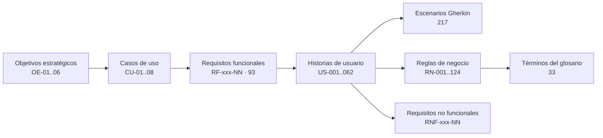

# 05 — Matriz de Trazabilidad e Informe de Validación

**Plataforma de Gobierno de Credenciales, Certificados y Secretos (PGCCS)**

| Atributo | Valor |
|---|---|
| Documento | 05-traceability-matrix.md |
| Versión | 1.0 |
| Fecha | 2026-09-24 |
| Alcance | Trazabilidad entre requisitos funcionales (RF), casos de uso (CU), historias de usuario (US), términos del glosario, reglas de negocio (RN) y requisitos no funcionales (RNF). Resultado de las 10 validaciones obligatorias. |

---

## 1. Modelo de trazabilidad

---

## 2. Catálogo de requisitos funcionales

Cada fila corresponde a un requisito funcional del encargo (validación 10: no se omite ninguno). **Fase:** F1 · F2, según las decisiones DEC-01 a DEC-11 (Visión §9.2).

### 2.1 Inventario de Objetos — CU-01

| ID | Requisito | Fase | Historias | Glosario | Reglas | RNF |
|---|---|---|---|---|---|---|
| RF-INV-01 | Mantener un repositorio centralizado de todos los objetos registrados | F1 | US-001, US-002, US-003, US-004, US-005, US-012 | Managed Object | RN-001, RN-005 | RNF-REN-02 |
| RF-INV-02 | Registrar diferentes tipos de objetos | F1 | US-001, US-002, US-003, US-004, US-005 | Certificate, Secret, Credential, Cryptographic Key, Service Account | RN-002, RN-015 a RN-029 | — |
| RF-INV-03 | Editar objetos | F1 | US-006 | Managed Object, Object Version | RN-002, RN-092 | — |
| RF-INV-04 | Desactivar objetos | F1 | US-007 | Lifecycle State | RN-007, RN-009 | — |
| RF-INV-05 | Consultar objetos | F1 | US-009, US-010 | Managed Object, Permission | RN-010, RN-043 | RNF-REN-01 |
| RF-INV-06 | Buscar objetos por múltiples criterios | F1 | US-010 | Managed Object | RN-010, RN-094 | RNF-REN-02 |
| RF-INV-07 | Clasificar por criticidad: Crítico, Alto, Medio, Bajo | F1 | US-001, US-011 | Managed Object | RN-003, RN-019 | — |
| RF-INV-08 | Clasificar por sensibilidad: Pública, Interna, Confidencial, Restringida | F1 | US-001, US-011 | Managed Object | RN-004 | — |
| RF-INV-09 | Carga del inventario inicial *(alcance y supuesto S-02; CSV, DEC-04)* | F1 | US-012 | Managed Object | RN-085, RN-087 | — |
| RF-INV-10 | Administrar estados de los objetos *(alcance §6.2)* | F1 | US-007 | Lifecycle State | RN-007 | — |
| RF-INV-11 | Eliminación definitiva de objetos creados por error, exclusiva del Administrador *(aclaración, DEC-18)* | F1 | US-055 | Managed Object, Object Version, Audit Event | RN-109 | — |
| RF-INV-12 | Marcar los objetos críticos; solo Seguridad autoriza su eliminación *(aclaración, DEC-18)* | F1 | US-008, US-011, US-054, US-055 | Managed Object | RN-107 | — |
| RF-INV-13 | Marcar con un check «Llave dividida» los objetos a los que aplique *(aclaración, DEC-21)* | F1 | US-056 | Split Key | RN-111, RN-112, RN-114 | — |

### 2.2 Propiedad de los Objetos — CU-01

| ID | Requisito | Fase | Historias | Glosario | Reglas | RNF |
|---|---|---|---|---|---|---|
| RF-PRO-01 | Asignar Propietario Funcional | F1 | US-013 | Object Owner | RN-087, RN-089 | — |
| RF-PRO-02 | Asignar Propietario Técnico | F1 | US-013 | Object Owner | RN-087, RN-088 | — |
| RF-PRO-03 | Todo objeto debe tener al menos un responsable | F1 | US-013, US-014 | Object Owner, User | RN-087, RN-031 | — |
| RF-PRO-04 | Impedir objetos sin propietario | F1 | US-001, US-012, US-013, US-014, US-050 | Object Owner, Discovery Finding | RN-087, RN-089, RN-097 | — |

### 2.3 Protección de Información — CU-01

| ID | Requisito | Fase | Historias | Glosario | Reglas | RNF |
|---|---|---|---|---|---|---|
| RF-PRT-01 | Cifrar toda la información sensible almacenada | F1 | US-002, US-003, US-005, US-015 | Sensitive Payload | RN-083 | RNF-SEG-03, RNF-SEG-04 |
| RF-PRT-02 | Cifrar toda la información sensible en tránsito | F1 | US-015 | Sensitive Payload | RN-086 | RNF-SEG-02 |
| RF-PRT-03 | Las credenciales nunca se muestran en texto plano | F1 | US-009, US-016, US-051 | Sensitive Payload | RN-043, RN-084, RN-085 | RNF-SEG-09 |
| RF-PRT-04 | Las llaves privadas nunca se visualizan sin autorización explícita | F1 | US-005, US-017 | Certificate, Cryptographic Key, Temporary Access | RN-017, RN-026, RN-096 | — |
| RF-PRT-05 | Impedir almacenar secretos sin cifrado | F1 | US-002, US-015 | Sensitive Payload | RN-083 | RNF-SEG-03 |
| RF-PRT-06 | En objetos con llave dividida, el valor se divide: una parte la custodian los miembros del grupo y otra Seguridad *(aclaración, DEC-21)* | F1 | US-016, US-017, US-046, US-056, US-057, US-058 | Key Component, Split Key | RN-113, RN-115, RN-116 | RNF-SEG-03 |
| RF-PRT-07 | Custodios con nombre por componente y guardia de Seguridad 24x7 para los objetos con llave dividida *(cierre de OBS-09, DEC-23, DEC-24)* | F1 | US-057, US-058 | Key Component, Split Key | RN-117, RN-118 | — |
| RF-PRT-08 | *Retirado (DEC-35, DEC-27).* Existía para el modo de contingencia ante la pérdida de Azure Key Vault; sin AKV no aplica. | Retirado | US-061 (retirada) | — | — | — |

### 2.4 Versionamiento — CU-01

| ID | Requisito | Fase | Historias | Glosario | Reglas | RNF |
|---|---|---|---|---|---|---|
| RF-VER-01 | Mantener historial completo de versiones | F1 | US-006, US-019 | Object Version | RN-092 | — |
| RF-VER-02 | Registrar quién realizó cada cambio | F1 | US-006, US-019 | Object Version, Audit Event | RN-092 | RNF-AUD-03 |
| RF-VER-03 | Mantener trazabilidad de modificaciones | F1 | US-006, US-019 | Object Version | RN-092, RN-093 | — |

### 2.5 Vencimientos — CU-04

| ID | Requisito | Fase | Historias | Glosario | Reglas | RNF |
|---|---|---|---|---|---|---|
| RF-VEN-01 | Monitorear continuamente las fechas de expiración | F1 | US-021 | Expiration Policy, Expiration Status | RN-094 | RNF-REN-05 |
| RF-VEN-02 | Configurar políticas de expiración | F1 | US-020 | Expiration Policy | RN-061, RN-062, RN-063 | — |
| RF-VEN-03 | Alertas a 180, 120, 90, 60, 30, 15, 7 y 1 días | F1 | US-020, US-022, US-047 | Alert, Notification | RN-061, RN-064, RN-065 | — |
| RF-VEN-04 | Escalar automáticamente según reglas configurables | F1 | US-020, US-023 | Escalation | RN-069, RN-070, RN-071 | — |
| RF-VEN-05 | Identificar objetos expirados | F1 | US-021, US-024, US-050 | Expiration Status, Alert | RN-068, RN-094 | — |

### 2.6 Gestión de Accesos — CU-02

| ID | Requisito | Fase | Historias | Glosario | Reglas | RNF |
|---|---|---|---|---|---|---|
| RF-ACC-01 | Integración con Active Directory (validación de cuentas de servicio) | F1 | US-026 | User, Service Account | RN-027 | — |
| RF-ACC-02 | Integración con Microsoft Entra ID | F1 | US-025 | User | RN-030 | — |
| RF-ACC-03 | Single Sign-On | F1 | US-025 | User | RN-030 | RNF-SEG-06 |
| RF-ACC-04 | MFA | F1 | US-025 | User | RN-032 | RNF-SEG-01 |
| RF-ACC-05 | Políticas de acceso condicional | F1 | US-025 | User | RN-032 | RNF-SEG-01 |
| RF-ACC-06 | Administrar grupos de acceso propios de la plataforma *(DEC-12, DEC-14)* | F1 | US-027 | Security Group | RN-033, RN-034, RN-035, RN-103, RN-104 | — |
| RF-ACC-07 | Asignar objetos a usuarios, grupos, áreas y aplicaciones | F1 | US-009, US-028 | Managed Object, Area, Application, Security Group | RN-010, RN-090, RN-091 | — |
| RF-ACC-08 | Notificar a los miembros del grupo las acciones de cualquier miembro sobre los objetos del grupo *(aclaración del usuario, DEC-15)* | F1 | US-053 | Security Group, Notification | RN-105 | — |
| RF-ACC-09 | Un grupo con un solo miembro (grupo personal) no requiere autorizaciones para objetos no críticos *(aclaración, DEC-19)* | F1 | US-008, US-016, US-017, US-027 | Security Group | RN-104, RN-108 | — |
| RF-ACC-10 | Cuentas locales de emergencia, habilitadas solo si Entra ID no responde y con activación conjunta de Administrador y Seguridad *(cierre de OBS-10, DEC-33)* | F1 | US-062 | User, Role | RN-030, RN-123 | RNF-SEG-15 |

### 2.7 Roles y Permisos — CU-02

| ID | Requisito | Fase | Historias | Glosario | Reglas | RNF |
|---|---|---|---|---|---|---|
| RF-ROL-01 | Roles Administrador, Custodio, Propietario, Operador, Auditor, Seguridad | F1 | US-029 | Role | RN-037, RN-039 | — |
| RF-ROL-02 | Permisos de Consulta, Creación, Modificación, Descarga, Eliminación, Aprobación, Exportación | F1 | US-008, US-016, US-017, US-029 | Permission | RN-040 a RN-043 | — |
| RF-ROL-03 | RBAC | F1 | US-027, US-029 | Role, Permission, Security Group | RN-041 | RNF-SEG-08 |
| RF-ROL-04 | Principio de mínimo privilegio | F1 | US-028, US-029 | Permission | RN-040, RN-042 | — |
| RF-ROL-05 | Segregación de funciones | F1 | US-027, US-030 | Segregation of Duties, Role | RN-036, RN-095 | — |
| RF-ROL-06 | Un usuario puede tener varios roles; solo Auditor y Seguridad son exclusivos *(aclaración, DEC-17)* | F1 | US-027, US-029, US-030 | Role | RN-036, RN-103 | — |

### 2.8 Solicitudes y Aprobaciones — CU-03

| ID | Requisito | Fase | Historias | Glosario | Reglas | RNF |
|---|---|---|---|---|---|---|
| RF-APR-01 | Acceso a información sensible con justificación, tiempo de acceso y aprobador responsable | F1 | US-031 | Access Request | RN-047, RN-048 | — |
| RF-APR-02 | Configurar flujos de aprobación | F1 | US-032 | Access Policy | RN-044, RN-045, RN-046 | — |
| RF-APR-03 | Aprobaciones multinivel | F1 | US-032, US-033 | Approval, Access Policy | RN-053 | — |
| RF-APR-04 | Doble aprobación (cuatro ojos) | F1 | US-008, US-017, US-032, US-033 | Approval, Four Eyes Principle | RN-052, RN-096 | — |
| RF-APR-05 | Ningún usuario aprueba sus propias solicitudes | F1 | US-008, US-033 | Approval | RN-054, RN-055 | — |
| RF-APR-06 | Aprobación por otro miembro del mismo grupo en objetos Restringidos no críticos *(aclaración del usuario, DEC-16, modificada por DEC-31)* | F1 | US-008, US-017, US-031, US-032, US-033 | Security Group, Approval | RN-104, RN-106 | — |
| RF-APR-07 | Los accesos a objetos Críticos los aprueba obligatoriamente Seguridad o su suplente *(cierre de OBS-06, DEC-31)* | F1 | US-031, US-032, US-033 | Approval, Role | RN-122 | — |

### 2.9 Acceso Temporal — CU-02

| ID | Requisito | Fase | Historias | Glosario | Reglas | RNF |
|---|---|---|---|---|---|---|
| RF-TMP-01 | Accesos temporales | F1 | US-016, US-031, US-034 | Temporary Access | RN-042, RN-056 | — |
| RF-TMP-02 | Accesos Just-In-Time | F1 | US-031, US-034 | Temporary Access | RN-056, RN-059 | — |
| RF-TMP-03 | Revocar automáticamente accesos vencidos | F1 | US-007, US-035 | Temporary Access | RN-009, RN-057, RN-058 | — |

### 2.10 Auditoría — CU-05

| ID | Requisito | Fase | Historias | Glosario | Reglas | RNF |
|---|---|---|---|---|---|---|
| RF-AUD-01 | Trazabilidad completa | F1 | US-036, US-038, US-059 | Audit Event | RN-077 | RNF-AUD-04 |
| RF-AUD-02 | Registrar consultas, descargas, cambios, eliminaciones, aprobaciones y accesos | F1 | US-009, US-016, US-017, US-036 | Audit Event | RN-060, RN-079 | RNF-AUD-04 |
| RF-AUD-03 | Bitácora inmutable | F1 | US-037 | Audit Event | RN-075, RN-076 | RNF-AUD-02 |
| RF-AUD-04 | Ningún administrador puede alterar la auditoría | F1 | US-037 | Audit Event, Role | RN-075 | RNF-AUD-05 |

### 2.11 Trazabilidad de Uso — CU-05, CU-07

| ID | Requisito | Fase | Historias | Glosario | Reglas | RNF |
|---|---|---|---|---|---|---|
| RF-USO-01 | Registrar el uso de cada objeto | F1 (F2: recuperación por aplicaciones) | US-016, US-039, US-046 | Usage Event | RN-060, RN-072 | — |
| RF-USO-02 | Registrar usuario, aplicación, fecha, hora y acción | F1 | US-039 | Usage Event, Application | RN-072, RN-074 | — |
| RF-USO-03 | Identificar objetos sin uso | F1 | US-040 | Usage Event | RN-073 | — |

### 2.12 Dashboard y Monitoreo — CU-06

| ID | Requisito | Fase | Historias | Glosario | Reglas | RNF |
|---|---|---|---|---|---|---|
| RF-DSH-01 | Dashboards operativos | F1 | US-041 | Managed Object, Alert | RN-010 | RNF-REN-01 |
| RF-DSH-02 | Dashboards ejecutivos | F1 | US-042 | Compliance Control | RN-102 | — |
| RF-DSH-03 | Mostrar objetos registrados, por tipo, por criticidad, próximos a vencer, expirados, accesos, riesgos y cumplimiento | F1 | US-041, US-042 | Managed Object, Temporary Access, Compliance Control | RN-094, RN-102 | — |

### 2.13 Reportería — CU-06

| ID | Requisito | Fase | Historias | Glosario | Reglas | RNF |
|---|---|---|---|---|---|---|
| RF-REP-01 | Reportes operativos | F1 | US-043 | Managed Object | RN-010 | RNF-REN-06 |
| RF-REP-02 | Reportes ejecutivos | F1 | US-043 | Compliance Control | RN-102 | — |
| RF-REP-03 | Reportes regulatorios | F1 | US-044 | Evidence Package, Compliance Control | RN-100 | RNF-CUM-01 |
| RF-REP-04 | Exportar a PDF, Excel y CSV | F1 | US-038, US-045 | Evidence Package | RN-101 | RNF-REN-06 |

### 2.14 Integraciones — CU-07

| ID | Requisito | Fase | Historias | Glosario | Reglas | RNF |
|---|---|---|---|---|---|---|
| RF-INT-01 | Integración mediante APIs REST | F1 | US-039, US-046 | Application | RN-086, RN-091 | RNF-SEG-08, RNF-MAN-03 |
| RF-INT-02 | Active Directory (validación de cuentas de servicio) | F1 | US-026 | User, Service Account | RN-027, RN-031 | — |
| RF-INT-03 | Microsoft Entra ID | F1 | US-025 | User | RN-030 | RNF-SEG-01 |
| RF-INT-04 | *Retirado (DEC-35).* La plataforma no integra Azure Key Vault en ningún alcance. | Retirado | US-018 (retirada) | — | — | — |
| RF-INT-05 | Microsoft Teams | F1 | US-047 | Notification | RN-067, RN-099 | — |
| RF-INT-06 | Correo corporativo | F1 | US-022, US-047 | Notification | RN-067, RN-099 | — |
| RF-INT-07 | SIEM corporativo | F2 | US-048 | Audit Event | RN-085 | RNF-AUD-06 |

### 2.15 Descubrimiento Automático — CU-08

| ID | Requisito | Fase | Historias | Glosario | Reglas | RNF |
|---|---|---|---|---|---|---|
| RF-DES-01 | Descubrir automáticamente certificados, secretos, credenciales y cuentas de servicio | F2 | US-049 | Discovery Finding | RN-097, RN-098 | — |
| RF-DES-02 | Identificar objetos no registrados, huérfanos, expirados y con configuración insegura | F1 (huérfanos, expirados, inseguros) · F2 (no registrados) | US-014, US-024, US-049, US-050 | Discovery Finding | RN-020, RN-029, RN-031, RN-097 | — |
| RF-DES-03 | *Retirado (DEC-35, DEC-26).* Sin Azure Key Vault no hay bóvedas que conciliar; la detección de objetos no registrados queda íntegramente en el descubrimiento de F2 (US-049). | Retirado | US-060 (retirada) | — | — | — |

### 2.16 Cumplimiento y Seguridad — CU-05, CU-06

| ID | Requisito | Fase | Historias | Glosario | Reglas | RNF |
|---|---|---|---|---|---|---|
| RF-CUM-01 | Segregación de funciones | F1 | US-030, US-052 | Segregation of Duties | RN-036, RN-095 | — |
| RF-CUM-02 | Principio de cuatro ojos | F1 | US-008, US-033, US-052 | Four Eyes Principle | RN-052, RN-096 | — |
| RF-CUM-03 | Auditoría de cumplimiento | F1 | US-038, US-042, US-044, US-052 | Compliance Control | RN-102 | RNF-CUM-01 |
| RF-CUM-04 | Generar evidencias para auditorías | F1 | US-044, US-052 | Evidence Package | RN-100 | RNF-AUD-03 |
| RF-CUM-05 | Impedir exposición de secretos en logs | F1 | US-051 | Sensitive Payload | RN-085 | RNF-SEG-09 |
| RF-CUM-06 | Impedir exposición de secretos en reportes | F1 | US-045, US-051 | Sensitive Payload, Evidence Package | RN-085, RN-100, RN-101 | RNF-SEG-09 |
| RF-CUM-07 | Impedir exposición de secretos en auditoría | F1 | US-036, US-048, US-051 | Audit Event | RN-077, RN-085 | RNF-SEG-09 |
| RF-CUM-08 | Notificar a Seguridad la creación, edición y eliminación de objetos (inmediato en críticos, resumen diario en el resto) *(aclaración, DEC-20)* | F1 | US-054 | Notification | RN-110 | — |
| RF-CUM-09 | Revisión diaria automatizada de eventos de seguridad con reglas de detección *(cierre de OBS-05 y de la brecha PCI de OBS-03; DEC-25 sustituida por DEC-30)* | F1 | US-059 | Audit Event, Alert | RN-119 | RNF-AUD-07 |
| RF-CUM-10 | Impedir el registro de datos de tarjeta en la plataforma para mantenerla fuera del CDE *(validación PCI de OBS-03, DEC-29)* | F1 | US-006, US-012 | Managed Object | RN-124 | RNF-CUM-03 |

**Totales:** 93 requisitos funcionales especificados (77 del encargo + 16 de las aclaraciones y del cierre de observaciones), de los cuales **90 vigentes** y **3 retirados por DEC-35** (RF-INT-04, RF-PRT-08, RF-DES-03, al quitarse la integración con Azure Key Vault) · de los vigentes: 86 F1 · 2 F1 con extensión en F2 (RF-USO-01, RF-DES-02) · 2 F2 (RF-DES-01, RF-INT-07).

---

## 3. Matriz Historia → Caso de uso → Requisitos → Dominio

| US | Título | CU | Prioridad · Fase | Requisitos | Términos del glosario |
|---|---|---|---|---|---|
| US-001 | Registrar certificado digital | CU-01 | Must · F1 | RF-INV-01, 02, 07, 08, RF-PRO-04 | Managed Object, Certificate, Sensitive Payload, Object Owner |
| US-002 | Registrar secreto, API Key u OAuth Token | CU-01 | Must · F1 | RF-INV-01, 02, RF-PRT-01, 05 | Secret, Sensitive Payload, Vault Reference |
| US-003 | Registrar credencial técnica | CU-01 | Must · F1 | RF-INV-01, 02, RF-PRT-01 | Credential, Sensitive Payload, Expiration Policy |
| US-004 | Registrar cuenta de servicio | CU-01 | Must · F1 | RF-INV-01, 02 | Service Account, Application, Object Owner |
| US-005 | Registrar clave criptográfica | CU-01 | Must · F1 | RF-INV-01, 02, RF-PRT-01, 04 | Cryptographic Key, Sensitive Payload |
| US-006 | Editar objeto | CU-01 | Must · F1 | RF-INV-03, RF-VER-01, 02, 03, RF-CUM-10 | Managed Object, Object Version, Permission |
| US-007 | Administrar estado del objeto | CU-01 | Must · F1 | RF-INV-04, 10, RF-TMP-03 | Lifecycle State, Temporary Access |
| US-008 | Eliminar objeto lógicamente | CU-01, CU-03 | Must · F1 | RF-ROL-02, RF-APR-04, 05, 06, RF-CUM-02, RF-INV-12, RF-ACC-09 | Managed Object, Approval, Four Eyes Principle, Security Group |
| US-009 | Consultar detalle de objeto | CU-01 | Must · F1 | RF-INV-05, RF-ACC-07, RF-PRT-03, RF-AUD-02 | Managed Object, Permission, Security Group |
| US-010 | Buscar por múltiples criterios | CU-01 | Must · F1 | RF-INV-05, 06 | Managed Object, Expiration Status |
| US-011 | Clasificar criticidad y sensibilidad | CU-01 | Must · F1 | RF-INV-07, 08, RF-INV-12, RF-INV-13 | Managed Object, Access Policy |
| US-012 | Carga inicial masiva | CU-01 | Must · F1 | RF-INV-09, 01, RF-PRO-04, RF-CUM-10 | Managed Object, Object Owner |
| US-013 | Asignar propietarios | CU-01 | Must · F1 | RF-PRO-01, 02, 03, 04 | Object Owner, User, Role |
| US-014 | Detectar objetos huérfanos | CU-01, CU-08 | Must · F1 | RF-PRO-03, 04, RF-DES-02 | Object Owner, User, Discovery Finding, Alert |
| US-015 | Cifrado en reposo y tránsito | CU-01 | Must · F1 | RF-PRT-01, 02, 05 | Sensitive Payload |
| US-016 | Revelar valor sensible | CU-02 | Must · F1 | RF-PRT-03, RF-ROL-02, RF-TMP-01, RF-AUD-02, RF-USO-01, RF-ACC-09, RF-PRT-06 | Sensitive Payload, Temporary Access, Audit Event, Usage Event |
| US-017 | Descargar llave privada | CU-02, CU-03 | Must · F1 | RF-PRT-04, RF-ROL-02, RF-APR-04, 06, RF-AUD-02, RF-ACC-09, RF-PRT-06 | Certificate, Cryptographic Key, Temporary Access, Approval, Security Group |
| US-018 | *Retirada:* referencia a Azure Key Vault | — | Retirada (DEC-35) | — | — |
| US-019 | Historial de versiones | CU-01, CU-05 | Must · F1 | RF-VER-01, 02, 03 | Object Version, Audit Event |
| US-020 | Configurar políticas de expiración | CU-04 | Must · F1 | RF-VEN-02, 03, 04 | Expiration Policy, Escalation, Alert |
| US-021 | Monitoreo continuo | CU-04 | Must · F1 | RF-VEN-01, 05 | Expiration Policy, Expiration Status |
| US-022 | Alertas por umbrales | CU-04 | Must · F1 | RF-VEN-03, RF-INT-06 | Alert, Notification, Expiration Policy |
| US-023 | Escalamiento de alertas | CU-04 | Must · F1 | RF-VEN-04 | Escalation, Alert |
| US-024 | Objetos expirados y gestión de alertas | CU-04 | Must · F1 | RF-VEN-05, RF-DES-02 | Alert, Expiration Status |
| US-025 | Autenticación Entra ID, SSO, MFA y acceso condicional | CU-02 | Must · F1 | RF-ACC-02, 03, 04, 05, RF-INT-03 | User, Security Group |
| US-026 | Integración con Active Directory (cuentas de servicio) | CU-02 | Must · F1 | RF-ACC-01, RF-INT-02 | User, Service Account |
| US-027 | Administrar grupos de acceso | CU-02 | Must · F1 | RF-ACC-06, RF-ROL-03, 05, RF-ACC-09, RF-ROL-06 | Security Group, Role |
| US-028 | Asignar objetos a usuarios, grupos, áreas y aplicaciones | CU-02 | Must · F1 | RF-ACC-07, RF-ROL-04 | Managed Object, Security Group, Area, Application, User |
| US-029 | Administrar roles y permisos | CU-02 | Must · F1 | RF-ROL-01, 02, 03, 04, RF-ROL-06 | Role, Permission |
| US-030 | Segregación de funciones | CU-02 | Must · F1 | RF-ROL-05, RF-CUM-01, RF-ROL-06 | Segregation of Duties, Role |
| US-031 | Solicitar acceso | CU-03 | Must · F1 | RF-APR-01, RF-TMP-01, 02, RF-APR-07 | Access Request, Access Policy, Temporary Access |
| US-032 | Configurar flujos multinivel | CU-03 | Must · F1 | RF-APR-02, 03, 04, 06, RF-APR-07 | Access Policy, Approval, Four Eyes Principle, Security Group |
| US-033 | Aprobar o rechazar solicitudes | CU-03 | Must · F1 | RF-APR-03, 04, 05, 06, RF-CUM-02, RF-APR-07 | Approval, Access Request, Four Eyes Principle, Security Group |
| US-034 | Acceso temporal y JIT | CU-02 | Must · F1 | RF-TMP-01, 02 | Temporary Access |
| US-035 | Revocación de accesos | CU-02 | Must · F1 | RF-TMP-03 | Temporary Access |
| US-036 | Registrar eventos de auditoría | CU-05 | Must · F1 | RF-AUD-01, 02, RF-CUM-07 | Audit Event |
| US-037 | Inmutabilidad de la bitácora | CU-05 | Must · F1 | RF-AUD-03, 04 | Audit Event |
| US-038 | Consultar y exportar auditoría | CU-05, CU-06 | Must · F1 | RF-AUD-01, RF-REP-04, RF-CUM-03 | Audit Event, Evidence Package |
| US-039 | Registrar uso | CU-05, CU-07 | Must · F1 | RF-USO-01, 02, RF-INT-01 | Usage Event, Application |
| US-040 | Objetos sin uso | CU-05 | Should · F1 | RF-USO-03 | Usage Event, Alert |
| US-041 | Dashboard operativo | CU-06 | Must · F1 | RF-DSH-01, 03 | Managed Object, Alert, Temporary Access |
| US-042 | Dashboard ejecutivo | CU-06 | Should · F1 | RF-DSH-02, 03, RF-CUM-03 | Compliance Control, Managed Object |
| US-043 | Reportes operativos y ejecutivos | CU-06 | Must/Should · F1 | RF-REP-01, 02 | Managed Object, Alert, Access Request, Audit Event |
| US-044 | Reportes regulatorios y evidencias | CU-06 | Should · F1 | RF-REP-03, RF-CUM-03, 04 | Evidence Package, Compliance Control, Audit Event |
| US-045 | Exportar a PDF, Excel y CSV | CU-06 | Must · F1 | RF-REP-04, RF-CUM-06 | Evidence Package, Permission |
| US-046 | API REST con OpenAPI | CU-07 | Must · F1 | RF-INT-01, RF-USO-01, RF-PRT-06 | Application, Permission, Usage Event |
| US-047 | Notificaciones por correo y Teams | CU-04 | Must · F1 | RF-INT-05, 06, RF-VEN-03 | Notification, Alert |
| US-048 | Integración con SIEM | CU-05 | Should · F2 | RF-INT-07, RF-CUM-07 | Audit Event |
| US-049 | Descubrimiento automático | CU-08 | Could · F2 | RF-DES-01, 02 | Discovery Finding, Certificate, Secret, Credential, Service Account |
| US-050 | Gestión de hallazgos | CU-08 | Must · F1 / F2 | RF-DES-02, RF-VEN-05, RF-PRO-04 | Discovery Finding, Alert |
| US-051 | No exposición de secretos | CU-05 | Must · F1 | RF-CUM-05, 06, 07, RF-PRT-03 | Sensitive Payload, Audit Event, Usage Event |
| US-052 | Controles de cumplimiento | CU-06 | Should · F1 | RF-CUM-01, 02, 03, 04 | Compliance Control, Segregation of Duties, Four Eyes Principle |
| US-053 | Notificaciones de actividad del grupo | CU-02, CU-04 | Must · F1 | RF-ACC-08, RF-INT-05, 06 | Security Group, Notification, Audit Event |
| US-054 | Notificar a Seguridad creación, edición y eliminación | CU-05 | Must · F1 | RF-CUM-08, RF-INV-12, RF-INT-05, 06 | Notification, Managed Object, Audit Event |
| US-055 | Eliminar definitivamente un objeto creado por error | CU-01 | Must · F1 | RF-INV-11, 12, RF-AUD-03 | Managed Object, Object Version, Sensitive Payload, Audit Event |
| US-056 | Marcar un objeto con llave dividida | CU-01 | Must · F1 | RF-INV-13, RF-PRT-06 | Split Key, Managed Object, Key Component |
| US-057 | Custodiar los componentes de un objeto con llave dividida | CU-01, CU-02 | Must · F1 | RF-PRT-06, 03, 04, RF-AUD-02 | Key Component, Split Key, Sensitive Payload, Security Group, Temporary Access |
| US-058 | Designar custodios de los componentes y guardia de Seguridad | CU-02 | Must · F1 | RF-PRT-07, 06 | Key Component, Split Key, Security Group, Escalation |
| US-059 | Revisar diariamente los eventos de seguridad | CU-05 | Must · F1 | RF-CUM-09, RF-AUD-01 | Audit Event, Alert, Evidence Package |
| US-060 | *Retirada:* conciliar Azure Key Vault con el inventario | — | Retirada (DEC-35) | — | — |
| US-061 | *Retirada:* modo de contingencia ante la pérdida de Key Vault | — | Retirada (DEC-35) | — | — |
| US-062 | Acceder en emergencia con cuentas locales | CU-02 | Must · F1 | RF-ACC-10 | User, Role, Audit Event, Alert |

**Distribución:** 62 historias · Must 53 · Should 5 · Could 1 · Retiradas 3 (DEC-35: US-018, US-060, US-061) (según la prioridad principal; US-043 y US-050 tienen partes con otra prioridad o fase; US-028, US-039 y US-046 tienen escenarios `@F2`) · 217 escenarios Gherkin.

---

## 4. Cobertura de los términos del glosario

| Término (mínimo requerido) | Definido en | Historias que lo usan |
|---|---|---|
| Managed Object | 03 §2.1 | US-001 a US-012, US-028, US-041 a US-043 |
| Credential | 03 §2.2 | US-003, US-049 |
| Certificate | 03 §2.3 | US-001, US-017, US-049 |
| Secret | 03 §2.4 | US-002, US-049 |
| Cryptographic Key | 03 §2.5 | US-005, US-017 |
| Service Account | 03 §2.6 | US-004, US-026, US-049 |
| User | 03 §2.7 | US-013, US-014, US-025, US-026, US-028 |
| Security Group | 03 §2.8 | US-008, US-009, US-017, US-027, US-028, US-030, US-032, US-033, US-053 |
| Role | 03 §2.9 | US-013, US-027, US-029, US-030 |
| Permission | 03 §2.10 | US-006, US-009, US-029, US-045, US-046 |
| Access Policy | 03 §2.11 | US-011, US-031, US-032 |
| Access Request | 03 §2.12 | US-031, US-033, US-043 |
| Approval | 03 §2.13 | US-008, US-017, US-032, US-033 |
| Temporary Access | 03 §2.14 | US-007, US-016, US-017, US-031, US-034, US-035, US-041 |
| Expiration Policy | 03 §2.15 | US-003, US-020 a US-022 |
| Alert | 03 §2.16 | US-014, US-020, US-022 a US-024, US-040, US-041, US-043, US-047, US-050 |
| Escalation | 03 §2.17 | US-020, US-023 |
| Usage Event | 03 §2.18 | US-016, US-039, US-040, US-046, US-051 |
| Audit Event | 03 §2.19 | US-016, US-019, US-036 a US-038, US-043, US-044, US-048, US-051 |
| Vault Reference | 03 §2.20 *(retirado, DEC-35)* | — |

Términos complementarios (Sensitive Payload, Object Owner, Area, Application, Object Version, Lifecycle State / Expiration Status, Segregation of Duties, Four Eyes Principle, Discovery Finding, Notification, Evidence Package, Compliance Control, Split Key, Key Component) también están definidos (03 §2.21–2.33) y todos se usan en al menos una historia.

---

## 5. Cobertura de los objetos administrados

| Objeto del encargo | Término del glosario | Subtipo | Historia de registro |
|---|---|---|---|
| Certificados digitales | Certificate | Digital (genérico) | US-001 |
| Certificados SSL/TLS | Certificate | SSL/TLS | US-001 |
| Certificados VPN | Certificate | VPN | US-001 |
| Certificados API | Certificate | API | US-001 |
| Certificados SWIFT | Certificate | SWIFT (RN-019) | US-001 |
| Claves criptográficas | Cryptographic Key | Clave criptográfica | US-005 |
| Llaves de cifrado | Cryptographic Key | Llave de cifrado | US-005 |
| Secretos de aplicaciones | Secret | Secreto de aplicación | US-002 |
| Contraseñas técnicas | Credential | Contraseña técnica | US-003 |
| API Keys | Secret | API Key | US-002 |
| OAuth Tokens | Secret | OAuth Token (RN-021) | US-002 |
| Cuentas de servicio | Service Account | Service Principal, Managed Identity, AD, local, BD | US-004 |
| Credenciales de bases de datos | Credential | Base de datos | US-003 |
| Credenciales de infraestructura | Credential | Infraestructura | US-003 |
| Credenciales de dispositivos de red | Credential | Dispositivo de red | US-003 |

---

## 6. Integraciones externas identificadas

| Sistema externo | Propósito | Protocolo / mecanismo | Dirección | Fase | Historias | Supuesto |
|---|---|---|---|---|---|---|
| Microsoft Entra ID | Autenticación SSO/MFA, acceso condicional, usuarios, identidades de aplicación (los grupos son propios de la plataforma) | OIDC / OAuth 2.0, Microsoft Graph | Entrada | F1 | US-025, US-027, US-014, US-046 | S-01 |
| Active Directory | Validación de cuentas de servicio de AD (no se usan grupos de AD, DEC-12) | LDAPS (636) | Entrada | F1 | US-026 | DEC-06 |
| Correo corporativo | Notificaciones | Microsoft Graph sendMail / SMTP autenticado con TLS | Salida | F1 | US-022, US-047 | S-04 |
| Microsoft Teams | Notificaciones | Microsoft Graph / webhook de flujo | Salida | F1 | US-047 | DEC-07 |
| SIEM corporativo | Correlación de eventos de seguridad | Syslog TLS (CEF/JSON) o conector de Sentinel / Azure Monitor | Salida | F2 | US-048 | DEC-08 |
| Aplicaciones consumidoras | Recuperación de secretos y notificación de uso | API REST (OAuth 2.0 con certificado de cliente) | Entrada | F1 (notificación de uso) · F2 (recuperación, DEC-03) | US-039, US-046 | S-07 |
| Fuentes de descubrimiento (endpoints TLS, servidores, Entra ID, AD) | Descubrimiento automático | Escaneo TLS, agentes o conectores | Entrada | F2 | US-049 | — |
| Almacenamiento WORM | Copia inmutable de la auditoría | Almacenamiento on-premise con retención bloqueada (o Azure Blob inmutable) | Salida | F1 | US-037 | — |

**Excluidas explícitamente:** CA, HSM dedicado, CyberArk, HashiCorp Vault, ServiceNow, CMDB (Visión §8).

---

## 7. Informe de validaciones obligatorias

| # | Validación | Resultado | Evidencia |
|---|---|---|---|
| 1 | Consistencia entre historias de usuario y glosario | ✅ Conforme | Los 35 nombres de término usados en las filas «Glosario» de las 62 historias existen en el glosario (33 secciones, 03 §2) (§4 de este documento). Las 124 reglas RN referenciadas en las historias están definidas en el glosario y las 124 se usan en al menos una historia (verificación automatizada). |
| 2 | Todos los objetos administrados están definidos | ✅ Conforme | Los 15 tipos de objeto del encargo se mapean a 5 especializaciones de Managed Object con sus subtipos (§5). |
| 3 | Trazabilidad entre requisitos y casos de uso | ✅ Conforme | Los 93 RF están asociados a un CU (§2) y a ≥ 1 historia (los 3 RF retirados por DEC-35 apuntan a sus 3 historias igualmente retiradas). Las 62 historias están asociadas a ≥ 1 CU (§3). CU-01 a CU-08 están cubiertos. |
| 4 | No existen conflictos entre permisos y roles | ✅ Conforme | Matriz de permisos (03 §4.2), matriz SoD (03 §4.3) y verificación de 8 escenarios de conflicto (03 §4.4): ningún rol se autoaprueba, tiene descarga permanente de datos sensibles, altera la auditoría o se autoasigna privilegios. Propietario ✖ Auditor/Seguridad reforzado en US-013. |
| 5 | Todas las historias incluyen criterios de aceptación | ✅ Conforme | 62 de 62 historias con la sección «Criterios de aceptación» (verificación automatizada). |
| 6 | Los escenarios Gherkin tienen sintaxis válida | ✅ Conforme | Los 62 bloques `gherkin` se analizaron con el parser oficial `@cucumber/gherkin` (dialecto `es`): 62 válidos y 217 escenarios. En los 15 «Esquema del escenario», todos los `<parámetros>` existen en la tabla de Ejemplos y no hay columnas sin usar. |
| 7 | Todas las reglas de seguridad están documentadas | ✅ Conforme | Consolidado en 04 §9 (autenticación, autorización, SoD, aprobaciones, JIT, cifrado, no exposición, auditoría, configuración insegura, continuidad). |
| 8 | Las integraciones externas están identificadas | ✅ Conforme | 11 integraciones con protocolo, dirección, fase y supuesto (§6). |
| 9 | Matriz de trazabilidad requisitos–historias–dominio | ✅ Conforme | §2 (RF → US → Glosario → RN → RNF) y §3 (US → CU → RF → Glosario). |
| 10 | No se omite ningún requisito funcional | ✅ Conforme, con fases | Los 93 RF (77 del encargo + 16 de las aclaraciones y del cierre de observaciones) están especificados. Los que tienen conflicto de alcance no se omiten: se especifican con fase F2 y la resolución consta en la Visión §7 (C-01 a C-10). |

### 7.1 Observaciones y riesgos abiertos

| ID | Observación | Acción recomendada | Responsable |
|---|---|---|---|
| OBS-01 | Faltaba confirmar la retención de la auditoría con el regulador. | **Cerrada (DEC-28):** retención de 10 años, confirmada por Cumplimiento. | Cumplimiento |
| OBS-02 | Sin descubrimiento automático (F2) y sin integración con Azure Key Vault (retirada por DEC-35), el inventario de la Fase 1 depende íntegramente de la carga manual y de la disciplina de registro de los custodios. | Reabierta: priorizar US-049 (descubrimiento) al inicio de F2; mientras tanto, reforzar la carga inicial (US-012) y las campañas de registro. | Product Owner |
| OBS-03 | Había que validar el alcance de PCI DSS. | **Cerrada (DEC-29, DEC-30):** la plataforma está dentro del alcance como sistema que afecta la seguridad del CDE, sin ser parte de él. Se agregan revisión diaria automatizada de logs (10.4.1), escaneos trimestrales (11.3), monitoreo de archivos críticos (11.5.2), confirmación anual del alcance (12.5.2) y bloqueo de datos de tarjeta en metadatos. Ver OBS-11. | Cumplimiento |
| OBS-04 | Con despliegue on-premise, perder la conexión con Azure bloqueaba las operaciones sensibles. | **Cerrada (DEC-35, sustituye a DEC-27):** la custodia criptográfica es local, así que perder la conexión con Azure ya no bloquea el cifrado ni el revelado. Solo afecta a Entra ID (cubierto por las cuentas de emergencia, DEC-33 / OBS-10) y a Microsoft 365 (colas persistentes, RNF-DIS-08). El riesgo nuevo es la pérdida del certificado local, cubierto por RNF-DIS-04 y RNF-DIS-07. | Arquitectura / Seguridad |
| OBS-05 | Sin SIEM en F1, la detección de anomalías dependía de la propia plataforma. | **Cerrada (DEC-30, que sustituye a DEC-25):** revisión diaria automatizada con reglas de detección y alertas inmediatas (US-059, control CC-10). | Seguridad |
| OBS-06 | La aprobación por par en objetos críticos podía no ser aceptada por los auditores. | **Cerrada (DEC-31):** los accesos a objetos Críticos los aprueba obligatoriamente Seguridad o su suplente; el par solo aprueba los Restringidos no críticos. | Seguridad / Auditoría |
| OBS-07 | La eliminación definitiva borra versiones e historial. | **Cerrada (DEC-32):** Auditoría Interna acepta el evento `OBJECT_PURGED` como evidencia, con el motivo (catálogo más descripción), el ejecutor y el autorizador. | Auditoría / Cumplimiento |
| OBS-08 | En un grupo personal se accedía sin aprobación a objetos Restringidos no críticos. | **Cerrada (DEC-22):** los objetos Restringidos, como los Críticos, no pueden estar en un grupo personal. | Seguridad |
| OBS-09 | Los componentes de la llave dividida no tenían custodios con nombre, y cada uso dependía de la disponibilidad de Seguridad. | **Cerrada (DEC-23, DEC-24):** custodios con nombre y aceptación formal, y guardia de Seguridad 24x7 con escalamiento a los 30 min (US-058, control CC-11). | Seguridad / Cumplimiento |
| OBS-10 | Sin Entra ID nadie podía iniciar sesión. | **Cerrada (DEC-33):** cuentas locales de emergencia con MFA propio, activación conjunta de Administrador y Seguridad y ventana de 8 h como máximo (US-062, RNF-SEG-15). | Seguridad / Arquitectura |
| OBS-11 | La clasificación de la plataforma dentro del alcance de PCI DSS era una validación interna. | **Cerrada (DEC-34):** la evaluación con el QSA se hace cada año, incluye la plataforma y confirma su clasificación; se conserva la evidencia y se da seguimiento a los hallazgos (RNF-CUM-04). | Cumplimiento / QSA |
